# Architecture — AI Revenue Recovery

Single-page system map for the implementation. Source of truth for *what/why* remains `specs/` (esp. `01-implementation-0-to-100.md` §0 and `02-architecture-and-domain.md`). This page maps every component to its concrete repo path and implementing roadmap step (`specs/steps/s-X.md`). Binding technology decisions live in [`adr/`](./adr/); engineering rules in [`CONVENTIONS.md`](./CONVENTIONS.md); requirement→step mapping in [`TRACEABILITY.md`](./TRACEABILITY.md).

---

## 1. Naming mapping (spec ↔ repo)

The specs use different folder names than this repository. The repo names are canonical; **do not rename**.

| Spec name | Repo path (canonical) | Role |
|---|---|---|
| `apps/api` | `apps/backend` | Fastify event gateway + internal REST APIs |
| `apps/web` | `apps/frontend` | Next.js dashboard |
| `services/ai-decision` | `apps/backend/src/modules/ai` | Collapsed into backend (spec 01 §2 allows collapsing services for MVP) |
| `services/risk-engine` | `apps/backend/src/modules/risk` + consumer wiring | Collapsed into backend |
| `services/worker` | `services/worker` | Temporal worker |

Shared code always lives in `packages/*` regardless of which app imports it.

## 2. System diagram

Adapted from spec 01 §0, annotated with repo paths:

```text
                 ┌─────────────────────────────┐
                 │ Stripe / Razorpay           │
                 │ Checkout / Billing          │
                 │ ERP / CRM                   │
                 └──────────────┬──────────────┘
                                ▼
                 ┌─────────────────────────────┐
                 │ Fastify Event Gateway       │   apps/backend
                 │ auth + validation           │   modules/webhooks, modules/events
                 │ idempotency                 │   plugins/{authn,rateLimit}        (s-07..s-10)
                 └──────────────┬──────────────┘
                                ▼
                 ┌─────────────────────────────┐
                 │ EventBus                    │   Redpanda topic revenue-events.v1   (s-11)
                 │ Kafka / Redpanda ⇄ inproc   │   or in-process fallback (ADR-006)
                 └──────────────┬──────────────┘
          ┌─────────────────────┼─────────────────────┐
          ▼                     ▼                     ▼
   Risk Engine          Context Service         Analytics      apps/backend
   modules/risk         modules/customers       modules/analytics, s-12/s-13/s-27
                                                     outcomes from packages/db
          │                     │
          └──────────┬──────────┘
                     ▼
          ┌─────────────────────┐
          │ AI Decision Service │   apps/backend/modules/ai               (s-14)
          │ structured outputs  │   prompts/, schemas/ (ADR-008)
          └──────────┬──────────┘
                     ▼
          ┌─────────────────────┐
          │ Policy Engine       │   packages/policy + modules/policy      (s-16)
          └──────────┬──────────┘
                     ▼
          ┌─────────────────────┐
          │ Temporal            │   services/worker                        (s-17, s-20..s-24)
          │ Durable Workflows   │   namespace revenue-recovery,
          │                     │   queue recovery-main (ADR-005)
          └──────────┬──────────┘
       ┌─────────────┼──────────────────┐
       ▼             ▼                  ▼
 Payment Adapter  Messaging Adapter  Human Escalation
 packages/        packages/          modules/cases + human tasks     (s-18,s-19,s-21)
 integrations/    integrations/
 payments         messaging
       │             │                  │
       └─────────────┼──────────────────┘
                     ▼
          ┌─────────────────────┐
          │ PostgreSQL          │   packages/db — schema, repositories,    (s-04..s-06)
          │ source of truth     │   migrations (ADR-003/004)
          │ outcomes + audit    │
          └──────────┬──────────┘
                     ▼
          ┌─────────────────────┐
          │ Next.js Dashboard   │   apps/frontend/src/app/(dashboard)/...  (s-28)
          └─────────────────────┘

   Cross-cutting: packages/config (env, s-02) · packages/domain (vocabulary, s-03)
                  packages/observability (otel/logging/metrics, s-08)
                  infra/docker · infra/temporal · infra/grafana (s-02, s-08, s-34)
```

## 3. Component responsibility table

From spec 02 §2, with repo locations and implementing steps:

| Component | Responsibilities | Does NOT | Repo location | Step(s) |
|---|---|---|---|---|
| **Event Gateway** | receive provider webhooks; authenticate requests; normalize external events; enforce idempotency; publish internal events | call LLMs; run long workflows; send customer messages | `apps/backend/src/modules/webhooks`, `modules/events`; plugins in `src/plugins` | s-07, s-09, s-10, s-11 |
| **Risk Engine** | detect financial risk; calculate deterministic score; identify risk type; set severity; create/update risk records | send customer messages; issue discounts; bypass policy | `apps/backend/src/modules/risk`; scoring rules in `packages/domain` | s-12 |
| **Customer Context Service** | aggregate approved customer context; summarize history; enforce field allowlists; protect tenant boundaries | decide actions | `apps/backend/src/modules/customers` (`GET /customers/:id/context`) | s-13 |
| **AI Decision Service** | diagnose likely cause; rank approved intervention types; generate customer-safe content where allowed; produce structured output | directly call Stripe/Razorpay; directly message customers; bypass policy | `apps/backend/src/modules/ai` (`prompts/`, `schemas/`, decision service) | s-14, s-15 |
| **Policy Engine** | enforce hard limits; approve/reject actions; require human approval; enforce contact frequency; enforce stop conditions. Deterministic for hard rules | trust LLM output without validation | `packages/policy` (evaluator + rules); HTTP surface `apps/backend/src/modules/policy` | s-16 |
| **Workflow Engine (Temporal)** | timers; retries; durable state; compensation; human waits; workflow lifecycle | run business decisions inline (delegates to activities) | `services/worker` (`workflows/`, `activities/`) | s-20, s-22–s-24 |
| **Integration Layer** | provider adapters (Payment, Messaging; CRM/ERP later), explicit interfaces, idempotent operations, provider credentials confined here | leak provider specifics into orchestration | `packages/integrations/payments`, `packages/integrations/messaging` | s-18, s-19 |
| **Human Escalation** | create human tasks; wait on Temporal signals for approve/reject/pause/resume | auto-resolve without policy basis | `apps/backend/src/modules/cases`; worker activities | s-21 |
| **Outcomes & Attribution** | record authoritative outcome rows; compute recovered amount, cost, attribution | derive money numbers from UI state | `apps/backend/src/modules/analytics` writes via `packages/db` repositories | s-26, s-27 |
| **Dashboard** | observation only: cases, risk, recovery metrics, policies, audit timeline | compute business state client-side | `apps/frontend/src/app/(dashboard)/...` | s-28 |
| **Demo/Simulation** | mock providers + simulation endpoints to prove the loop without real money | touch live providers when mock mode is on | `apps/backend/src/modules/demo`; mocks in `packages/integrations` | s-29 |

Architectural contract (spec 02 §1), enforced by review at every step:
`AI = recommendation + interpretation · Policy = permission · Temporal = execution + durability · PostgreSQL = source of truth · Event bus = asynchronous propagation · Adapters = provider-specific execution · Dashboard = observation`. No component silently takes over another layer's responsibility.

## 4. Target repository layout

```text
AI-Revenue-Recovery/
├── apps/
│   ├── backend/            # Fastify Event Gateway + internal REST APIs
│   │   └── src/
│   │       ├── app.ts              # Fastify factory, plugin registration
│   │       ├── server.ts           # listen + graceful shutdown (replaces index.ts)
│   │       ├── modules/
│   │       │   ├── events/         # POST /events, /events/replay
│   │       │   ├── webhooks/       # POST /webhooks/stripe, /webhooks/razorpay
│   │       │   ├── cases/          # case CRUD + pause/resume/escalate
│   │       │   ├── risk/
│   │       │   ├── customers/      # GET /customers/:id/context
│   │       │   ├── ai/             # prompts/, schemas/, decision service
│   │       │   ├── policy/         # evaluate + policy admin
│   │       │   ├── analytics/
│   │       │   ├── demo/           # simulation endpoints (mock mode)
│   │       │   └── admin/          # users, api keys, tenants
│   │       └── plugins/            # authn, rbac, rateLimit, audit, otel, errorHandler
│   └── frontend/           # Next.js dashboard (existing shell)
│       └── src/app/(dashboard)/...
├── services/
│   └── worker/             # Temporal worker: workflows/ + activities/
├── packages/
│   ├── domain/             # entities, enums, state machines, event envelope, action catalog
│   ├── db/                 # exists — schema/, repositories/, migrations
│   ├── policy/             # evaluator + rule definitions
│   ├── integrations/       # payments/, messaging/ adapters
│   ├── observability/      # otel setup, logger, metrics helpers
│   ├── config/             # typed env loading + validation
│   └── testing/            # fixtures, factories, test containers helpers
├── infra/
│   ├── docker/             # compose (9-service default profile) + Dockerfiles + otel-collector config
│   ├── temporal/           # dynamicconfig for local Temporal
│   ├── grafana/            # 4 dashboards as code (executive/operations/ai/infra) + provisioning (s-34)
│   ├── prometheus/         # Prometheus + Alertmanager rules (14 alerts, s-34)
│   └── loki/               # Loki log aggregation config (s-34; KPI snapshot via pushgateway per ADR-016)
├── docs/                   # adr/, ARCHITECTURE.md, CONVENTIONS.md, TRACEABILITY.md
└── specs/                  # untouched source-of-truth documents
```

## 5. Layout gap review (repo vs target)

Reviewed at s-01. Every gap has an owning step; nothing is left unassigned.

| Gap | Current state | Owner step |
|---|---|---|
| `apps/backend/src/index.ts` raw `Bun.serve` stub | exists, must be replaced by `app.ts` + `server.ts` | s-07 |
| `apps/backend/src/modules/*`, `plugins/*` | missing | s-07…s-10, s-13, s-14, s-16, s-27, s-29 |
| `services/worker/` | missing | s-20 |
| `packages/domain/` | missing | s-03 |
| `packages/config/` | missing | s-02 |
| `packages/observability/` | missing | s-08 |
| `packages/policy/` | missing | s-16 |
| `packages/integrations/` | missing | s-18, s-19 |
| `packages/db/src/repositories/` | missing (schema empty) | s-04…s-06 |
| `packages/testing/` | skeleton created (this step) | filled s-06 onward |
| `infra/docker/`, `infra/temporal/` | missing | s-02 |
| `infra/grafana/` | missing | s-08 (provisioning), s-34 (4 dashboards as code + loki/pushgateway observability) |
| `docs/` ADRs, conventions, traceability | created (this step) | updated by each later step |

## 6. Appendix: Entity-Relationship Diagram (ERD)

Complete relational schema implemented across `s-04` (Financial Core) and `s-05` (Recovery Domain).

```mermaid
erDiagram
    tenants ||--o{ users : "has"
    tenants ||--o{ api_keys : "issues"
    tenants ||--o{ customers : "owns"
    tenants ||--o{ subscriptions : "manages"
    tenants ||--o{ payments : "records"
    tenants ||--o{ checkouts : "hosts"
    tenants ||--o{ invoices : "bills"
    tenants ||--o{ events : "receives"
    tenants ||--o{ revenue_risks : "evaluates"
    tenants ||--o{ recovery_cases : "tracks"
    tenants ||--o{ ai_decisions : "generates"
    tenants ||--o{ recovery_actions : "executes"
    tenants ||--o{ workflows : "runs"
    tenants ||--o{ messages : "sends"
    tenants ||--o{ customer_responses : "receives"
    tenants ||--o{ promises_to_pay : "holds"
    tenants ||--o{ human_tasks : "assigns"
    tenants ||--o{ policy_rules : "defines"
    tenants ||--o{ policy_evaluations : "audits"
    tenants ||--o{ audit_logs : "stores"
    tenants ||--o{ case_events : "publishes"
    tenants ||--o{ recovery_outcomes : "finalizes"
    tenants ||--o{ recovery_cost_entries : "incurs"

    customers ||--o{ payments : "makes"
    customers ||--o{ subscriptions : "subscribes"
    customers ||--o{ checkouts : "initiates"
    customers ||--o{ invoices : "owes"
    customers ||--o{ revenue_risks : "assessed_for"
    customers ||--o{ recovery_cases : "targeted_in"
    customers ||--o{ messages : "contacted_via"
    customers ||--o{ customer_responses : "replies_with"

    payments ||--o{ payment_attempts : "attempts"
    payments ||--o{ recovery_outcomes : "credited_in"
    payments ||--o{ promises_to_pay : "honored_by"

    checkouts ||--o{ checkout_events : "emits"
    invoices ||--o{ invoice_events : "emits"

    revenue_risks ||--o{ recovery_cases : "triggers"

    recovery_cases ||--o{ ai_decisions : "evaluated_by"
    recovery_cases ||--o{ recovery_actions : "intervenes_with"
    recovery_cases ||--o| workflows : "orchestrated_by"
    recovery_cases ||--o{ messages : "communicates_through"
    recovery_cases ||--o{ customer_responses : "receives_for"
    recovery_cases ||--o{ promises_to_pay : "secures"
    recovery_cases ||--o{ human_tasks : "escalates_to"
    recovery_cases ||--o{ policy_evaluations : "governed_by"
    recovery_cases ||--o{ audit_logs : "audited_in"
    recovery_cases ||--o{ case_events : "chronicles"
    recovery_cases ||--o| recovery_outcomes : "concludes_with"
    recovery_cases ||--o{ recovery_cost_entries : "accumulates_costs"

    ai_decisions ||--o{ recovery_actions : "recommends"
    ai_decisions ||--o{ policy_evaluations : "checked_in"

    workflows ||--o{ workflow_events : "records"
    messages ||--o{ message_delivery_events : "tracks_receipts"
    policy_rules ||--o{ policy_versions : "versions"
```



## 7. Related documents

- Decision records: [`adr/ADR-001-runtime.md`](./adr/ADR-001-runtime.md) … [`adr/ADR-016-dashboard-data-pushgateway.md`](./adr/ADR-016-dashboard-data-pushgateway.md) (16 ADRs: ADR-001…016)
- Conventions: [`CONVENTIONS.md`](./CONVENTIONS.md)
- Traceability: [`TRACEABILITY.md`](./TRACEABILITY.md)
- Roadmap: [`../specs/steps/README.md`](../specs/steps/README.md) and progress tracker [`../specs/steps/progress.md`](../specs/steps/progress.md)
