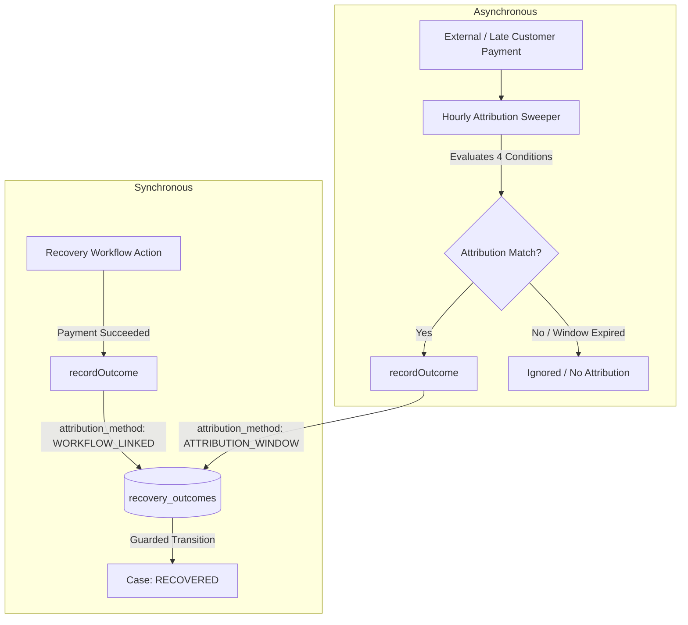

# Authoritative Recovery Attribution & Cost Model

This document defines the authoritative economics and attribution engine of the AI Revenue Recovery platform (Spec 01 §25, Spec 02 §8/§9, Pillar D).

---

## 1. Core Principle: Authoritative Ledger vs UI State

> **Pillar D Mandate:** Never compute recovered revenue from ephemeral dashboard UI filters or raw payment sums. Every recovered rupee is an authoritative fact stored in `recovery_outcomes` and linked to an underlying recovery case and gateway payment.

The platform treats revenue recovery and recovery costs as strict double-entry ledger facts. A case produces exactly one final outcome record in `recovery_outcomes`.

---

## 2. Attribution Methods

The system supports two authoritative attribution pathways:



### 1. `WORKFLOW_LINKED` (Synchronous Attribution)
Set directly by automated workflows (e.g. `failedPaymentRecoveryWorkflow`, `checkoutAbandonmentWorkflow`, `invoiceOverdueWorkflow`) when their own retried charge, generated payment link, or checkout recovery succeeds.
- Case transitions to `RECOVERED` (if not already closed).
- Emits `RECOVERY_RECORDED` case timeline event.
- Marks associated workflow `COMPLETED`.

### 2. `ATTRIBUTION_WINDOW` (Asynchronous Sweeper)
Evaluated by the hourly `AttributionSweeper` for cases that were closed without direct workflow payment (e.g. `STOPPED`, `FAILED`), but whose underlying obligation was subsequently paid by the customer within the allowed attribution window.
- Evaluates the 4 strict attribution conditions (below).
- Persists outcome with `attribution_method: ATTRIBUTION_WINDOW`.
- **Status Invariant:** Closed/stopped cases remain in their terminal status (`STOPPED` / `FAILED`); the sweeper never reopens closed cases. Analytics count recovered revenue authoritatively from the `recovery_outcomes` ledger regardless of case status.

---

## 3. The 4 Strict Attribution Conditions

A payment $P$ is attributed to a candidate case $C$ if and only if all four conditions are satisfied:

```text
1. Same Customer & Financial Obligation:
   - P.customer_id == C.customer_id
   - AND obligation link holds:
     * If C.source_entity_type == 'PAYMENT': P.id == C.source_entity_id OR (P.subscription_id != NULL AND P.subscription_id == source_payment.subscription_id)
     * If C.source_entity_type == 'SUBSCRIPTION': P.subscription_id == C.source_entity_id
     * If C.source_entity_type == 'INVOICE' or 'CHECKOUT': P matches customer obligation

2. Workflow Inception:
   - P.occurred_at >= C.opened_at (or workflow.started_at)

3. Attribution Window Bound:
   - P.occurred_at <= C.opened_at + (C.attribution_window_hours * 1 hour)
   - Default attribution window is 72 hours (configurable per tenant/case).

4. No Competing Live Case:
   - No OTHER live case (status NOT IN ('RECOVERED', 'STOPPED', 'FAILED')) owns that obligation at attribution time.
```

---

## 4. Double-Count Prevention & Concurrency Guarantees

1. **Database-Level Partial Unique Index:**
   `recovery_outcomes` enforces a unique constraint on `case_id`:
   ```sql
   UNIQUE INDEX "recovery_outcomes_case_id_unique" ON "recovery_outcomes"("case_id");
   ```
   Exactly one outcome row can ever exist for a given case.

2. **Idempotency & Replay Safety:**
   Calling `recordOutcome` repeatedly for the same case is a safe no-op that returns the existing authoritative outcome row without modifying timestamps, amounts, or costs.

3. **Superseded Competing Payments:**
   If a competing payment arrives after an outcome has already been recorded for a case, the system logs a `outcome.superseded_payment` warning and preserves the original outcome record intact.

4. **Guarded State Transition Precedence:**
   If `recordOutcome` races against a case `STOPPED` transition, the transactional guard ensures deterministic resolution: `RECOVERED` takes precedence over concurrent non-terminal transitions.

---

## 5. Recovery Cost Model & ROI

All costs incurred while attempting recovery are appended to the immutable `recovery_cost_entries` ledger.

### Cost Categories

| Category | Source | Example Unit Cost / Basis |
|---|---|---|
| `LLM` | AI Decision Service (s-14, s-15) | Minor units (paise) calculated from prompt + completion tokens |
| `MESSAGING` | WhatsApp, Email, SMS Adapters (s-19) | WhatsApp: ₹0.50 (50 paise), Email: ₹0.05 (5 paise), SMS: ₹0.25 (25 paise) |
| `PAYMENT_PROCESSING` | Payment Gateway Retries (s-18) | Gateway retry fee or provider fee (e.g. ₹2.00 / 200 paise) |
| `DISCOUNT` | Workflow Incentives (s-23, s-24) | Discount amount granted on recovery checkout/invoice |
| `MANUAL_HANDLING` | Human Escalation Tasks (s-21) | Operator time / handling overhead |
| `PROVIDER` | Upstream Platform Fees | Fixed provider verification costs |

### Rollup & Formulas

At the moment an outcome is recorded, `OutcomeRecordService` calculates:

$$\text{recovery\_cost} = \sum \text{recovery\_cost\_entries}(\text{case\_id})$$

Stored automatically via PostgreSQL generated always column:

$$\text{net\_recovered} = \text{recovered\_amount} - \text{recovery\_cost}$$

And Recovery ROI is computed at query time:

$$\text{recovery\_roi} = \begin{cases} \frac{\text{net\_recovered}}{\text{recovery\_cost}} & \text{if recovery\_cost} > 0 \\ \infty \text{ (or 100\% net)} & \text{if recovery\_cost} = 0 \end{cases}$$

---

## 6. Cost Completeness Audit Job

The daily `CostCompletenessJob` inspects all executed actions (`recovery_actions` with `status = 'EXECUTED'`). If any executed messaging or incentive action lacks an associated `recovery_cost_entries` row, the job automatically creates the entry using standard pricing constants and increments the `cost_entry_gaps_total` metric.

---

## 7. API Endpoints & Contracts

### `GET /outcomes`
Returns cursor-paginated outcome records with server-side aggregates calculated strictly from stored database columns.
- **RBAC:** `VIEWER`, `SUPPORT`, `OPERATIONS`, `FINANCE`, `ADMIN`
- **Query Parameters:** `from`, `to`, `surface`, `method`, `customer_id`, `limit`, `cursor`
- **Response Format:**
```json
{
  "items": [
    {
      "id": "7f13b52a-9e12-4c28-bb71-12f7a08b7d41",
      "tenant_id": "4df8a753-c8b8-478e-a058-cd855dddd145",
      "case_id": "d82a28b6-53ac-4f74-b878-d22bfc85016c",
      "payment_id": "bd7c9b9c-757e-42fd-8e80-a014c447e1e0",
      "baseline_amount": "500000",
      "recovered_amount": "500000",
      "recovery_cost": "250",
      "net_recovered": "499750",
      "attribution_method": "WORKFLOW_LINKED",
      "attribution_window_hours": 72,
      "recovered_at": "2026-08-29T02:00:00.000Z",
      "recorded_at": "2026-08-29T02:00:01.000Z",
      "created_at": "2026-08-29T02:00:01.000Z",
      "updated_at": "2026-08-29T02:00:01.000Z"
    }
  ],
  "aggregates": {
    "recovered_minor": "50000000",
    "cost_minor": "25000",
    "net_minor": "49975000",
    "count": 100
  },
  "next_cursor": "eyJ..."
}
```

### `GET /cases/:id/outcome`
Returns the single authoritative outcome for a specific recovery case, or `404 Not Found` with `code: "NO_OUTCOME"`.
