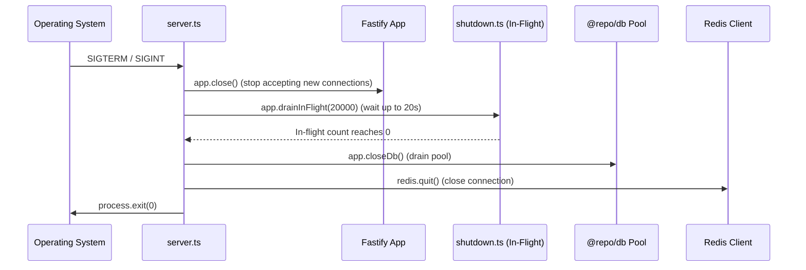

# s-07 — Backend Application Skeleton (Fastify): Implementation Explanation

This document provides a comprehensive, architectural explanation of everything implemented in `specs/steps/s-07.md`. It covers the replacement of the raw `Bun.serve` prototype in `apps/backend` with a production-ready Fastify 5 application architecture, including the application factory (`buildApp`), signal-aware graceful shutdown, request context propagation (request-id and correlation-id), structured Pino logging with strict secret redaction, canonical error envelopes with domain error mapping, Redis-backed rate limiting with graceful fallback, CORS allowlisting, database repository decoration, auto-registered route modules, and health/readiness/version endpoints.

---

## Table of contents

1. [What the step required](#1-what-the-step-required)
2. [Workspace architecture & file layout](#2-workspace-architecture--file-layout)
3. [Fastify application factory & configuration (`app.ts`)](#3-fastify-application-factory--configuration-appts)
4. [Server entrypoint & graceful shutdown lifecycle (`server.ts`, `shutdown.ts`)](#4-server-entrypoint--graceful-shutdown-lifecycle-serverts-shutdownts)
5. [Request context & correlation tracking (`context.ts`)](#5-request-context--correlation-tracking-contextts)
6. [Structured logging, performance hooks & secret redaction (`logger.ts`)](#6-structured-logging-performance-hooks--secret-redaction-loggerts)
7. [Canonical error envelope & DomainError mapping (`errors.ts`, `error-handler.ts`)](#7-canonical-error-envelope--domainerror-mapping-errorsts-error-handlerts)
8. [Rate limiting with Redis store & graceful degradation (`rate-limit.ts`)](#8-rate-limiting-with-redis-store--graceful-degradation-rate-limitts)
9. [CORS & security boundaries (`cors.ts`)](#9-cors--security-boundaries-corsts)
10. [Database client & repository injection (`db.ts`)](#10-database-client--repository-injection-dbts)
11. [Module registry & Meta service endpoints (`routes.ts`, `meta.service.ts`, `routes.ts`)](#11-module-registry--meta-service-endpoints-routests-metaservicets-routests)
12. [Testing strategy & verification results (`app.test.ts`)](#12-testing-strategy--verification-results-apptestts)
13. [Verification evidence (Definition of Done)](#13-verification-evidence-definition-of-done)
14. [Key design decisions & architectural rationale](#14-key-design-decisions--architectural-rationale)

---

## 1. What the step required

Per `specs/steps/s-07.md`, the Event Gateway and all internal REST APIs (Spec 01 §3, §7; Spec 02 §13; ADR-002) run on Fastify. Step s-07 establishes the shared host application for the backend so that subsequent endpoint steps (s-09 authn, s-10 webhooks, s-13 customers, s-14 AI, s-16 policy, s-27 analytics) simply plug into the established plugin pipeline and module registry.

### Definition of Done Checklist (from `specs/steps/s-07.md`):

- [x] Raw `Bun.serve` code removed; `bun run dev` boots Fastify with hot reload
- [x] `/health`, `/api/health`, `/ready`, `/version` respond per contract
- [x] Error envelope consistent across 400/404/413/422/429/500 paths
- [x] Graceful shutdown verified by test and implementation
- [x] Pino logs show `requestId` / `correlationId`; secrets redacted
- [x] Rate limiting active with Redis store (global sane defaults; per-route tuning later)
- [x] Root `bun run check-types`, `lint`, and `bun test` green including `apps/backend`

---

## 2. Workspace architecture & file layout

**Directory:** `apps/backend`

```text
apps/backend/
├── package.json                    # Scripts (dev, start, build, check-types, test), deps
├── tsconfig.json                   # TS configuration (bundler resolution, strict mode)
├── Dockerfile                      # Multi-stage production container image (oven/bun:1.4-alpine)
├── README.md                       # Backend documentation, endpoints, and Docker instructions
├── src/
│   ├── index.ts                    # Thin re-export & launcher for backward compatibility
│   ├── server.ts                   # Entrypoint: loads env, initializes app, handles signals
│   ├── app.ts                      # buildApp(opts) factory (inject/fetch testable)
│   ├── app.test.ts                 # Comprehensive unit & integration test suite (27 tests)
│   ├── lib/
│   │   ├── errors.ts               # DomainError classes & canonical ErrorEnvelope type
│   │   └── routes.ts               # Feature module registry & auto-registration loop
│   ├── plugins/
│   │   ├── context.ts              # Request ID, correlation ID (W3C traceparent), child logger
│   │   ├── logger.ts               # Pino logger config, redaction, request duration metric hook
│   │   ├── cors.ts                 # CORS origin allowlist, exposed headers (Retry-After, trace)
│   │   ├── rate-limit.ts           # @fastify/rate-limit with Redis client & canonical 429
│   │   ├── db.ts                   # Decorates Fastify with @repo/db, repositories, withTransaction
│   │   ├── error-handler.ts        # Maps DomainError, Zod, Fastify schema errors to envelope
│   │   ├── otel.ts                 # OpenTelemetry registration point (placeholder for s-08)
│   │   └── shutdown.ts             # In-flight request tracking counter & drain helper
│   └── modules/
│       └── meta/
│           ├── meta.service.ts     # Health, readiness (DB + Redis + Temporal), 5s cache
│           └── routes.ts           # /health, /api/health, /ready, /version, root discovery
```

---

## 3. Fastify application factory & configuration (`app.ts`)

The application is created via the `buildApp(opts?: AppOptions): Promise<FastifyInstance>` factory function in `apps/backend/src/app.ts`.

Key characteristics:
1. **Testable without listening**: Uses Fastify's `.inject()` interface so unit tests run in milliseconds in-memory without opening network ports.
2. **Strict Body Limit**: Configures `bodyLimit: 256 * 1024` (256KB) to protect against memory exhaustion attacks before request payloads are parsed.
3. **Deterministic Plugin Pipeline**: Plugins execute in strict dependency order:
   - `contextPlugin` (generates/attaches correlation and request IDs)
   - `loggerPlugin` (instruments start times and duration logging)
   - `corsPlugin` (origin allowlisting and header security)
   - `rateLimitPlugin` (cluster-level rate limiting via Redis)
   - `dbPlugin` (injects database client and repositories)
   - `errorHandlerPlugin` (centralized error transformation)
   - `otelPlugin` (observability registration)
   - `shutdownPlugin` (tracks in-flight requests)
   - `registerRouteModules` (mounts all feature routes)

---

## 4. Server entrypoint & graceful shutdown lifecycle (`server.ts`, `shutdown.ts`)

The server entrypoint (`apps/backend/src/server.ts`) manages process signal handling and graceful teardown according to CONVENTIONS §8 & §11:



Uncaught exceptions and unhandled promise rejections are intercepted, logged at `fatal` level with structured context, and immediately trigger the shutdown sequence to prevent running the process in a compromised state ("never run half-dead").

---

## 5. Request context & correlation tracking (`context.ts`)

Every incoming HTTP request is enriched by `apps/backend/src/plugins/context.ts`:
- **Request ID (`req.requestId`)**: Extracted from `x-request-id` or generated via `crypto.randomUUID()`.
- **Correlation ID (`req.correlationId`)**:
  1. Checked from `x-correlation-id`.
  2. If absent, extracted from W3C `traceparent` (`00-<trace_id>-<parent_id>-<flags>`).
  3. If absent, freshly generated via `crypto.randomUUID()`.
- **Response Headers**: `onSend` hook automatically echoes `x-request-id` and `x-correlation-id` on all responses.
- **Child Logger**: Binds `req.log = req.log.child({ requestId, correlationId })` so every log entry emitted during request handling carries complete correlation context.

---

## 6. Structured logging, performance hooks & secret redaction (`logger.ts`)

Per CONVENTIONS §7 & §12:
1. **Redaction Paths**: Sensitive values are censored with `[REDACTED]`:
   - `req.headers.authorization`
   - `req.headers["stripe-signature"]`
   - `req.headers["x-razorpay-signature"]`
   - `req.headers.cookie`
   - `*.password`, `*.apiKey`, `*.stripeSecretKey`, `*.razorpayKeySecret`, `*.token`, `*.secret`
2. **One-Line Request Log**: `onResponse` emits a single structured `info` log with `{ method, url, status, durationMs }`.
3. **Performance Metrics Hook**: Fires `onDurationRecorded("http_request_duration_ms", durationMs, { method, route, status })` providing the insertion point for Prometheus / OpenTelemetry histogram metrics in s-08.

---

## 7. Canonical error envelope & DomainError mapping (`errors.ts`, `error-handler.ts`)

### Canonical Error Envelope Interface

```ts
export interface ErrorEnvelope {
  readonly error: {
    readonly code: string;
    readonly message: string;
    readonly details: unknown;
  };
}
```

### HTTP Status Mapping

| Error Type / Class | HTTP Status | Response Code | Details Payload |
|---|---|---|---|
| `ValidationError` | 422 | `VALIDATION` | Target field issue map |
| Zod Schema (`ZodError`) | 422 | `VALIDATION` | Array of `z.ZodIssue` |
| Fastify Schema (`FST_ERR_VALIDATION`) | 422 | `VALIDATION` | Fastify validation issues |
| `UnauthenticatedError` | 401 | `UNAUTHENTICATED` | Context details |
| `ForbiddenError` | 403 | `FORBIDDEN` | Access reason |
| `NotFoundError` | 404 | `NOT_FOUND` | Path / resource IDs |
| Route 404 (NotFoundHandler) | 404 | `NOT_FOUND` | `{ path, method }` |
| `ConflictError` | 409 | `CONFLICT` (or custom) | Conflict context |
| `IdempotencyInFlightError` | 409 | `IDEMPOTENCY_IN_FLIGHT` | Includes `Retry-After: 2` header |
| `RateLimitedError` / 429 | 429 | `RATE_LIMITED` | Includes `Retry-After` header |
| Payload Too Large (413) | 413 | `PAYLOAD_TOO_LARGE` | Size limit details |
| Bad Request (400) | 400 | `BAD_REQUEST` | Syntax error details |
| Unhandled Exceptions (500) | 500 | `INTERNAL` | `{}` (stack logged internally, never leaked) |

---

## 8. Rate limiting with Redis store & graceful degradation (`rate-limit.ts`)

Configured via `@fastify/rate-limit` with Redis integration (ADR-007):
- **Redis Namespace**: All rate limiting keys are prefixed with `rr:global:ratelimit:`.
- **Headers**: Automatically sets `x-ratelimit-limit`, `x-ratelimit-remaining`, `x-ratelimit-reset`, and `retry-after`.
- **Graceful Fallback**: `skipOnError: true` ensures that if Redis experiences a temporary network partition, requests are allowed to proceed in degraded mode rather than throwing 500 errors.
- **Custom Response Builder**: Standardizes 429 errors into the canonical `{ error: { code: 'RATE_LIMITED', ... } }` envelope.

---

## 9. CORS & security boundaries (`cors.ts`)

Configured via `@fastify/cors`:
- **Allowed Origins**: Strict allowlist based on environment (development: `http://localhost:3000`, `http://127.0.0.1:3000`; production: configured frontend dashboard domain).
- **Methods**: `GET, POST, PUT, DELETE, PATCH, OPTIONS`.
- **Allowed Headers**: `Content-Type, Authorization, X-Correlation-ID, X-Request-ID, Stripe-Signature, X-Razorpay-Signature, X-Tenant-ID, X-API-Key`.
- **Exposed Headers**: `X-Correlation-ID, X-Request-ID, Retry-After`.

---

## 10. Database client & repository injection (`db.ts`)

Decorates the `FastifyInstance` with access to the data layer:
- `fastify.db`: The Drizzle database client.
- `fastify.repos`: The complete bundle of all 23 aggregate repositories from `@repo/db`.
- `fastify.withTransaction`: Context-propagating transaction wrapper.
- `fastify.dbHealthCheck`: Connection pool probe function.
- `fastify.closeDb`: Graceful connection pool shutdown function.

---

## 11. Module registry & Meta service endpoints (`routes.ts`, `meta.service.ts`, `routes.ts`)

### Route Module Registry (`lib/routes.ts`)

Provides a modular registration array (`routeModules`) that later steps plug their routes into.

### Meta Endpoints (`modules/meta/routes.ts`)

1. **`GET /health` & `GET /api/health`**:
   - Status: `200 OK`
   - Response: `{ status: "ok", uptime: 12.34, timestamp: "2026-08-27T04:15:00.000Z" }`
   - Used by load balancers and process monitors for fast liveness checks without touching dependencies.
2. **`GET /ready`**:
   - Status: `200 OK` (if healthy) or `503 Service Unavailable` (if critical dependencies are down).
   - Response: `{ status: "ready" | "unhealthy", checks: { db: "up" | "down", redis: "up" | "down" | "disabled", temporal: "up" | "unconfigured" }, timestamp }`
   - Caches dependency health check results for 5 seconds to prevent hammering database and Redis on high-frequency readiness probes.
3. **`GET /version`**:
   - Status: `200 OK`
   - Response: `{ name: "AI-Revenue-Recovery Backend", version: "0.1.0", gitSha: "...", env: "development" }`
4. **`GET /` & `GET /api`**:
   - Status: `200 OK`
   - Returns discovery object and service status.

---

## 12. Testing strategy & verification results (`app.test.ts`)

`apps/backend/src/app.test.ts` contains 27 tests verifying all functionality:

1. **Health & Meta Endpoints (6 tests)**:
   - Verifies `/health`, `/api/health`, `/version`, and root discovery routes.
   - Verifies `/ready` returns 200 when database healthcheck is positive.
   - Verifies `/ready` returns 503 when database healthcheck fails.
2. **Request Context & Correlation Tracking (3 tests)**:
   - Verifies automatic UUID generation for request-id and correlation-id.
   - Verifies preservation and echoing of custom `x-correlation-id`.
   - Verifies extraction of trace IDs from W3C `traceparent` headers.
3. **Error Envelope & Status Mappings (11 tests)**:
   - Verifies 404 canonical envelope for unknown routes.
   - Verifies mappings for `ValidationError` (422), `UnauthenticatedError` (401), `ForbiddenError` (403), `NotFoundError` (404), `ConflictError` (409), `IdempotencyInFlightError` (409 + Retry-After), `RateLimitedError` (429 + Retry-After), and `InternalError` (500).
   - Verifies Zod schema validation errors produce 422 with issue details.
   - Verifies Fastify schema validation errors produce 422.
   - Verifies generic unhandled runtime errors return sanitized 500 without leaking stack traces.
4. **Body Limits & Security (3 tests)**:
   - Verifies payloads within 256KB succeed.
   - Verifies payloads exceeding 256KB are rejected with 413 `PAYLOAD_TOO_LARGE`.
   - Verifies malformed JSON produces 400 `BAD_REQUEST`.
5. **CORS & Preflight (1 test)**:
   - Verifies `OPTIONS` preflight returns 204 with correct allow-origin, methods, and headers.
6. **Graceful Shutdown & In-Flight Tracking (2 tests)**:
   - Verifies request counter tracks active requests and decrements upon reply.
   - Verifies `drainInFlight` completes cleanly when active count is zero.
7. **Rate Limiting (1 test)**:
   - Verifies route-level rate limits trigger 429 with canonical envelope and `Retry-After` header.

---

## 13. Verification evidence (Definition of Done)

```bash
# 1. Type check
$ bun run check-types
Tasks: 6 successful, 6 total (0 errors across workspace)

# 2. Linting
$ bun run lint
Tasks: 1 successful, 1 total (0 errors)

# 3. Test suites (Vitest Workspace Runner)
$ bun run test
Test Files: 12 passed (12)
Tests: 314 passed (314)
Duration: 44.71s

# 4. Backend-specific unit suite
$ bun test apps/backend/src/app.test.ts
27 pass, 0 fail, 76 expect() calls (770ms)

# 5. Documentation links
$ bun run check-docs
Checked 19 relative links across docs, specs/steps, ..
All doc links OK.
```

---

## 14. Key design decisions & architectural rationale

1. **Fastify Factory Pattern (`buildApp`)**:
   Decoupling the Fastify instance construction from network binding (`app.listen`) allows instantaneous unit and integration testing via Fastify's built-in `.inject()` mechanism without needing to spin up ephemeral network ports.
2. **Canonical Error Envelope Unification**:
   Regardless of where an error originates (domain logic, Zod validation, Fastify schema validation, rate limiters, or unexpected exceptions), the client receives a guaranteed `{ error: { code, message, details } }` JSON structure.
3. **Health vs Readiness Separation**:
   - `/health` checks process liveness (CPU/event loop responsive) without querying downstream databases or caches.
   - `/ready` evaluates whether all required dependencies (Postgres, Redis) are functional and caches the evaluation for 5 seconds to minimize probe overhead.
4. **Degraded-Mode Redis Resiliency**:
   Redis is used as an acceleration and coordination layer (ADR-007). In the event of a Redis outage, rate limiters and readiness probes gracefully degrade rather than crashing the API process.
