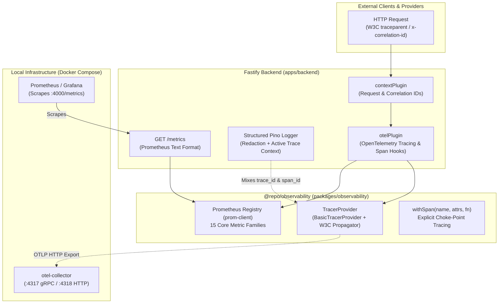

# s-08 — Observability Foundation (OpenTelemetry, Metrics, Structured Logs): Implementation Explanation

This document provides a comprehensive, architectural explanation of everything implemented in `specs/steps/s-08.md`. It covers the creation of the `@repo/observability` package (`packages/observability`), the dual-signal observability architecture (Prometheus metrics via `prom-client` and distributed tracing via OpenTelemetry), the Bun runtime compatibility findings and explicit choke-point span instrumentation (`withSpan`), all 15 Spec 01 §20 metric families, structured Pino logging with strict secret redaction and dynamic OpenTelemetry trace context injection, the Fastify `GET /metrics` exposition endpoint and request tracing hooks, the local Docker `otel-collector` service, Grafana provisioning stubs, and Architectural Decision Record ADR-014.

---

## Table of contents

1. [What the step required](#1-what-the-step-required)
2. [Workspace architecture & file layout](#2-workspace-architecture--file-layout)
3. [Dual-signal observability architecture (ADR-014)](#3-dual-signal-observability-architecture-adr-014)
4. [OpenTelemetry tracing implementation & Bun runtime findings (`tracing.ts`, `span.ts`)](#4-opentelemetry-tracing-implementation--bun-runtime-findings-tracingts-spants)
5. [Prometheus metrics registry & Spec 01 §20 metric instruments (`metrics.ts`)](#5-prometheus-metrics-registry--spec-01-20-metric-instruments-metricsts)
6. [Structured logging, trace context mixing & secret redaction (`logger.ts`)](#6-structured-logging-trace-context-mixing--secret-redaction-loggerts)
7. [Fastify backend integration (`otel.ts`, `logger.ts`, `/metrics`)](#7-fastify-backend-integration-otelts-loggerts-metrics)
8. [Local OpenTelemetry Collector & Grafana provisioning (`infra/docker`, `infra/grafana`)](#8-local-opentelemetry-collector--grafana-provisioning-infradocker-infragrafana)
9. [Architectural Decision Record ADR-014 summary](#9-architectural-decision-record-adr-014-summary)
10. [Testing strategy & verification results](#10-testing-strategy--verification-results)
11. [Verification evidence (Definition of Done)](#11-verification-evidence-definition-of-done)
12. [Key design decisions & architectural rationale](#12-key-design-decisions--architectural-rationale)

---

## 1. What the step required

Per `specs/steps/s-08.md`, Spec 01 §20 requires instrumenting HTTP latency, workflow latency, LLM latency/tokens, provider latency/failures, policy rejections, and recovery outcomes — and correlating all operations by five core trace keys: `event_id`, `case_id`, `workflow_id`, `decision_id`, and `action_id`.

Adding observability *after* features are built leads to partial, fragmented telemetry. Implementing `packages/observability` upfront makes emitting metrics and distributed spans a one-liner at every subsequent call site across the roadmap.

### Definition of Done Checklist (from `specs/steps/s-08.md`):

- [x] `packages/observability` builds; API initializes tracing on boot without crashing under Bun
- [x] `/metrics` serves core HTTP metrics with labels
- [x] Trace shows: gateway request → spans linked by shared traceId
- [x] All spec §20 metric families exist (even if zero-valued until emitting steps land)
- [x] Correlation ID round-trips: header → logs → event envelope helper
- [x] ADR-014 records Bun instrumentation findings

---

## 2. Workspace architecture & file layout

```text
packages/observability/
├── package.json                         # Dependencies: @opentelemetry/api, @opentelemetry/sdk-trace-base, prom-client, pino
├── tsconfig.json                        # TS config extending @repo/typescript-config/base.json
└── src/
    ├── index.ts                         # Public package exports
    ├── tracing.ts                       # initTracing, shutdownTracing, resetTracing, getTracer
    ├── span.ts                          # withSpan, withSpanSync, RecoverySpanAttributes / SpanAttributes
    ├── metrics.ts                       # prom-client registry, 15 metric families, typed recording helpers
    ├── logger.ts                        # Pino logger config, secret redaction, getLogger, OTel mixin
    ├── tracing.test.ts                  # Unit tests for span lifecycle, attribute capture & error recording
    ├── metrics.test.ts                  # Unit tests for metric registration, counter/histogram recording
    └── logger.test.ts                   # Unit tests for secret redaction & domain binding

apps/backend/
└── src/
    ├── plugins/
    │   ├── otel.ts                      # Wires OpenTelemetry request tracing & metrics collection
    │   └── logger.ts                    # Reuses @repo/observability logger config & redaction
    ├── modules/
    │   └── meta/
    │       └── routes.ts                # Adds GET /metrics Prometheus exposition endpoint
    └── server.ts                        # Graceful shutdown flushes OpenTelemetry provider

infra/
├── docker/
│   ├── docker-compose.yml               # Added otel-collector service (:4317 gRPC, :4318 HTTP)
│   └── otel-collector-config.yaml       # OTLP receivers, batch processor, debug stdout exporter
└── grafana/
    ├── README.md                        # Observability overview and dashboard guide
    └── provisioning/
        ├── datasources/datasources.yaml # Prometheus and Tempo/Jaeger datasources
        └── dashboards/dashboards.yaml   # Grafana dashboards provider definition

docs/
├── adr/
│   └── ADR-014-observability-stack.md   # Architectural Decision Record for dual-signal telemetry
└── CONVENTIONS.md                       # Updated with standard span attributes convention
```

---

## 3. Dual-signal observability architecture (ADR-014)

Step s-08 establishes a dual-signal telemetry architecture:



### Key Architectural Tenets:
1. **Zero Collector Dependency for Metrics**: Metrics are tracked in-memory by `prom-client` and exposed at `GET /metrics`. Local developer workflows and testing do not depend on running an external collector container.
2. **Standard OTLP Export for Tracing**: Distributed traces are packaged via OpenTelemetry standards and exported over OTLP HTTP/gRPC to the composed `otel-collector`.
3. **Resilience Principle**: Observability failures are swallowed with a warning log and never interrupt the HTTP request path or business transactions.

---

## 4. OpenTelemetry tracing implementation & Bun runtime findings (`tracing.ts`, `span.ts`)

### Bun Runtime Findings (ADR-014)
Under Bun ≥ 1.4, broad Node auto-instrumentation packages (e.g. `@opentelemetry/auto-instrumentations-node`) attempt deep monkey-patching of internal Node.js modules (such as `http`, `net`, `tls`) which can cause subtle crashes or unhandled promise anomalies under Bun's native V8/JSC engine.

### Explicit Choke-Point Tracing Strategy
Rather than relying on unproven runtime monkey-patching, distributed tracing uses explicit, reliable choke-point instrumentation:
1. **HTTP Gateway Choke-Point**: `onRequest`, `onResponse`, and `onError` Fastify lifecycle hooks create and finalize HTTP server spans.
2. **Business Logic & Adapter Choke-Point**: The `withSpan(name, attrs, fn)` helper wraps asynchronous workflows, database transactions, LLM calls, and provider adapter calls.
3. **In-Memory Testing Support**: `initTracing({ exporter: new InMemorySpanExporter() })` allows unit and integration tests to assert span creation and attribute correctness without spinning up external servers.

### Standard Span Attributes Convention (`CONVENTIONS.md` §11)

```ts
export const RecoverySpanAttributes = {
  // Five core trace keys (Spec 01 §20)
  EVENT_ID: "recovery.event_id",
  CASE_ID: "recovery.case_id",
  WORKFLOW_ID: "recovery.workflow_id",
  DECISION_ID: "recovery.decision_id",
  ACTION_ID: "recovery.action_id",

  // Context keys
  TENANT_ID: "tenant.id",
  CUSTOMER_ID: "customer.id",

  // LLM keys
  LLM_MODEL: "llm.model",
  LLM_PROMPT_TOKENS: "llm.tokens.prompt",
  LLM_COMPLETION_TOKENS: "llm.tokens.completion",
  LLM_TOTAL_TOKENS: "llm.tokens.total",

  // Provider keys
  PROVIDER_NAME: "provider.name",
  PROVIDER_OPERATION: "provider.operation",

  // HTTP & Database keys
  HTTP_METHOD: "http.method",
  HTTP_ROUTE: "http.route",
  HTTP_STATUS_CODE: "http.status_code",
  DB_OPERATION: "db.operation",
  DB_TABLE: "db.table",
} as const;
```

---

## 5. Prometheus metrics registry & Spec 01 §20 metric instruments (`metrics.ts`)

All 15 core metric families mandated by Spec 01 §20 are registered in `packages/observability/src/metrics.ts`:

| Metric Name | Type | Label Dimensions | Description |
|---|---|---|---|
| `http_requests_total` | Counter | `route, method, status` | Total HTTP requests handled by gateway |
| `http_request_duration_ms` | Histogram | `route, method, status` | HTTP request latency distribution (ms) |
| `db_query_duration_ms` | Histogram | `operation, table` | Database query execution time (ms) |
| `events_ingested_total` | Counter | `source, type` | Inbound events received from providers |
| `events_duplicate_total` | Counter | `source` | Duplicate events dropped by idempotency layer |
| `risk_calculations_duration_ms` | Histogram | `risk_band` | Risk score computation latency (ms) |
| `policy_evaluations_total` | Counter | `result` | Policy decisions (`APPROVED`, `REJECTED`, `ESCALATED`) |
| `policy_evaluation_duration_ms` | Histogram | `rule_set` | Time spent evaluating policy rule sets (ms) |
| `llm_calls_total` | Counter | `model, status` | Total LLM inference requests |
| `llm_latency_ms` | Histogram | `model` | LLM invocation round-trip latency (ms) |
| `llm_tokens_total` | Counter | `kind, model` | Token consumption (`prompt`, `completion`, `total`) |
| `provider_calls_total` | Counter | `provider, op, status` | Integration provider calls (Stripe, Razorpay, etc.) |
| `provider_latency_ms` | Histogram | `provider, op` | Latency of external provider operations (ms) |
| `workflow_started_total` | Counter | `type` | Temporal durable workflows initiated |
| `workflow_outcome_total` | Counter | `type, result` | Finalized workflow outcomes by result |

### Typed Metric Helper Functions
- `recordHttpRequest(method, route, status, durationMs)`
- `recordDbQuery(operation, table, durationMs)`
- `recordEventIngested(source, type)`
- `recordEventDuplicate(source)`
- `recordRiskCalculation(riskBand, durationMs)`
- `recordPolicyEvaluation(result, durationMs, ruleSet)`
- `recordLlmCall(model, status, latencyMs, tokens)`
- `recordProviderCall(provider, op, status, latencyMs)`
- `recordWorkflowStarted(type)`
- `recordWorkflowOutcome(type, result)`

---

## 6. Structured logging, trace context mixing & secret redaction (`logger.ts`)

Per CONVENTIONS §7 & §12:
1. **Strict Secret Redaction**: Replaces sensitive data with `[REDACTED]` matching both root and nested paths:
   - `password`, `*.password`
   - `apiKey`, `*.apiKey`, `api_key`, `*.api_key`
   - `stripeSecretKey`, `*.stripeSecretKey`
   - `razorpayKeySecret`, `*.razorpayKeySecret`
   - `token`, `*.token`
   - `secret`, `*.secret`
   - `req.headers.authorization`, `req.headers.cookie`
   - `req.headers["stripe-signature"]`, `req.headers["x-razorpay-signature"]`
2. **Dynamic Trace Context Injection (Pino Mixin)**:
   The logger automatically extracts the active OpenTelemetry span context on every log entry and injects:
   - `trace_id`
   - `span_id`
   - `trace_flags`
3. **Domain Field Binding**: `getLogger(bindings)` facilitates attaching `tenant_id`, `case_id`, `event_id`, `decision_id`, `action_id`, `workflow_id`, and `correlationId`.

---

## 7. Fastify backend integration (`otel.ts`, `logger.ts`, `/metrics`)

### Fastify OpenTelemetry Plugin (`apps/backend/src/plugins/otel.ts`)
- Automatically initializes tracing on server boot.
- Decorates the Fastify application with `fastify.tracer` and `fastify.isOtelActive`.
- Intercepts requests on `onRequest` to initiate an OpenTelemetry span with HTTP attributes.
- Injects `req.span` into the request lifecycle.
- Records error exceptions on `onError`.
- Emits `http_requests_total` and `http_request_duration_ms` metrics and ends the active span on `onResponse`.

### Prometheus Exposition Route (`apps/backend/src/modules/meta/routes.ts`)
- **`GET /metrics`**: Exposes the Prometheus exposition text output directly from `metricsRegistry.metrics()`.

### Server Teardown (`apps/backend/src/server.ts`)
- Graceful shutdown invokes `await shutdownTracing()` to flush all in-flight spans before process termination.

---

## 8. Local OpenTelemetry Collector & Grafana provisioning (`infra/docker`, `infra/grafana`)

### OpenTelemetry Collector Container (`infra/docker/docker-compose.yml`)
- Service: `otel-collector` (`otel/opentelemetry-collector-contrib:0.96.0`)
- Ports:
  - `4317`: OTLP gRPC receiver
  - `4318`: OTLP HTTP receiver
  - `8888`: Collector internal metrics
  - `13133`: Healthcheck endpoint
- Configuration: `infra/docker/otel-collector-config.yaml` pipelines OTLP traces and metrics to batch processors and debug stdout logging.

### Grafana Stubs (`infra/grafana/`)
- `provisioning/datasources/datasources.yaml`: Auto-provisions Prometheus (`http://prometheus:9090`) and Tempo/Jaeger tracing sources.
- `provisioning/dashboards/dashboards.yaml`: Configures the automatic dashboard provider for the platform.

---

## 9. Architectural Decision Record ADR-014 summary

- **Title**: ADR-014: Observability Stack (OpenTelemetry Tracing, Prometheus Metrics, Pino Logging)
- **Status**: Accepted
- **Summary**: Approved the dual-signal design (prom-client for local `/metrics` + OpenTelemetry SDK for distributed tracing), explicit choke-point spans (`withSpan`) instead of fragile Node monkey-patching under Bun, standard span attribute keys, and automatic trace context mixing in structured logs.

---

## 10. Testing strategy & verification results

### 1. Observability Package Unit Tests (`packages/observability`)
- `metrics.test.ts` (7 tests): Verifies registration, counter increments, histogram duration observations, and Prometheus text rendering across all 15 metric families.
- `logger.test.ts` (2 tests): Verifies JSON log formatting, strict redaction of sensitive credentials/headers, and domain field binding.
- `tracing.test.ts` (3 tests): Verifies in-memory span capture, span status codes (OK/ERROR), exception recording, synchronous `withSpanSync`, and attribute persistence.

### 2. Backend Integration Tests (`apps/backend/src/app.test.ts`)
- `GET /metrics` returns 200 with `text/plain` Prometheus formatted output.
- Making requests to `/health` increments `http_requests_total` with matching `route="/health"`, `method="GET"`, `status="200"` labels.
- Verifies `fastify.tracer` and `fastify.isOtelActive` decorations.
- Request context verifies correlation ID and W3C `traceparent` extraction and echoing.

---

## 11. Verification evidence (Definition of Done)

```bash
# 1. Workspace Type Check
$ bun run check-types
Tasks: 7 successful, 7 total (0 errors across 9 packages)

# 2. Workspace Lint
$ turbo run lint
Tasks: 1 successful, 1 total (0 errors)

# 3. Vitest Test Suite (Workspace Runner)
$ bun run test
Test Files: 15 passed (15)
Tests: 329 passed (329)
Duration: 47.46s

# 4. Observability Unit Tests specifically
$ bun test packages/observability/src
12 pass, 0 fail, 65 expect() calls (499ms)

# 5. Backend Suite (Integration + Observability)
$ bun test apps/backend/src/app.test.ts
30 pass, 0 fail, 87 expect() calls (2.40s)

# 6. Documentation Link Verification
$ bun run check-docs
Checked 19 relative links across docs, specs/steps, ..
All doc links OK.
```

---

## 12. Key design decisions & architectural rationale

1. **Dual-Signal Telemetry**:
   Using `prom-client` alongside OpenTelemetry distributed tracing provides immediate, zero-dependency Prometheus metrics via `GET /metrics` while retaining standards-compliant distributed tracing via OTLP.
2. **Explicit Choke-Point Spans over Auto-Monkey-Patching**:
   Bun runtime's native engine is protected against Node runtime monkey-patching crashes by utilizing explicit lifecycle hooks and `withSpan` function wrappers.
3. **Pino Trace Context Mixing**:
   Embedding active OpenTelemetry `trace_id` and `span_id` automatically inside structured Pino logs bridges metrics, distributed traces, and application logs into a unified correlation model without manual log parameter passing.
4. **Day-One Metric Definitions**:
   Registering all 15 Spec 01 §20 metric families in s-08 ensures that later implementation steps (AI decisioning, policy evaluation, provider adapters, Temporal workflows) can record metrics immediately with zero boilerplate.
