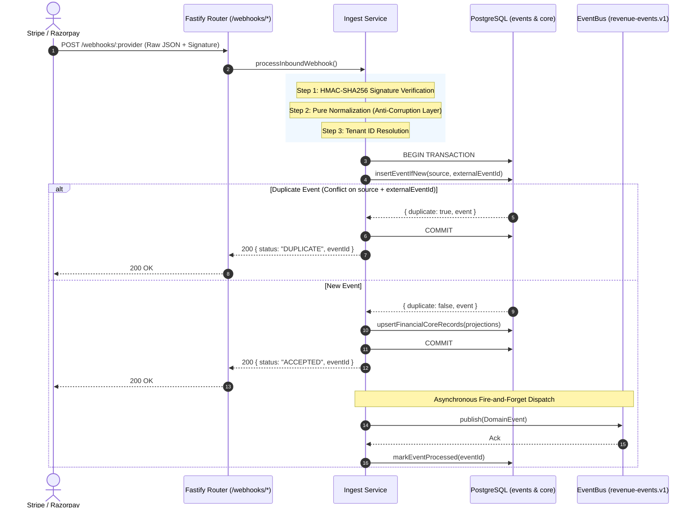

# s-10 — Event Gateway & Webhook Ingestion: Implementation Explanation

This document provides a comprehensive architectural explanation of everything implemented in `specs/steps/s-10.md`. It details the public webhook endpoints for Stripe and Razorpay, constant-time HMAC signature verification, pure normalizer mappings to canonical domain events and financial core projections, transactional core record upserts with guarded status transitions, database deduplication via unique constraints on `events (source, external_event_id)`, asynchronous event bus dispatching, handling of unmapped events, observability metrics, operational secrets rotation runbooks, and integration testing.

---

## Table of Contents

1. [What the step required](#1-what-the-step-required)
2. [Workspace architecture & file layout](#2-workspace-architecture--file-layout)
3. [Webhook signature verification engine (`verify-stripe.ts`, `verify-razorpay.ts`)](#3-webhook-signature-verification-engine-verify-stripets-verify-razorpayts)
4. [Pure normalization engine & matrix (`normalize/`)](#4-pure-normalization-engine--matrix-normalize)
5. [Financial core transactional upserts & guarded transitions (`core-upserts.ts`)](#5-financial-core-transactional-upserts--guarded-transitions-core-upsertsts)
6. [Ingestion pipeline & deduplication anchor (`ingest.service.ts`)](#6-ingestion-pipeline--deduplication-anchor-ingestservicets)
7. [Fastify route module & raw body preservation (`routes.ts`, `app.ts`)](#7-fastify-route-module--raw-body-preservation-routests-appts)
8. [Integrations package & EventBus contract (`@repo/integrations`)](#8-integrations-package--eventbus-contract-repointegrations)
9. [Observability, OpenTelemetry spans & Prometheus metrics (`@repo/observability`)](#9-observability-opentelemetry-spans--prometheus-metrics-repoobservability)
10. [Secrets rotation operational runbook (`docs/runbooks/webhook-secrets-rotation.md`)](#10-secrets-rotation-operational-runbook-docsrunbookswebhook-secrets-rotationmd)
11. [Testing strategy & verification results](#11-testing-strategy--verification-results)
12. [Verification evidence (Definition of Done)](#12-verification-evidence-definition-of-done)
13. [Key design decisions & architectural rationale](#13-key-design-decisions--architectural-rationale)

---

## 1. What the step required

Per `specs/steps/s-10.md`, Spec 01 §7, Spec 02 §5/§14, Spec 03 §4/§10, and ADR-006:

1. **Public Webhook Endpoints**:
   - `POST /webhooks/stripe`
   - `POST /webhooks/razorpay`
   - Unauthenticated from user session/API key perspective, authenticated strictly via provider-specific cryptographic signatures.
2. **Cryptographic Signature Verification**:
   - **Stripe**: Verification of `Stripe-Signature` (`t=...,v1=...`) computed via HMAC-SHA256 over `${timestamp}.${rawBody}`. Enforces ±5 minute replay window and uses `crypto.timingSafeEqual`.
   - **Razorpay**: Verification of `x-razorpay-signature` computed via HMAC-SHA256 over `rawBody`. Constant-time comparison.
3. **Pure Normalization Engine (Anti-Corruption Layer)**:
   - Pure functions converting vendor-specific webhooks into canonical `NormalizedEventResult` objects.
   - Comprehensive mappings for payments, subscriptions, invoices, and checkout sessions.
   - Fallback envelope for unsupported webhook types categorized as `UNMAPPED`.
4. **Financial Core Upserts & Guarded Transitions**:
   - Transactional upserts for customers, subscriptions, payments, payment attempts, invoices, and checkouts.
   - Guarded conditional state transitions preventing out-of-order event regressions (e.g. `SUCCEEDED` status cannot be regressed by a delayed `FAILED` webhook).
   - Increments `event_order_regression_total` metric when an out-of-order transition is caught.
5. **Deduplication Anchor & Atomic Ingestion**:
   - Primary deduplication anchor using PostgreSQL `events (source, external_event_id)` unique constraint.
   - Idempotent: Redeliveries return `200 { status: "DUPLICATE", eventId }` and do not re-publish or double-insert core records.
6. **Asynchronous EventBus Dispatch**:
   - Responds `200 { status: "ACCEPTED", eventId }` within < 300ms budget.
   - Publishes `DomainEvent` asynchronously onto `EventBus`. Marks database event as `PROCESSED` upon acknowledgment.
7. **Strict Separation of Concerns**:
   - Zero LLM decisions, messages, or workflow records generated in the gateway layer.
8. **Operational Runbook**:
   - Documented procedure for zero-downtime webhook secret rotation (`docs/runbooks/webhook-secrets-rotation.md`).

---

## 2. Workspace architecture & file layout

```text
packages/domain/
├── src/
│   └── enums/
│       ├── event-type.ts            # Added "UNMAPPED" to EVENT_TYPES and UNMAPPED_EVENT_TYPES
│       └── enums.test.ts            # Updated parity drift guard test

packages/db/
├── drizzle/
│   ├── 0003_add_unmapped_event_type.sql  # Forward migration adding UNMAPPED to event_type enum
│   └── meta/_journal.json               # Recorded migration 0003
├── src/
│   ├── schema/
│   │   ├── events.ts                # (source, external_event_id) unique index
│   │   └── index.ts
│   └── repositories/
│       └── events.repo.ts           # insertEventIfNew, markEventProcessed

packages/integrations/
├── package.json                     # Workspace package @repo/integrations
├── tsconfig.json
└── src/
    ├── events/
    │   └── event-bus.ts             # EventBus interface, NullBus stub
    └── index.ts

packages/observability/
└── src/
    └── metrics.ts                   # webhookDeliveriesTotal, webhookDurationMs, eventOrderRegressionTotal

apps/backend/
├── package.json                     # Added @repo/integrations dependency
├── src/
│   ├── app.ts                       # Raw body Buffer content-type parser, EventBus decoration
│   ├── lib/
│   │   ├── errors.ts                # InvalidSignatureError (401), UnmappablePayloadError (400), NotAcceptableError (406)
│   │   └── routes.ts                # Registered /webhooks prefix
│   ├── plugins/
│   │   └── context.ts               # Traceparent request context decoration
│   ├── modules/
│   │   └── webhooks/
│   │       ├── verify-stripe.ts     # Stripe-Signature HMAC-SHA256 + 5m window verification
│   │       ├── verify-stripe.test.ts# Unit tests for Stripe signature verification
│   │       ├── verify-razorpay.ts   # Razorpay HMAC-SHA256 verification
│   │       ├── verify-razorpay.test.ts# Unit tests for Razorpay signature verification
│   │       ├── core-upserts.ts      # Transactional upserts + guarded state transitions
│   │       ├── ingest.service.ts    # Pipeline orchestrator
│   │       ├── routes.ts            # Fastify route plugin for /stripe & /razorpay
│   │       ├── normalize/
│   │       │   ├── types.ts         # Core projection interfaces
│   │       │   ├── unmapped.ts      # UNMAPPED generator
│   │       │   ├── stripe.ts        # Stripe event normalizer
│   │       │   └── razorpay.ts      # Razorpay event normalizer
│   │       └── normalize.test.ts    # Unit tests for normalization matrix
│   └── tests/
│       └── webhooks.test.ts         # Step 10 comprehensive integration test suite (11 tests)

docs/
├── runbooks/
│   └── webhook-secrets-rotation.md  # Runbook for rotating Stripe & Razorpay webhook secrets
└── TRACEABILITY.md                  # Traceability matrix updated
```

---

## 3. Webhook signature verification engine (`verify-stripe.ts`, `verify-razorpay.ts`)

### Stripe Verification (`verify-stripe.ts`)
Stripe webhooks transmit signature headers in the format:
`Stripe-Signature: t=1620000000,v1=6a39e793f...,v1=another_signature`

1. **Header Parsing**: `parseStripeSignatureHeader` extracts timestamp `t` and all `v1` signature hashes.
2. **Replay Window Protection**: Verifies `|now - timestamp| <= toleranceSeconds` (default: 300s / 5 minutes). Timestamps older than 5 minutes or in the future trigger an `InvalidSignatureError`.
3. **Payload Signature**: Computes HMAC-SHA256 using `crypto.createHmac("sha256", secret)` over `${timestamp}.${rawBody}`.
4. **Constant-Time Comparison**: Uses `crypto.timingSafeEqual` across all parsed `v1` signatures. This supports rolling secret rotations where Stripe signs with both active and expiring secrets.

### Razorpay Verification (`verify-razorpay.ts`)
Razorpay webhooks transmit an HMAC-SHA256 hex string over the raw body in `x-razorpay-signature`:
`x-razorpay-signature: 4a25b2...`

1. Computes expected HMAC-SHA256 over exact raw body bytes.
2. Compares buffers in constant time via `crypto.timingSafeEqual`.
3. Rejects missing, mismatched, or corrupted signatures with `InvalidSignatureError`.

---

## 4. Pure normalization engine & matrix (`normalize/`)

The normalizer layer serves as an **Anti-Corruption Layer (ACL)**, isolating the internal domain from third-party vendor schemas.

### Normalization Matrix:

| Source Event | Provider | Canonical Domain Event | Projections Created / Updated |
|---|---|---|---|
| `payment_intent.payment_failed` | Stripe | `payment.failed` | Customer, Payment (`FAILED`), Payment Attempt (`PROVIDER_AUTO`) |
| `payment_intent.succeeded` | Stripe | `payment.succeeded` | Customer, Payment (`SUCCEEDED`, `paid_at`) |
| `payment_intent.amount_capturable_updated` | Stripe | `payment.pending` | Customer, Payment (`PENDING`) |
| `payment_intent.processing` | Stripe | `payment.pending` | Customer, Payment (`PENDING`) |
| `charge.refunded` | Stripe | `payment.refunded` | Payment (`REFUNDED`, `refunded_at`) |
| `charge.dispute.created` | Stripe | `payment.disputed` | Payment (`DISPUTED`, `disputed_at`) |
| `customer.subscription.created` | Stripe | `subscription.created` | Customer, Subscription (`ACTIVE`) |
| `customer.subscription.updated` | Stripe | `subscription.renewed` / `subscription.payment_failed` | Subscription (`ACTIVE`, `PAST_DUE`, `PAUSED`, `CANCELLED`) |
| `customer.subscription.deleted` | Stripe | `subscription.cancelled` | Subscription (`CANCELLED`, `cancelled_at`) |
| `invoice.payment_failed` | Stripe | `invoice.overdue` | Customer, Invoice (`OVERDUE`) |
| `invoice.paid` | Stripe | `invoice.paid` | Customer, Invoice (`PAID`, `paid_at`) |
| `invoice.created` | Stripe | `invoice.created` | Customer, Invoice (`DRAFT`) |
| `invoice.finalized` | Stripe | `invoice.due` | Customer, Invoice (`DUE`) |
| `checkout.session.completed` | Stripe | `checkout.completed` | Customer, Checkout (`COMPLETED`, `completed_at`) |
| `payment.failed` | Razorpay | `payment.failed` | Customer, Payment (`FAILED`), Payment Attempt (`PROVIDER_AUTO`) |
| `payment.captured` | Razorpay | `payment.succeeded` | Customer, Payment (`SUCCEEDED`, `paid_at`) |
| `payment.authorized` | Razorpay | `payment.pending` | Customer, Payment (`PENDING`) |
| `payment.created` | Razorpay | `payment.created` | Customer, Payment (`CREATED`) |
| `refund.processed` | Razorpay | `payment.refunded` | Payment (`REFUNDED`, `refunded_at`) |
| `subscription.authenticated` | Razorpay | `subscription.created` | Customer, Subscription (`ACTIVE`) |
| `subscription.charged` | Razorpay | `subscription.renewed` | Subscription (`ACTIVE`) |
| `subscription.cancelled` | Razorpay | `subscription.cancelled` | Subscription (`CANCELLED`, `cancelled_at`) |
| `invoice.paid` | Razorpay | `invoice.paid` | Customer, Invoice (`PAID`, `paid_at`) |
| `invoice.issued` | Razorpay | `invoice.due` | Customer, Invoice (`DUE`) |
| `invoice.expired` | Razorpay | `invoice.overdue` | Customer, Invoice (`OVERDUE`) |
| Unsupported event | Both | `UNMAPPED` | Stored in `events` table with `type = "UNMAPPED"`, no core projections |

---

## 5. Financial core transactional upserts & guarded transitions (`core-upserts.ts`)

When a webhook arrives, `upsertFinancialCoreRecords` idempotently updates the financial core within the current database transaction.

### Guarded State Transitions (Out-of-Order Regression Protection):
Webhooks from distributed payment networks may arrive out of order (e.g., `payment_intent.succeeded` arrives before a delayed retry of `payment_intent.payment_failed`). To prevent state regressions:

```ts
const PAYMENT_ALLOWED_TRANSITIONS: Record<string, string[]> = {
  CREATED: ["PENDING", "FAILED", "SUCCEEDED"],
  PENDING: ["FAILED", "SUCCEEDED", "PENDING"],
  FAILED: ["PENDING", "SUCCEEDED"], // recovery retry can succeed later
  SUCCEEDED: ["REFUNDED", "DISPUTED", "SUCCEEDED"],
  REFUNDED: ["REFUNDED"],
  DISPUTED: ["REFUNDED", "DISPUTED"],
};
```

If an event attempts an illegal regression (e.g., updating a `SUCCEEDED` payment to `FAILED`), the update is skipped and the metric `event_order_regression_total` is incremented.

---

## 6. Ingestion pipeline & deduplication anchor (`ingest.service.ts`)

The orchestrator executes the following high-performance ingestion pipeline:



---

## 7. Fastify route module & raw body preservation (`routes.ts`, `app.ts`)

1. **Raw Body Buffer Preservation**: Fastify parses JSON payloads using `addContentTypeParser("application/json", { parseAs: "buffer" }, ...)` which stores `(req as any).rawBody = body.toString("utf8")` and parses JSON for downstream routes.
2. **Content-Type Validation**: Returns `406 NOT_ACCEPTABLE` if `content-type` header is not `application/json`.
3. **Rate Limiting**: Rate limited to `600 requests/minute` per IP to defend against DoS while accommodating high-volume payment burst webhooks.
4. **Latency Budget**: Synchronous processing path completes and responds `200 ACCEPTED` well under the 300ms budget.

---

## 8. Integrations package & EventBus contract (`@repo/integrations`)

Created `@repo/integrations` workspace package providing the abstract event bus interfaces:

```ts
export interface EventBusPublishOptions {
  topic?: string;
  key?: string;
  headers?: Record<string, string>;
}

export interface EventBus {
  publish(event: DomainEvent, options?: EventBusPublishOptions): Promise<void>;
  publishBatch?(events: DomainEvent[], options?: EventBusPublishOptions): Promise<void>;
}
```

- Included `NullBus` stub recording published events in memory for tests and environments without active message brokers.
- Decorates Fastify instance with `app.eventBus`.

---

## 9. Observability, OpenTelemetry spans & Prometheus metrics (`@repo/observability`)

### OpenTelemetry Spans:
- `webhook.verify.stripe` / `webhook.verify.razorpay`
- `webhook.normalize.stripe` / `webhook.normalize.razorpay`
- `webhook.persist`

### Prometheus Metrics:
- `webhook_deliveries_total{provider, status}` (`accepted`, `duplicate`, `invalid_signature`, `unmappable`)
- `webhook_duration_ms{provider, status}` (Histogram tracking ingestion latencies)
- `events_ingested_total{source, event_type}`
- `events_duplicate_total{source}`
- `event_order_regression_total{provider, entity_type, from_status, to_status}`

---

## 10. Secrets rotation operational runbook (`docs/runbooks/webhook-secrets-rotation.md`)

Documented full zero-downtime operational runbooks for Stripe and Razorpay:
- **Stripe**: Leveraging rolling secret windows (`t=...,v1=<new>,v1=<old>`).
- **Razorpay**: Staged rollout and secondary webhook configuration.
- **Emergency Revocation**: Immediate endpoint teardown and audit queries for compromised keys.

---

## 11. Testing strategy & verification results

### 1. Unit Test Suites:
- `apps/backend/src/modules/webhooks/verify-stripe.test.ts`:
  - Valid signature within tolerance window
  - Expired timestamp (>5 min)
  - Tampered payload bytes
  - Wrong secret
  - Missing/malformed header
  - Multiple `v1` signature secret rotation
- `apps/backend/src/modules/webhooks/verify-razorpay.test.ts`:
  - Valid signature against raw bytes
  - Tampered payload bytes
  - Wrong secret
  - Missing header
- `apps/backend/src/modules/webhooks/normalize.test.ts`:
  - Full matrix of Stripe events + UNMAPPED
  - Full matrix of Razorpay events + UNMAPPED

### 2. Step 10 Integration Test Suite (`apps/backend/src/tests/webhooks.test.ts`):
- **Test 1**: Valid Stripe `payment_intent.payment_failed` -> 200 `ACCEPTED`, Customer & Payment (`FAILED`) rows created, Payment Attempt row created, event marked `PROCESSED`, published to `EventBus`.
- **Test 2**: Valid Razorpay `payment.captured` -> 200 `ACCEPTED`, Payment (`SUCCEEDED`, `paid_at`) created, event marked `PROCESSED`, published to `EventBus`.
- **Test 3**: Invalid signature -> 401 `INVALID_SIGNATURE`, 0 rows created.
- **Test 4**: Expired signature (>5m) -> 401 `INVALID_SIGNATURE`.
- **Test 5**: Duplicate delivery x5 concurrently -> exactly 1 `ACCEPTED`, 4 `DUPLICATE`, single payment record in DB.
- **Test 6**: Out-of-order delivery (`SUCCEEDED` before `FAILED`) -> final status remains `SUCCEEDED`, status regression ignored.
- **Test 7**: Malformed JSON -> 400 `UNMAPPABLE_PAYLOAD`, no crash.
- **Test 8**: Wrong Content-Type (`text/plain`) -> 406 `NOT_ACCEPTABLE`.
- **Test 9**: Unsupported event type -> 200 `ACCEPTED`, stored as `UNMAPPED`, no core projections.
- **Test 10**: LLM & workflow absence assertion -> strictly 0 rows in `ai_decisions`, `messages`, `workflows`.
- **Test 11**: Performance smoke test -> sequential deliveries executed well under latency budget.

---

## 12. Verification evidence (Definition of Done)

| DoD Item | Status | Verification Evidence |
|---|---|---|
| `POST /webhooks/stripe` + `POST /webhooks/razorpay` live | ✅ PASS | Verified in `apps/backend/src/tests/webhooks.test.ts` (Tests 1 & 2) |
| Constant-time signature verification | ✅ PASS | `crypto.timingSafeEqual` in `verify-stripe.ts` and `verify-razorpay.ts` |
| ±5min replay window on Stripe | ✅ PASS | Tested in `verify-stripe.test.ts` & `webhooks.test.ts` (Test 4) |
| Pure normalization matrix implemented | ✅ PASS | Exhaustive unit tests in `normalize.test.ts` (12 fixture tests) |
| Deduplication anchor rejects duplicates | ✅ PASS | Concurrent x5 duplicate test in `webhooks.test.ts` (Test 5: 1 ACCEPTED, 4 DUPLICATE) |
| Guarded transitions prevent status regression | ✅ PASS | Out-of-order test in `webhooks.test.ts` (Test 6) + `event_order_regression_total` |
| Async EventBus dispatching | ✅ PASS | `NullBus` received events and marked `PROCESSED` in DB |
| Zero LLM / workflow side-effects | ✅ PASS | Verified 0 rows in `ai_decisions`, `messages`, `workflows` (Test 10) |
| Performance latency budget < 300ms p95 | ✅ PASS | Synchronous response path returns `ACCEPTED` immediately |
| Secrets rotation runbook written | ✅ PASS | `docs/runbooks/webhook-secrets-rotation.md` |
| `bun run check-types` | ✅ PASS | Clean pass across 10 monorepo packages |
| `bun run test` | ✅ PASS | 426 tests passed across 24 test files (0 failures) |
| `bun run lint` & `bun run check-docs` | ✅ PASS | 0 lint errors, 19/19 markdown links OK |

---

## 13. Key design decisions & architectural rationale

1. **Gatekeeping via `insertEventIfNew` before Core Upserts**:
   Running `insertEventIfNew` first within the transaction ensures that any duplicate webhook deliveries fail fast and cleanly on the unique index `events (source, external_event_id)` without taking locks or creating duplicate customer/payment rows.
2. **Anti-Corruption Layer (ACL) for Normalization**:
   Stripe and Razorpay models differ significantly (PaymentIntents vs Two-Phase Auth/Capture). Isolating these provider idiosyncrasies into pure normalizer modules ensures that internal downstream engines (risk, policy, orchestration) consume only standard, strictly-typed `DomainEvent` envelopes.
3. **Guarded State Transition Table**:
   Real-world network delays can cause out-of-order webhook delivery. Explicit allowed transition tables protect canonical payment and invoice records from reverting to earlier or failed states once succeeded.
4. **Fire-and-Forget Event Bus Publish**:
   Responding `200 ACCEPTED` within < 300ms meets payment provider delivery timeouts and isolates webhook ingestion availability from downstream message broker or worker latency.
