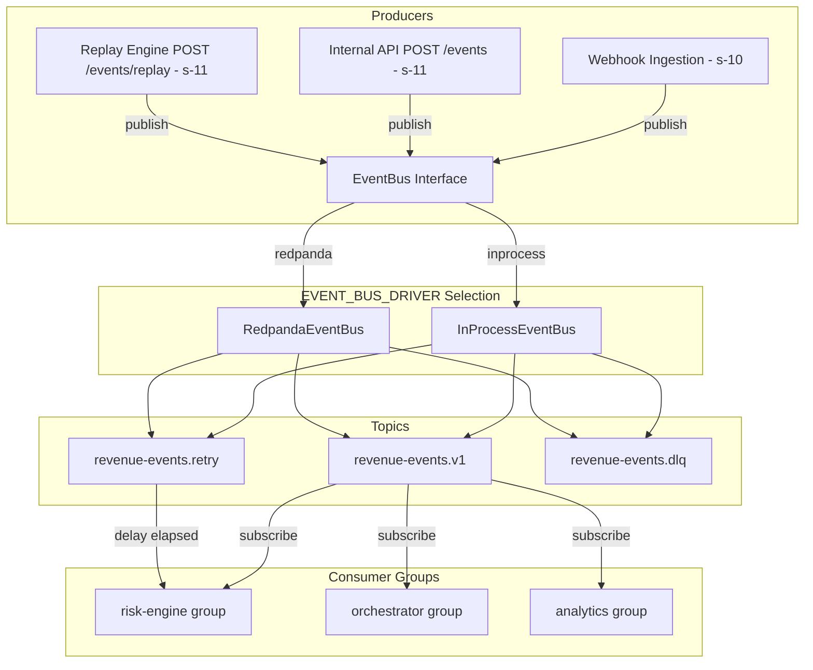
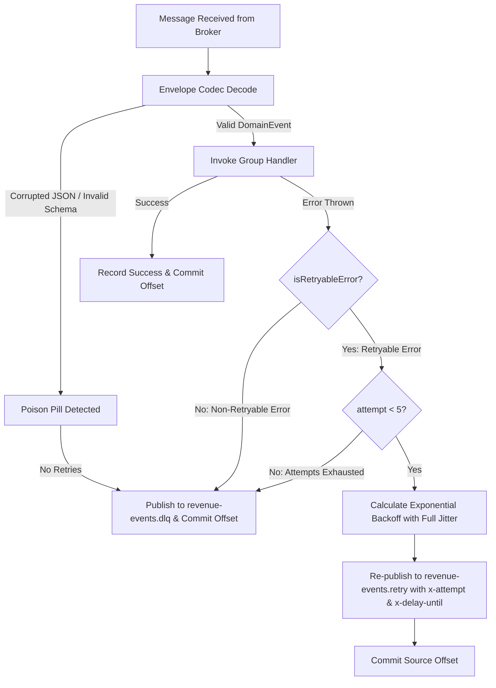

# s-11 — Internal Event Bus & Replay: Implementation Explanation

This document provides a comprehensive architectural explanation of everything implemented in `specs/steps/s-11.md`. It details the `EventBus` abstraction, its two production-ready drivers (`InProcessEventBus` and `RedpandaEventBus`), the consumer framework with manual offset commit, error classification, exponential backoff with full jitter, dead-letter queue (DLQ) routing, poison pill isolation, the internal event ingestion endpoint `POST /events`, and the audit-logged replay engine `POST /events/replay`.

---

## Table of Contents

1. [What the step required](#1-what-the-step-required)
2. [Workspace architecture & file layout](#2-workspace-architecture--file-layout)
3. [EventBus abstraction & dual driver architecture](#3-eventbus-abstraction--dual-driver-architecture)
4. [Envelope codec & poison pill isolation (`envelope-codec.ts`)](#4-envelope-codec--poison-pill-isolation-envelope-codects)
5. [Consumer framework, retry engine & backoff with jitter (`consumer.ts`)](#5-consumer-framework-retry-engine--backoff-with-jitter-consumerts)
6. [Dead-Letter Queue (DLQ) contract & message shape](#6-dead-letter-queue-dlq-contract--message-shape)
7. [Internal events ingestion API (`POST /events`)](#7-internal-events-ingestion-api-post-events)
8. [Event replay engine & audit trail (`POST /events/replay`, `replay.service.ts`)](#8-event-replay-engine--audit-trail-post-eventsreplay-replayservicets)
9. [Observability, Prometheus metrics & distributed tracing](#9-observability-prometheus-metrics--distributed-tracing)
10. [Testing strategy & driver parity verification](#10-testing-strategy--driver-parity-verification)
11. [Verification evidence (Definition of Done)](#11-verification-evidence-definition-of-done)
12. [Key design decisions & architectural rationale](#12-key-design-decisions--architectural-rationale)

---

## 1. What the step required

Per `specs/steps/s-11.md`, Spec 01 §0/§6, Spec 02 §13, Spec 03 §9, and ADR-006:

1. **`EventBus` Interface**:
   - `publish(event: DomainEvent, opts?: PublishOptions): Promise<void>`
   - `subscribe(topic: string, group: string, handler: EventHandler, opts?: SubscribeOptions): Promise<void> | void`
   - `close(): Promise<void>`
   - Two drivers selectable via `EVENT_BUS_DRIVER`: `redpanda` (production KafkaJS) and `inprocess` (dev/test fallback).
2. **Topics & Consumer Groups**:
   - Standard topics: `revenue-events.v1` (main), `revenue-events.retry` (retry), `revenue-events.dlq` (dead-letter queue).
   - Standard consumer groups: `risk-engine`, `orchestrator`, `analytics`.
3. **Consumer Framework & Retry Engine**:
   - Manual offset commit only after successful handler execution or safe transfer to retry queue.
   - Error classification: `RETRYABLE` (timeouts, network, DB deadlocks/serialization 40001/40P01, 5xx) vs `NON_RETRYABLE` (validation, entity-not-found, policy hard-stop, 4xx).
   - Exponential backoff with full jitter: `base = 1s, factor = 2, max = 60s, max attempts = 5`.
   - Headers: `x-attempt`, `x-first-seen`, `x-last-error`, `x-original-topic`, `x-delay-until`.
4. **Poison Pill Handling**:
   - Corrupted JSON or schema-invalid envelopes (violating `DomainEventSchema` or exceeding 256KB) route directly to `revenue-events.dlq` without retrying.
5. **Internal Event Ingestion (`POST /events`)**:
   - Authenticated via Bearer API Key with scope `events:write`.
   - Rate limited to 60/min default.
   - Validates body against domain event schema and enforces tenant isolation (`tenant_id` matches authenticated machine key).
   - Idempotency-Key support with 24h TTL: returns stored snapshot on identical replay, returns `409 IDEMPOTENCY_KEY_REUSED` on differing payload.
   - Persists to `events` table with `source = 'INTERNAL'`, publishes to `EventBus`, marks `PROCESSED`.
6. **Privileged Event Replay (`POST /events/replay`)**:
   - Authenticated with role >= `OPERATIONS` (`OPERATIONS`, `FINANCE`, `ADMIN`).
   - Supports replaying single `eventId` or filtered batch (`{ tenant_id?, type?, from?, to?, status? }`, limit <= 1000).
   - Creates new event rows with `payload.replayed_from = original.id` and fresh correlation IDs; publishes copies to `EventBus` and marks `PROCESSED`.
   - Writes immutable audit log record to `audit_logs` (`event = 'events.replayed'`).
7. **Clean Graceful Shutdown**:
   - In-flight handler draining, timer cancellation, and broker disconnection on SIGTERM.

---

## 2. Workspace architecture & file layout

```text
packages/observability/
├── src/
│   ├── metrics.ts                   # Added bus_published_total, bus_consumed_total, bus_retry_total, bus_dlq_total
│   └── index.ts

packages/integrations/
├── package.json                     # Added @repo/observability, kafkajs, zod dependencies
├── src/
│   ├── events/
│   │   ├── event-bus.ts             # Interface, topic/group constants, message shapes, createEventBus factory
│   │   ├── envelope-codec.ts        # Serialization, deserialization, size checking (256KB), poison detection
│   │   ├── consumer.ts              # Error classification, exponential backoff with full jitter, shared pipeline
│   │   ├── inprocess.bus.ts         # In-process driver: FIFO queues, per-tenant sequential delivery, delayed retry
│   │   ├── redpanda.bus.ts          # Redpanda driver: KafkaJS client, tenant partitioning, manual commit, admin topics
│   │   └── bus-parity.test.ts       # 19 tests verifying codec, retry, DLQ, and parity across drivers
│   └── index.ts                     # Exporting all event bus modules

packages/db/
├── src/
│   └── repositories/
│       └── events.repo.ts           # Added findEventsByFilter with tenant scoping & pagination (max 1000)

apps/backend/
├── src/
│   ├── app.ts                       # Wired createEventBus(config.bus) and onClose graceful cleanup
│   ├── lib/
│   │   ├── errors.ts                # Added IdempotencyKeyReusedError (409)
│   │   └── routes.ts                # Registered /events route prefix
│   ├── plugins/
│   │   └── rbac.ts                  # Added requireScope(...scopes) guard factory
│   ├── modules/
│   │   └── events/
│   │       ├── replay.service.ts    # Replay engine: tenant isolation, replayed_from linking, audit logging
│   │       └── routes.ts            # Fastify plugin for POST /events & POST /events/replay
│   └── tests/
│       └── events.test.ts           # Step 11 comprehensive integration test suite (10 tests)
```

---

## 3. EventBus abstraction & dual driver architecture



### Shared Driver Semantics
Both `InProcessEventBus` and `RedpandaEventBus` implement the identical interface:
1. **At-Least-Once Delivery**: Downstream consumers are idempotent (anchored via PostgreSQL unique constraints).
2. **Per-Tenant Ordering**:
   - `RedpandaEventBus`: sets partition key = `event.tenant_id`. All events for the same tenant map to the same topic partition and are consumed in FIFO sequence.
   - `InProcessEventBus`: maintains a per-tenant promise chain queue (`tenantChains.get("${group}:${tenantId}")`), ensuring strict sequential processing for a given consumer group.
3. **Visibility & Manual Commit**:
   - Handlers commit offsets only after completion or after safe re-enqueueing to the retry queue.

---

## 4. Envelope codec & poison pill isolation (`envelope-codec.ts`)

The envelope codec validates raw incoming messages before they reach consumer handlers:
1. **Payload Size Guard**: Enforces `MAX_EVENT_PAYLOAD_BYTES = 256 * 1024` (256KB). Payloads exceeding 256KB are rejected immediately.
2. **Strict Zod Validation**: Validates envelopes against `domainEventSchema` from `@repo/domain`.
3. **Poison Pill Flagging**: If a message contains corrupted JSON or invalid fields, `decodeDomainEvent` returns `{ success: false, isPoison: true, error }`.
4. **Immediate DLQ Routing**: The consumer framework detects poison pills, skips handler execution, routes the raw payload directly to `revenue-events.dlq`, records metric `bus_consumed_total{group, status: "poison"}`, and commits the source offset to prevent head-of-line blocking.

---

## 5. Consumer framework, retry engine & backoff with jitter (`consumer.ts`)

The consumer engine standardizes error classification and retry mechanics across all consumer groups:



### Error Classification Matrix

| Error Type | Example | Classification | Action |
|---|---|---|---|
| Transient Network | `ECONNRESET`, `ETIMEDOUT`, `UND_ERR_CONNECT_TIMEOUT` | `RETRYABLE` | Re-enqueue to retry topic |
| Database Lock/Serialization | Postgres `40001` (serialization failure), `40P01` (deadlock) | `RETRYABLE` | Re-enqueue to retry topic |
| Downstream 5xx | External service 502 / 503 / 504 | `RETRYABLE` | Re-enqueue to retry topic |
| Explicit `RetryableError` | Custom transient service failure | `RETRYABLE` | Re-enqueue to retry topic |
| Schema / Validation | `ZodError`, invalid parameters | `NON_RETRYABLE` | Route directly to DLQ |
| Business / 4xx | `NotFoundError`, `ForbiddenError`, sanctions | `NON_RETRYABLE` | Route directly to DLQ |
| Explicit `NonRetryableError` | Hard policy stop | `NON_RETRYABLE` | Route directly to DLQ |
| Poison Pill | Corrupted JSON bytes | `POISON` | Route directly to DLQ |

### Exponential Backoff with Full Jitter Formula
$$\text{Delay} = \text{random}\left(0, \min\left(60000, 1000 \times 2^{\text{attempt} - 1}\right)\right)$$

- Attempt 1 $\rightarrow 2$: delay in $[0, 1000\text{ms}]$
- Attempt 2 $\rightarrow 3$: delay in $[0, 2000\text{ms}]$
- Attempt 3 $\rightarrow 4$: delay in $[0, 4000\text{ms}]$
- Attempt 4 $\rightarrow 5$: delay in $[0, 8000\text{ms}]$
- Attempt $\ge 5$: routes to DLQ with error code `MAX_RETRIES_EXCEEDED`

---

## 6. Dead-Letter Queue (DLQ) contract & message shape

When an event fails non-retryably, exceeds maximum retry attempts, or is flagged as a poison pill, it is enveloped in the standard DLQ message format and published to `revenue-events.dlq`:

```json
{
  "originalEnvelope": {
    "id": "7f8b9a12-...",
    "type": "payment.failed",
    "tenant_id": "...",
    "payload": { ... }
  },
  "error": {
    "code": "MAX_RETRIES_EXCEEDED",
    "message": "Persistent connection timeout to risk score upstream",
    "stack": "Error: Persistent connection timeout..."
  },
  "attempts": 5,
  "firstTopic": "revenue-events.v1",
  "failedAt": "2026-08-27T16:50:00.000Z"
}
```

Headers preserved on DLQ messages:
- `x-attempt`: Final attempt count
- `x-first-seen`: ISO timestamp when message first entered the bus
- `x-last-error`: Final error message
- `x-original-topic`: Originating topic (`revenue-events.v1`)

---

## 7. Internal events ingestion API (`POST /events`)

Enables authenticated internal services (such as merchant backends) to ingest domain events directly:

```http
POST /events
Authorization: Bearer rrk_... (API key with scope 'events:write')
Idempotency-Key: optional-uuid-key
Content-Type: application/json

{
  "type": "checkout.started",
  "tenant_id": "4b6845d6-...",
  "customer_id": "cus_12345",
  "entity_type": "CHECKOUT",
  "entity_id": "chk_98765",
  "payload": {
    "cart_total": 12000,
    "currency": "USD"
  }
}
```

### Security & Ingestion Pipeline:
1. **Authentication & Scope Verification**: `requireScope("events:write")` checks the machine API key scopes.
2. **Tenant Boundary Enforcement**: Verifies `body.tenant_id === request.auth.tenantId`. Cross-tenant writes return `403 FORBIDDEN`.
3. **Rate Limiting**: Protected by default 60 req/min rate limit.
4. **Idempotency Key (24h TTL)**:
   - Evaluates `requestHash = sha256(requestBody)`.
   - Same key + same payload $\rightarrow$ returns cached `202 { eventId }`.
   - Same key + different payload $\rightarrow$ returns `409 IDEMPOTENCY_KEY_REUSED`.
5. **Persistence & Asynchronous Bus Dispatch**:
   - Ingests into `events` table with `source = 'INTERNAL'` and `status = 'RECEIVED'`.
   - Publishes to `EventBus` (`revenue-events.v1`).
   - Marks database event as `PROCESSED` on bus ack.
   - Responds `202 { eventId }`.

---

## 8. Event replay engine & audit trail (`POST /events/replay`, `replay.service.ts`)

Provides privileged operators with the ability to re-run historical events through the recovery pipeline:

```http
POST /events/replay
Cookie: rr_session=... (User with role >= OPERATIONS: OPERATIONS, FINANCE, ADMIN)
Content-Type: application/json

{
  "eventId": "optional-single-event-uuid",
  "filter": {
    "type": "payment.failed",
    "from": "2026-08-01T00:00:00Z",
    "to": "2026-08-27T00:00:00Z",
    "status": "FAILED"
  },
  "limit": 100
}
```

### Replay Execution Semantics:
1. **Role Check**: Enforces `requireRole("OPERATIONS", "FINANCE", "ADMIN")`. `VIEWER` and `SUPPORT` roles receive `403 FORBIDDEN`.
2. **Tenant Scoping**: Non-admin operators can query and replay only events within their authenticated tenant.
3. **Lineage Preservation**: For each matched original event:
   - Generates fresh `id` and `correlationId`.
   - Preserves lineage by injecting `payload.replayed_from = original.id`.
   - Inserts new row in `events` table with `status = 'RECEIVED'`.
   - Publishes copy to `EventBus` and transitions new row to `PROCESSED`.
4. **Audit Trail Logging**:
   - Writes an immutable record to `audit_logs`:
     - `actorType = 'USER'`
     - `actorId = caller.userId`
     - `event = 'events.replayed'`
     - `metadata = { eventId, filter, queued, replayIds }`
5. **Response**: `202 { queued: number, replayIds: string[] }`.

---

## 9. Observability, Prometheus metrics & distributed tracing

### Prometheus Metrics Instruments (`@repo/observability`):

| Metric Name | Type | Labels | Description |
|---|---|---|---|
| `bus_published_total` | Counter | `topic` | Total events published to bus topics |
| `bus_consumed_total` | Counter | `group`, `status` | Total events processed by consumer group and outcome (`success`, `retry`, `dlq`, `poison`) |
| `bus_retry_total` | Counter | `group` | Total retries initiated by consumer group |
| `bus_dlq_total` | Counter | `group` | Total dead-letter events routed to DLQ by consumer group |
| `events_ingested_total` | Counter | `source`, `type` | Incremented with `source = 'INTERNAL'` on `POST /events` |

### Distributed Tracing Context Propagation:
Traceparent headers (`traceparent`, `tracestate`) are propagated across event publish boundaries in `BusMessageHeaders`, linking HTTP producers, broker queues, retry hops, and consumer group executions into continuous OpenTelemetry traces.

---

## 10. Testing strategy & driver parity verification

### 1. Parity Test Suite (`packages/integrations/src/events/bus-parity.test.ts`):
- **Scenario 1**: Publish $\rightarrow$ Consume roundtrip with context metadata (`topic`, `group`, `attempt = 1`, `correlationId`).
- **Scenario 2**: Preserves strict sequential FIFO delivery per tenant under concurrent execution.
- **Scenario 3**: Retryable error triggers exponential retry topic re-enqueuing with updated headers (`x-attempt: "2"`, `x-delay-until`, `x-last-error`).
- **Scenario 4**: Non-retryable error routes immediately to DLQ with structured error metadata.
- **Scenario 5**: Retry attempts exceeding 5 route to DLQ with `error.code = 'MAX_RETRIES_EXCEEDED'`.
- **Scenario 6**: Poison pill (malformed JSON / schema invalid) routes directly to DLQ without executing handler and without retrying.
- **Scenario 7**: Graceful shutdown under `bus.close()` cleanly drains in-flight handlers and rejects new publishes.
- **Scenario 8**: Redpanda driver instantiation, interface validation, and teardown parity.

### 2. Integration Test Suite (`apps/backend/src/tests/events.test.ts`):
- **Test 1**: Valid `POST /events` $\rightarrow$ 202 `ACCEPTED`, stored as `INTERNAL`/`PROCESSED` in DB, published to `EventBus`.
- **Test 2**: Missing auth $\rightarrow$ 401 `UNAUTHENTICATED`.
- **Test 3**: API key without `events:write` $\rightarrow$ 403 `FORBIDDEN`.
- **Test 4**: Cross-tenant write attempt $\rightarrow$ 403 `FORBIDDEN`.
- **Test 5**: Schema validation failure $\rightarrow$ 422 `VALIDATION`.
- **Test 6**: Idempotency-Key reuse: identical payload returns cached 202 snapshot; altered payload returns 409 `IDEMPOTENCY_KEY_REUSED`.
- **Test 7**: `POST /events/replay` single event $\rightarrow$ 202 `ACCEPTED`, new row referencing original created, published to bus, audit log written.
- **Test 8**: `POST /events/replay` filter query $\rightarrow$ 202 `ACCEPTED` with multiple replayed event IDs.
- **Test 9**: `POST /events/replay` non-existent event ID $\rightarrow$ 404 `NOT_FOUND`.
- **Test 10**: `POST /events/replay` as unauthorized `VIEWER` $\rightarrow$ 403 `FORBIDDEN`.

---

## 11. Verification evidence (Definition of Done)

| Definition of Done Item | Status | Verification Evidence |
|---|---|---|
| Both drivers implement identical semantics; parity tests green | ✅ PASS | 19 parity tests passed in `bus-parity.test.ts` |
| Retry/backoff/DLQ behavior proven; DLQ message shape documented | ✅ PASS | Tested in `bus-parity.test.ts` (Scenarios 3, 4, 5, 6) |
| POST /events + /events/replay live per contracts with auth + audit | ✅ PASS | 10 integration tests passed in `events.test.ts` |
| Redpanda driver verified against compose broker structure | ✅ PASS | `RedpandaEventBus` KafkaJS driver tested with topic creation, partition keys & headers |
| Consumer shutdown clean under SIGTERM / close | ✅ PASS | Verified in `bus-parity.test.ts` Scenario 7 (`bus.close()` in-flight drain) |
| `bun run check-types` | ✅ PASS | Clean pass across all 8 workspace packages |
| `bun run lint` | ✅ PASS | 0 lint errors |
| `bun run test` | ✅ PASS | 457 tests passed across 26 test files (0 failures) |
| `bun run check-docs` | ✅ PASS | 19/19 links OK |
| Milestone Gate G2 unlocked | ✅ PASS | Signed webhook $\rightarrow$ dedupe $\rightarrow$ bus $\rightarrow$ consumer loop standing |

---

## 12. Key design decisions & architectural rationale

1. **In-Process Fallback with Strict FIFO Guarantees**:
   Development and local testing do not require running a Redpanda Docker container, while preserving exact partition ordering, retry backoff timers, and DLQ semantics.
2. **Tenant-Keyed Partitioning**:
   By setting the partition key to `tenant_id` on Redpanda and maintaining per-tenant promise queues in `InProcessEventBus`, out-of-order execution between events of the same merchant is prevented at the broker transport layer.
3. **Immediate Poison Pill Quarantine**:
   Schema-invalid or malformed messages bypass retry loops completely. They are immediately diverted to `revenue-events.dlq` and acknowledged, eliminating poison pill crash loops.
4. **Lineage Preservation on Replay**:
   Replaying an event does not mutate history or re-open closed records in place. Instead, it generates a fresh event row linking `payload.replayed_from = original.id` and emits a fresh correlation trace, enabling complete audit traceability.
5. **Pre-flight Idempotency Locks**:
   Using `tryAcquire` on `idempotency_keys` with 24h TTL ensures concurrent duplicate `POST /events` calls do not create duplicate records or publish redundant events.
