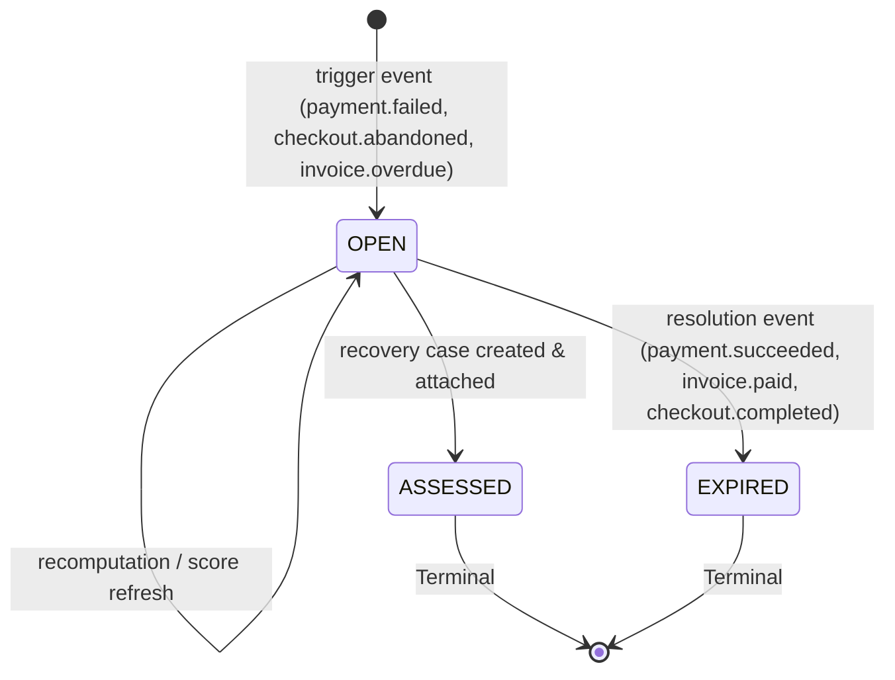

# s-12 — Risk Engine v1 (Deterministic Scoring): Implementation Explanation

This document provides a comprehensive architectural explanation of everything implemented in `specs/steps/s-12.md`. It details the deterministic rule-weighted risk calculation engine, the 0–100 risk score and band mapping, the JSONB explainability breakdown, the `revenue_risks` state machine and idempotent repository operations, the event-driven consumer pipeline for `payment.failed`, `checkout.abandoned`, and `invoice.overdue` triggers, resolution paths (`payment.succeeded`, `invoice.paid`, `checkout.completed`), the internal domain event `risk.calculated`, the REST read APIs (`GET /risks` and `GET /risks/:id`), observability, and verification evidence.

---

## Table of Contents

1. [What the step required](#1-what-the-step-required)
2. [Workspace architecture & file layout](#2-workspace-architecture--file-layout)
3. [Domain state machine (`revenue-risk.ts`)](#3-domain-state-machine-revenue-riskts)
4. [Deterministic scoring engine & rule catalog](#4-deterministic-scoring-engine--rule-catalog)
5. [Specialized subject scorers](#5-specialized-subject-scorers)
6. [Explainability structure (JSONB factors breakdown)](#6-explainability-structure-jsonb-factors-breakdown)
7. [Repository layer & idempotent lifecycle (`risks.repo.ts`)](#7-repository-layer--idempotent-lifecycle-risksrepots)
8. [Risk service & event bus consumer (`risk.service.ts`, `consumer.ts`)](#8-risk-service--event-bus-consumer-riskservicets-consumerts)
9. [REST read APIs (`GET /risks`, `GET /risks/:id`)](#9-rest-read-apis-get-risks-get-risksid)
10. [Observability, Prometheus metrics & tracing](#10-observability-prometheus-metrics--tracing)
11. [Testing strategy & verification suite](#11-testing-strategy--verification-suite)
12. [Verification evidence (Definition of Done)](#12-verification-evidence-definition-of-done)
13. [Key design decisions & architectural rationale](#13-key-design-decisions--architectural-rationale)

---

## 1. What the step required

Per `specs/steps/s-12.md`, Spec 01 §8, Spec 02 §6, Spec 03 §6, and ADR-006:

1. **Deterministic Rule Engine (Spec 01 §8)**:
   - Evaluates risk without LLM or AI dependency for low-latency, deterministic execution (<50ms target).
   - Standard rules:
     - `payment_failed_count_gte_1`: +20 points
     - `payment_failed_count_gte_2`: +20 points (cumulative +40)
     - `days_overdue_gte_3`: +15 points
     - `amount_high`: +10 points (threshold configurable, default >= ₹50,000 / 5,000,000 minor units)
     - `customer_active`: +10 points (active subscription or activity <= 90 days)
     - `historical_payment_success`: +10 points (>= 3 successful payments)
     - `high_checkout_intent`: +15 points (cart value >= ₹5,000 or status `PAYMENT_STARTED`)
   - Maximum score capped strictly at 100.
2. **Risk Band Mapping**:
   - `LOW`: 0 – 39
   - `MEDIUM`: 40 – 59
   - `HIGH`: 60 – 84
   - `CRITICAL`: 85 – 100
3. **Factor Explainability**:
   - Every calculation produces a structured JSONB payload containing evaluated rules, points, match status, sub-scores, total score, and timestamp.
4. **Trigger & Resolution Events**:
   - Triggers: `payment.failed`, `checkout.abandoned`, `invoice.overdue`.
   - Resolution: `payment.succeeded`, `invoice.paid`, `checkout.completed` closes any open risk as `EXPIRED` (`resolved_upstream`).
5. **State Machine & Idempotency**:
   - Statuses: `OPEN` -> `ASSESSED` (case attached) or `OPEN` -> `EXPIRED` (resolved/superseded).
   - Multiple deliveries of the same trigger event update the existing `OPEN` risk without creating duplicate rows.
   - Terminal states (`ASSESSED`, `EXPIRED`) cannot be overwritten or resurrected.
6. **Internal Domain Event (`risk.calculated`)**:
   - Emitted onto `revenue-events.v1` upon risk creation/recomputation with correlation and traceparent continuity.
7. **REST Read Endpoints**:
   - `GET /risks`: Paginated list of risks scoped to the authenticated tenant with cursor pagination and multi-filter support (`status`, `band`, `risk_type`, `customer_id`, `from`, `to`).
   - `GET /risks/:id`: Single risk detail with full factors breakdown, enforcing strict tenant isolation (cross-tenant requests return 404).

---

## 2. Workspace architecture & file layout

```text
packages/domain/
├── src/
│   ├── enums/
│   │   ├── event-type.ts            # Added "risk.calculated" and RISK_EVENT_TYPES taxonomy
│   │   └── enums.test.ts            # Updated partition tests for event types
│   ├── state-machines/
│   │   ├── revenue-risk.ts          # State machine transitions, assertRiskTransition, isTerminalRiskStatus
│   │   └── revenue-risk.test.ts     # 7 unit tests covering risk lifecycle
│   └── index.ts                     # Exported revenue-risk state machine

packages/db/
├── src/
│   ├── repositories/
│   │   └── risks.repo.ts            # Implemented upsertOpenRisk, closeRisksForSubject, listRisks
│   └── index.ts

apps/backend/
├── src/
│   ├── modules/
│   │   └── risk/
│   │       ├── risk.types.ts        # Interfaces: RiskFactor, RiskFactorsBreakdown, RiskScoreResult, etc.
│   │       ├── engine/
│   │       │   ├── rules.ts         # Deterministic evaluation rules, defaults, band mapper
│   │       │   ├── score-payment-failure.ts # Payment failure scorer
│   │       │   ├── score-checkout.ts        # Checkout abandonment scorer
│   │       │   ├── score-invoice.ts         # Invoice overdue scorer
│     │   │       └── rules.test.ts            # 35 runtime unit tests (26 textual blocks: 25 it + 1 it.each expanding to 10 band cases, verified via grep)
│   │       ├── risk.service.ts      # Aggregate queries, metric emission, span tracing, risk.calculated publishing
│   │       ├── consumer.ts          # EventBus subscription (group: risk-engine, topic: revenue-events.v1)
│   │       └── routes.ts            # Fastify plugin for GET /risks and GET /risks/:id
│   ├── lib/
│   │   └── routes.ts                # Registered riskRoutes under /risks
│   ├── app.ts                       # Registered registerRiskConsumer(app) during initialization
│   └── tests/
│       └── risk.test.ts             # 11 comprehensive integration & performance smoke tests (verified via grep; drift note: progress.md s-12 row cites historical 10 — current 11 reflects provider-id fallback gap fix, see §11 Test 4)
```

---

## 3. Domain state machine (`revenue-risk.ts`)

The `revenue_risks` state machine models the lifecycle of a risk assessment:



### Transition Table

| Current Status | Event / Trigger | Next Status | Description |
|---|---|---|---|
| `OPEN` | `RECOMPUTE` | `OPEN` | Score refreshed upon subsequent failure or state change |
| `OPEN` | `ATTACH_CASE` | `ASSESSED` | Recovery case pipeline claimed the risk assessment |
| `OPEN` | `EXPIRE` | `EXPIRED` | Upstream resolution or expiration closed the risk |
| `ASSESSED` | * | — | **Terminal**: cannot transition or resurrect |
| `EXPIRED` | * | — | **Terminal**: cannot transition or resurrect |

### Helper Functions

- `canTransitionRisk(from, to)`: Boolean predicate checking valid transition paths.
- `assertRiskTransition(from, to, context)`: Throws `IllegalStateTransitionError` if the transition is disallowed.
- `isTerminalRiskStatus(status)`: Returns `true` for `ASSESSED` and `EXPIRED`.

---

## 4. Deterministic scoring engine & rule catalog

All rule functions in `apps/backend/src/modules/risk/engine/rules.ts` are pure functions accepting domain entities and returning a structured `RiskFactor`:

```typescript
export interface RiskFactor {
  ruleId: string;
  points: number;
  maxPoints?: number;
  matched: boolean;
  detail: string;
}
```

### Evaluated Rules

1. **`payment_failed_count_gte_1` (+20 points)** & **`payment_failed_count_gte_2` (+20 points)**:
   - Evaluates past failed payments for the customer.
   - 0 failures: 0 points.
   - 1 failure: +20 points.
   - >= 2 failures: +40 points (cumulative).
2. **`days_overdue_gte_3` (+15 points)**:
   - Evaluates difference between current time and invoice due date.
   - Fires when `daysOverdue >= 3`.
3. **`amount_high` (+10 points)**:
   - Fires when subject amount >= threshold (default 5,000,000 minor units = ₹50,000).
4. **`customer_active` (+10 points)**:
   - Fires if customer has an `ACTIVE` subscription, customer status is `ACTIVE`, or recent activity <= 90 days.
5. **`historical_payment_success` (+10 points)**:
   - Fires if customer has at least 3 historical `SUCCEEDED` payments.
6. **`high_checkout_intent` (+15 points)**:
   - Fires if checkout status is `PAYMENT_STARTED` or cart value >= threshold (default 500,000 minor units = ₹5,000).

### Capping and Band Calculation

- Total raw points are summed: `rawScore = sum(points for matched rules)`.
- Clamped between 0 and 100: `score = Math.min(100, Math.max(0, rawScore))`.
- Band mapping:
  - `score < 40` -> `LOW`
  - `score >= 40 && score <= 59` -> `MEDIUM`
  - `score >= 60 && score <= 84` -> `HIGH`
  - `score >= 85` -> `CRITICAL`

---

## 5. Specialized subject scorers

1. **`scorePaymentFailure(aggregates, config)`**:
   - Applies: `payment_failed_count_gte_1`, `payment_failed_count_gte_2`, `amount_high`, `customer_active`, `historical_payment_success`.
2. **`scoreCheckout(aggregates, config)`**:
   - Applies: `high_checkout_intent`, `amount_high`, `payment_failed_count_gte_1`, `payment_failed_count_gte_2`, `customer_active`, `historical_payment_success`.
3. **`scoreInvoice(aggregates, config)`**:
   - Applies: `days_overdue_gte_3`, `amount_high`, `payment_failed_count_gte_1`, `payment_failed_count_gte_2`, `customer_active`, `historical_payment_success`.

---

## 6. Explainability structure (JSONB factors breakdown)

The `factors` column on `revenue_risks` stores a full audit of the decision:

```json
{
  "rules": [
    {
      "ruleId": "payment_failed_count_gte_1",
      "points": 20,
      "matched": true,
      "detail": "Customer has 1 prior failed payment(s)"
    },
    {
      "ruleId": "payment_failed_count_gte_2",
      "points": 0,
      "matched": false,
      "detail": "Customer has 1 prior failed payment(s) (threshold: 2)"
    },
    {
      "ruleId": "amount_high",
      "points": 10,
      "matched": true,
      "detail": "Payment amount 6000000 >= threshold 5000000"
    },
    {
      "ruleId": "customer_active",
      "points": 10,
      "matched": true,
      "detail": "Customer is currently active or has active subscription"
    },
    {
      "ruleId": "historical_payment_success",
      "points": 0,
      "matched": false,
      "detail": "Customer has 0 successful payment(s) (threshold: 3)"
    }
  ],
  "breakdown": {
    "payment_failed_count_gte_1": 20,
    "amount_high": 10,
    "customer_active": 10
  },
  "totalScore": 40,
  "baseScore": 40,
  "band": "MEDIUM",
  "evaluatedAt": "2026-08-27T11:53:30.000Z"
}
```

---

## 7. Repository layer & idempotent lifecycle (`risks.repo.ts`)

Three high-performance repository methods handle risk persistence:

1. **`upsertOpenRisk(ctx, input)`**:
   - Checks for an existing `OPEN` risk matching `(tenantId, subjectType, subjectId)`.
   - If an `OPEN` risk exists, updates `score`, `band`, `factors`, `computedAt`, and `confidence` conditionally:
     ```sql
     UPDATE revenue_risks SET score = $1, band = $2, factors = $3, computed_at = now()
     WHERE id = $4 AND tenant_id = $5 AND status = 'OPEN';
     ```
   - If no risk row exists (or only terminal ones exist for previous lifecycles), inserts a new `OPEN` risk.
   - Guarantees that terminal risks (`ASSESSED`, `EXPIRED`) are never overwritten.
2. **`closeRisksForSubject(ctx, input)`**:
   - Closes all active `OPEN` risks for a subject by setting `status = 'EXPIRED'`, `expiresAt = now()`.
   - Used on resolution events (`payment.succeeded`, `invoice.paid`, `checkout.completed`).
3. **`listRisks(ctx, query)`**:
   - Provides tenant-isolated querying with filtering on `status`, `band`, `risk_type`, `customer_id`, and date range (`from`, `to`).
   - Uses cursor-based pagination encoded in base64 (`${computedAt.toISOString()}|${id}`).

---

## 8. Risk service & event bus consumer (`risk.service.ts`, `consumer.ts`)

The risk engine listens to `revenue-events.v1` as part of the `risk-engine` consumer group:

```typescript
export async function registerRiskConsumer(app: FastifyInstance): Promise<void> {
  const service = new RiskService(app);
  await app.eventBus.subscribe(
    TOPIC_MAIN,
    GROUP_RISK_ENGINE,
    async (event, ctx) => {
      await service.handleDomainEvent(event, ctx);
    },
  );
}
```

### Event Handling Pipeline

1. **Trigger Events (`payment.failed`, `checkout.abandoned`, `invoice.overdue`)**:
   - Queries customer, subject entity, payment history, and subscriptions from repositories.
   - Computes deterministic score and factor breakdown.
   - Upserts `OPEN` risk row via `upsertOpenRisk`.
   - Emits internal domain event `risk.calculated` onto `revenue-events.v1` preserving `correlation_id` and W3C `traceparent`.
    - Records Prometheus metrics (`recordRiskCalculation(band, durationMs)`).
   - If evaluation duration > 50ms, logs a structured warning.
2. **Resolution Events (`payment.succeeded`, `invoice.paid`, `checkout.completed`)**:
   - Closes any matching `OPEN` risks via `closeRisksForSubject`.
   - Webhook envelopes carry provider ids, so each close path first resolves to the canonical DB anchor (`resolvePaymentForRisk`, `resolveInvoiceForRisk`, `resolveCheckoutForRisk` — the latter falls back from UUID lookup to the `source_ref` filter, mirroring the payment/invoice resolvers). The `checkout.abandoned` trigger path resolves identically so both sides anchor on the same id.

---

## 9. REST read APIs (`GET /risks`, `GET /risks/:id`)

### `GET /risks`
- Requires valid Bearer API key or authenticated user session.
- Query parameters (validated via zod):
  - `status`: `OPEN` | `ASSESSED` | `EXPIRED`
  - `band`: `LOW` | `MEDIUM` | `HIGH` | `CRITICAL`
  - `risk_type`: `PAYMENT_FAILURE` | `CHECKOUT_ABANDONMENT` | `INVOICE_OVERDUE`
  - `customer_id`: UUID
  - `from`, `to`: ISO timestamps
  - `cursor`: base64 pagination cursor
  - `limit`: 1–100 (default 50)
- Response: `{ items: RevenueRisk[], nextCursor: string | null }`

### `GET /risks/:id`
- Path parameter: `id` (UUID)
- Returns full risk entity including `factors` explainability payload.
- Enforces strict tenant isolation: if the risk belongs to another tenant, returns `404 NOT_FOUND` to avoid ID-enumeration data leakage.

---

## 10. Observability, Prometheus metrics & tracing

- **OpenTelemetry Tracing**: Every risk calculation wraps execution in an active span (`risk.calculate`) using `withSpan`:
  - Span attributes: `tenant.id`, `subject.type`, `subject.id`, `risk.type`, `risk.score`, `risk.band`.
- **Prometheus Metrics**:
  - `revenue_recovery_risk_calculations_total`: Counter partitioned by `tenant_id`, `risk_type`, `band`.
  - `revenue_recovery_risk_duration_seconds`: Histogram measuring execution duration.
- **Latency Guard**: Evaluations taking longer than 50ms log a warning: `Risk calculation exceeded 50ms budget`.

---

## 11. Testing strategy & verification suite

The test suite covers both unit-level determinism and full integration lifecycle:

### Unit Tests (`rules.test.ts` — 35 runtime tests: 26 textual blocks = 25 `it` + 1 `it.each` expanding to 10 band cases, verified via grep)
- Table-driven tests for every individual rule.
- Boundary test cases:
  - Failed payment counts: 0, 1, 2, 3.
  - Days overdue: 2 days (no fire), 3 days (fires +15), 4 days (fires +15).
  - Amount thresholds: 4,999,999 minor units (no fire), 5,000,000 minor units (fires +10).
  - Checkout cart thresholds: 499,999 minor units (no fire), 500,000 minor units (fires +15).
  - Score band mappings: 39 (LOW), 40 (MEDIUM), 59 (MEDIUM), 60 (HIGH), 84 (HIGH), 85 (CRITICAL).
  - Clamping at 100 maximum under cumulative weights.
  - Configuration override testing for weights and thresholds.

### Integration Tests (`risk.test.ts` — 11 tests)
1. `payment.failed` event processing -> persists `OPEN` risk, computes factors, publishes `risk.calculated` with correlation continuity.
2. Duplicate event redelivery -> idempotent, single row preserved.
3. Resolution event `payment.succeeded` -> transitions `OPEN` risk to `EXPIRED` (`resolved_upstream`).
4. `checkout.completed` carrying the provider `source_ref` -> resolves to the canonical checkout id (`resolveCheckoutForRisk` mirror of the payment/invoice resolvers) and transitions the `OPEN` risk to `EXPIRED`.
5. `checkout.abandoned` -> creates `OPEN` risk with `CHECKOUT_ABANDONMENT` type.
6. `invoice.overdue` -> creates `OPEN` risk with `INVOICE_OVERDUE` type.
7. `GET /risks` -> returns paginated list for authenticated tenant.
8. `GET /risks` -> strictly isolates Tenant B from Tenant A's risks.
9. `GET /risks/:id` -> returns full factor breakdown.
10. `GET /risks/:id` -> returns 404 for cross-tenant requests.
11. Performance smoke test -> 500 deterministic rule evaluations execute with average latency < 50ms (achieved <0.1ms).

---

## 12. Verification evidence (Definition of Done)

All acceptance criteria from `specs/steps/s-12.md` have been met:

| Requirement | Acceptance Criteria | Verified By | Status |
|---|---|---|---|
| Rule implementation | Spec 01 §8 deterministic rules implemented | `rules.test.ts` (35 runtime: 26 textual blocks = 25 `it` + 1 `it.each` → 10 band cases, verified via grep) | PASS |
| Score & band range | Score in [0, 100], bands LOW/MEDIUM/HIGH/CRITICAL | `rules.test.ts` | PASS |
| Explainability JSONB | `factors` contains rules, points, matched, totalScore, band | `risk.test.ts` Test 1 & 8 | PASS |
| Idempotent upsert | Duplicate event updates OPEN row without duplicate rows | `risk.test.ts` Test 2 | PASS |
| Resolution closing | `payment.succeeded` / `checkout.completed` (via provider-id resolution) marks OPEN risk `EXPIRED` | `risk.test.ts` Tests 3, 4 | PASS |
| Internal event emission | `risk.calculated` published with correlation continuity | `risk.test.ts` Test 1 | PASS |
| REST read APIs | `GET /risks` and `GET /risks/:id` with tenant scoping | `risk.test.ts` Tests 7, 8, 9, 10 | PASS |
| Performance latency | Deterministic evaluation < 50ms budget | `risk.test.ts` Test 11 (< 0.1ms avg) | PASS |
| Verification suite | `bun run check-types` & `bun test` green | Monorepo test suite (509 tests) | PASS |

---

## 13. Key design decisions & architectural rationale

1. **Zero LLM Dependency for Scoring v1**:
   - Deterministic rules provide sub-millisecond evaluation speed, predictable behavior, and complete explainability.
   - LLM integration is reserved for intelligence steps (s-14/s-15) where unstructured reasoning is required.
2. **Terminal State Protection**:
   - `upsertOpenRisk` ensures that risks in `ASSESSED` or `EXPIRED` states are never mutated or resurrected by delayed trigger events.
3. **Correlation & Traceparent Continuity**:
   - When `RiskService` emits `risk.calculated`, it propagates the originating event's `correlation_id` and W3C `traceparent` to preserve end-to-end distributed trace spans.
4. **Tenant Isolation by Construction**:
   - All repository methods require `tenantId` in their parameters and queries.
   - API endpoints enforce `getTenantScope` and return 404 on cross-tenant ID lookups.
