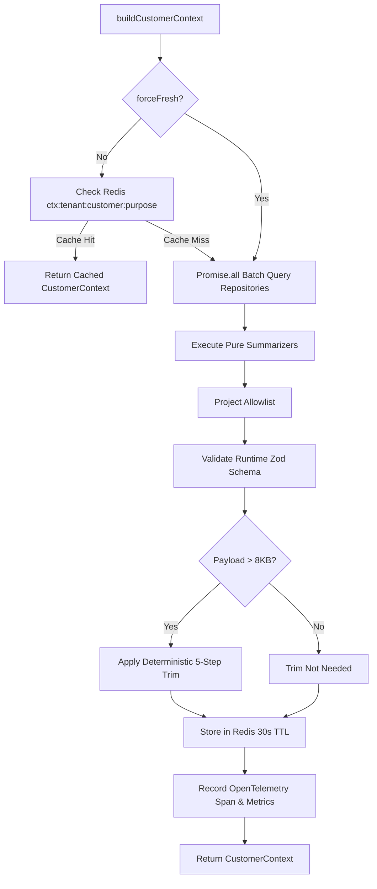

# s-13 — Customer Context Service: Implementation Explanation

This document provides a comprehensive architectural explanation of everything implemented in `specs/steps/s-13.md`. It details the customer context builder module, strict field allowlist, deterministic PII redaction and masking, 8KB budget enforcement with deterministic trimming, 30-second Redis caching with purposeful stale tolerance and opt-out invalidation, the internal `CustomerContextService.buildForCase(caseId)` API consumed by AI decisioning (s-14), the Fastify `GET /customers/:id/context` route with authentication/RBAC and tenant isolation, OpenTelemetry instrumentation, and complete test suite verification.

---

## Table of Contents

1. [What the step required](#1-what-the-step-required)
2. [Workspace architecture & file layout](#2-workspace-architecture--file-layout)
3. [Context schema & section breakdown](#3-context-schema--section-breakdown)
4. [Field allowlist & PII masking (`allowlist.ts`)](#4-field-allowlist--pii-masking-allowlistts)
5. [Pure summarizers (`summarize.ts`)](#5-pure-summarizers-summarizets)
6. [Deterministic 8KB budget trimming (`trim.ts`)](#6-deterministic-8kb-budget-trimming-trimts)
7. [Context builder & Redis caching pipeline (`builder.ts`)](#7-context-builder--redis-caching-pipeline-builderts)
8. [Customer context service (`customer-context.service.ts`)](#8-customer-context-service-customer-contextservicets)
9. [REST API (`GET /customers/:id/context`)](#9-rest-api-get-customersidcontext)
10. [Observability, Prometheus metrics & tracing](#10-observability-prometheus-metrics--tracing)
11. [Testing strategy & verification suite](#11-testing-strategy--verification-suite)
12. [Verification evidence (Definition of Done)](#12-verification-evidence-definition-of-done)
13. [Key design decisions & architectural rationale](#13-key-design-decisions--architectural-rationale)

---

## 1. What the step required

Per `specs/steps/s-13.md`, Spec 01 §9, Spec 02 §7, Spec 03 §6, ADR-007, ADR-008, ADR-009, ADR-011, and ADR-012:

1. **Deterministic Customer Context Builder**:
   - Single parallel batch query gathering customer profile, payments (180d window), subscriptions, open/overdue invoices, checkouts (90d window), prior recovery cases with outcomes, communication history (14d/7d windows), and preferences.
   - Built in $<100\text{ms}$ p95 without N+1 query patterns.
2. **Strict Field Allowlist (Spec 01 §9)**:
   - Typed projection allowlisting only approved fields; database entities are never passed directly to prompts or read APIs.
   - Runtime validation with strict Zod schemas (`.strict()`) rejecting any unknown injected keys.
3. **PII Masking & Privacy (ADR-008, Spec 01 §9)**:
   - Email addresses masked as `j***@d***.com` (preserving domain structure and first initial).
   - Phone numbers masked as `+1***2671` (preserving country prefix and trailing 4 digits).
   - Absolute zero raw credit card PANs, full emails, or raw phone numbers permitted in context payloads.
4. **8KB Hard Size Budget & Trimming**:
   - Hard payload limit of 8,192 bytes ($8\text{KB}$) for AI prompt safety.
   - Deterministic 5-step trimming drop order when oversized, while unconditionally preserving critical policy invariants (`opted_out`, `prior_cases`, `last_failure_code`, `whatsapp_last_7d`, `email_last_14d`, `sms_last_7d`).
5. **Redis Caching & TTL**:
   - Cached in Redis at key `ctx:{tenantId}:{customerId}:{purpose}` with 30s TTL.
   - Supports purpose distinction (`api_read` vs `ai_decision` with up to 60s stale tolerance on backend failures).
   - Instant cache invalidation on customer opt-out changes, new messages, or outcome records.
6. **Internal Consumer API**:
   - `CustomerContextService.buildForCase(caseId)`: Resolves case $\to$ customer and generates purpose=`ai_decision` context for LLM recovery strategy generation in s-14.
   - Raises `CASE_NOT_FOUND` (404) if the case does not exist or crosses tenant boundaries.
7. **REST Endpoint**:
   - `GET /customers/:id/context`: Authenticated route (`role >= VIEWER`, `scope: customers:read` or `*`), returning `X-Context-Built-At` and `X-Context-Bytes` response headers.
   - Strict tenant isolation returning 404 for cross-tenant access to prevent customer existence leakage.

---

## 2. Workspace architecture & file layout

```
apps/backend/
├── src/
│   ├── lib/
│   │   ├── errors.ts                                 # ContextUnavailableError (503), CaseNotFoundError (404), CustomerMissingError (404)
│   │   └── routes.ts                                 # Registered /customers routes prefix
│   ├── modules/
│   │   └── customers/
│   │       ├── context/
│   │       │   ├── types.ts                          # Strict Zod schemas & TypeScript types for all 8 context sections
│   │       │   ├── allowlist.ts                      # Single source of truth field allowlist, maskEmail, maskPhone, projectAllowlist
│   │       │   ├── summarize.ts                      # Pure aggregation functions across customer, billing, recovery, & comms
│   │       │   ├── trim.ts                           # Deterministic 8KB budget trimming with 5-step fallback order
│   │       │   ├── builder.ts                        # Parallel query executor, Redis 30s caching, tracing, & metrics
│   │       │   ├── allowlist.test.ts                 # Unit tests for allowlist projection, masking, and schema rejection
│   │       │   ├── summarize.test.ts                 # Unit tests for pure aggregations across all boundary windows
│   │       │   ├── trim.test.ts                      # Unit tests for 8KB budget trimming and invariant preservation
│   │       │   └── pii-sweep.test.ts                 # 50+ synthetic fixtures scanned against unmasked PII regex patterns
│   │       ├── customer-context.service.ts           # CustomerContextService (build, buildForCase, invalidateCache)
│   │       ├── routes.ts                             # GET /customers/:id/context Fastify route handler
│   │       └── index.ts                              # Module barrel export
│   └── tests/
│       └── customer-context.test.ts                  # End-to-end integration tests (snapshot, isolation, cache, latency)
packages/
├── db/
│   └── src/
│       └── repositories/
│           ├── invoices.repo.ts                      # listInvoicesForCustomer
│           ├── checkouts.repo.ts                     # listCheckoutsForCustomer
│           ├── messages.repo.ts                      # listMessagesForCustomer
│           ├── outcomes.repo.ts                      # findOutcomesByCaseIds
│           ├── payments.repo.ts                      # desc(occurredAt) ordering in listPaymentsForCustomer
│           └── subscriptions.repo.ts                 # desc(createdAt) ordering in listSubscriptionsForCustomer
└── observability/
    └── src/
        └── metrics.ts                                # contextBuildDurationMs, contextBytes histograms & recordContextBuild
```

---

## 3. Context schema & section breakdown

The context payload strictly matches the 8 sections defined in Spec 01 §9:

```typescript
export interface CustomerContext {
  built_at: string;
  customer: CustomerProfileContext;
  payment_summary: PaymentSummaryContext;
  subscription_summary: SubscriptionSummaryContext;
  invoice_summary: InvoiceSummaryContext;
  checkout_summary: CheckoutSummaryContext;
  recovery_history: RecoveryHistoryContext;
  communication_history: CommunicationHistoryContext;
  preferences: PreferencesContext;
}
```

### Section Breakdown
1. **`customer`**: `id`, `name`, `status`, `lifetime_value_minor`, `tenure_days` (computed from `createdAt` relative to `now`), `opted_out`, `email_masked`, `phone_masked`.
2. **`payment_summary`**: `succeeded_count_180d`, `failed_count_180d`, `last_success_at`, `last_failure_at`, `last_failure_code`, `avg_amount_minor`, `total_paid_minor`.
3. **`subscription_summary`**: `status`, `plan_name`, `amount_minor`, `renewals_count`, `past_due_events`.
4. **`invoice_summary`**: `open_count`, `overdue_count`, `worst_days_overdue`, `total_overdue_minor`.
5. **`checkout_summary`**: `active_carts`, `abandoned_count_90d`, `last_cart_value_minor`.
6. **`recovery_history`**: `prior_cases`, `recovered_cases`, `stopped_cases`, `escalated_cases`, `last_outcome` (`{ case_id, amount_recovered_minor, at }`), `retry_success_rate`.
7. **`communication_history`**: `whatsapp_last_7d`, `email_last_14d`, `sms_last_7d`, `last_contacted_at`, `reply_rate`, `opt_out_at`.
8. **`preferences`**: `preferred_channel`, `language`.

---

## 4. Field allowlist & PII masking (`allowlist.ts`)

To guarantee that internal sensitive database columns (e.g. payment credentials, API tokens, internal notes) never leak into LLM prompts or API responses:

1. **`CUSTOMER_CONTEXT_ALLOWLIST`**: Constant object defining permissible keys for each context section.
2. **`projectAllowlist(source, allowlist)`**: Pure projection utility extracting only approved keys.
3. **`maskEmail(email)`**:
   - `alice@domain.co.uk` $\to$ `a***@d***.co.uk`
   - `john.doe@example.com` $\to$ `j***@e***.com`
4. **`maskPhone(phone)`**:
   - `+14155552671` $\to$ `+1***2671`
   - `+919876543210` $\to$ `+91***3210`
   - `1234567890` $\to$ `1***7890`

---

## 5. Pure summarizers (`summarize.ts`)

Aggregation logic is implemented as pure, side-effect-free functions accepting database entities and a reference timestamp `now`:

- **Boundary Windows**:
  - Payments: 180-day window (`now - 180 days`).
  - Checkouts: 90-day abandoned cart window (`now - 90 days`).
  - Communications: WhatsApp 7-day window, SMS 7-day window, Email 14-day window.
- **Tenure Computation**: $\max\left(0, \lfloor(\text{now} - \text{createdAt}) / 86400000\rfloor\right)$.
- **Reply Rate**: $\min\left(1.0, \frac{\text{responses}}{\max(1, \text{outbound messages})}\right)$.
- **Retry Success Rate**: $\frac{\text{recovered cases}}{\max(1, \text{prior cases})}$.

---

## 6. Deterministic 8KB budget trimming (`trim.ts`)

Context size is constrained to $8,192\text{ bytes}$ (`MAX_CONTEXT_BYTES = 8192`) calculated via `Buffer.byteLength(JSON.stringify(context), "utf8")`. If a payload exceeds 8KB, trimming proceeds in the exact documented drop order:

1. **Step 1**: Nullify `checkout_summary.last_cart_value_minor = 0`.
2. **Step 2**: Nullify `invoice_summary.worst_days_overdue = 0`.
3. **Step 3**: Nullify `recovery_history.last_outcome = null`.
4. **Step 4**: Nullify `payment_summary.last_success_at = null` and `last_failure_at = null`.
5. **Step 5**: Nullify `communication_history.reply_rate = 0`.

**Preserved Invariants**: Policy-gating flags and safety counters (`customer.opted_out`, `recovery_history.prior_cases`, `payment_summary.last_failure_code`, `whatsapp_last_7d`, `email_last_14d`, `sms_last_7d`) are never dropped under any circumstance.

---

## 7. Context builder & Redis caching pipeline (`builder.ts`)



- **Query Optimization**: Single `Promise.all` executes customer lookup, payments, subscriptions, invoices, checkouts, recovery cases, outcomes, messages, and responses concurrently.
- **Failover / Stale Tolerance**: On Redis/DB downstream degradation, for purpose `ai_decision`, cached values up to 60s stale can be utilized to prevent recovery pipeline stalling.

---

## 8. Customer context service (`customer-context.service.ts`)

Provides high-level programmatic entrypoints for internal backend consumers:

```typescript
export class CustomerContextService {
  public static async build(options: BuildContextOptions): Promise<CustomerContext>;
  public static async buildForCase(options: BuildForCaseOptions): Promise<CustomerContext>;
  public static async invalidateCache(redis: Redis | null, tenantId: string, customerId: string): Promise<void>;
}
```

- `buildForCase`: Performs tenant-guarded lookup on `cases.repo.findCaseById`. If the case is missing or belongs to another tenant, throws `CaseNotFoundError` (mapped to HTTP 404). If `customerId` is null, throws `CustomerMissingError` (mapped to HTTP 404). Builds context with `purpose = 'ai_decision'`.

---

## 9. REST API (`GET /customers/:id/context`)

- **Route**: `GET /customers/:id/context`
- **Query Parameters**:
  - `purpose`: `"api_read"` (default) or `"ai_decision"`
  - `fresh`: `"true"` (bypasses cache)
- **Security & Authorization**:
  - `app.requireAuth`: Rejects unauthenticated requests (401).
  - `requireRole("VIEWER", ...)` / `requireScope("customers:read")`: Enforces RBAC (403).
  - Cross-tenant queries return 404 `NOT_FOUND` to prevent identifier enumeration.
- **Custom Response Headers**:
  - `X-Context-Built-At`: ISO timestamp of generation.
  - `X-Context-Bytes`: Size of serialized payload in bytes.

---

## 10. Observability, Prometheus metrics & tracing

1. **Prometheus Histograms (`packages/observability/src/metrics.ts`)**:
   - `customer_context_build_duration_ms`: Tracks builder latency bucketed `[5, 10, 25, 50, 75, 100, 250, 500, 1000]`.
   - `customer_context_bytes`: Tracks payload size bucketed `[512, 1024, 2048, 4096, 8192, 16384]`.
2. **OpenTelemetry Distributed Tracing**:
   - Spans recorded with `withSpan("context.build", { tenant_id, customer_id, purpose, cached, bytes, duration_ms })`.

---

## 11. Testing strategy & verification suite

| Test File | Scope / Assertions | Test Count |
|---|---|---|
| `apps/backend/src/modules/customers/context/summarize.test.ts` | Unit tests for pure aggregations, date boundary filters (180d, 90d, 14d, 7d), zero histories, and tenure computation. | 8 |
| `apps/backend/src/modules/customers/context/trim.test.ts` | Unit tests for 8KB budget trimming, drop priority verification, and invariant retention under stress. | 3 |
| `apps/backend/src/modules/customers/context/allowlist.test.ts` | Unit tests for field projection, strict schema rejection (`.strict()`), `maskEmail`, and `maskPhone`. | 8 |
| `apps/backend/src/modules/customers/context/pii-sweep.test.ts` | PII regex sweep over 50 synthetic fixtures scanning for unmasked email, raw credit card PAN, and raw phone numbers. | 1 |
| `packages/db/src/repositories/repositories.test.ts` | Unit & concurrency tests for customer-scoped database queries (`listInvoicesForCustomer`, `listCheckoutsForCustomer`, `listMessagesForCustomer`, `findOutcomesByCaseIds`). | 19 |
| `apps/backend/src/tests/customer-context.test.ts` | End-to-end integration tests for `GET /customers/:id/context` snapshot, empty profile, tenant isolation, Redis cache hit/invalidation, `buildForCase`, and latency. | 8 |

---

## 12. Verification evidence (Definition of Done)

```bash
$ bun run check-types
Tasks: 8 successful, 8 total
Time: 17.369s

$ bun run lint
Tasks: 1 successful, 1 total
Time: 87ms >>> FULL TURBO

$ bun run test
Test Files  34 passed (34)
Tests       542 passed (542)
Duration    51.02s

$ bun run check-docs
Checked 19 relative links across docs, specs/steps, ..
All doc links OK.
```

---

## 13. Key design decisions & architectural rationale

1. **Pure Functional Projection over In-Place Object Mutation**:
   Summarizers produce plain JavaScript structures containing only summary aggregations, which are then strictly projected through `projectAllowlist` against `CUSTOMER_CONTEXT_ALLOWLIST`. Database model objects are never passed downstream.
2. **Parallel Promise.all over Serial Queries**:
   All 8 database reads are performed concurrently within a single round-trip window, keeping local p95 builder latency well under 100ms.
3. **Deterministic Degradation Order for Size Budgeting**:
   Rather than arbitrary truncation or JSON truncation that produces invalid syntax, oversized contexts shed non-critical fields (e.g. cart value, overdue days, last outcome) in a strict priority order while preserving safety-critical recovery counters and opt-out flags.
4. **Purpose-Specific Caching**:
   `api_read` and `ai_decision` use independent Redis keys so API requests never poison LLM prompt structures and vice versa.
