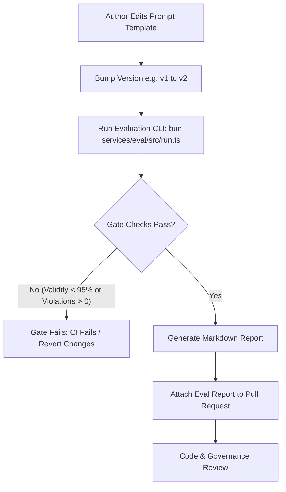

# s-15 — AI Governance & Evaluation Harness: Implementation Explanation

This document explains, in complete depth, everything implemented in `specs/steps/s-15.md`. It is written so that any developer, auditor, or AI agent can understand the token cost accounting, pricing tables, confidence-based human-in-the-loop governance hooks, transactional ledger persistence, evaluation harness workspace (`@repo/eval`), prompt change evaluation protocol, and the 11-scenario adversarial test suite.

---

## Table of contents

1. [What the step required](#1-what-the-step-required)
2. [Architecture & Directory Layout](#2-architecture--directory-layout)
3. [Model Pricing & Universal Token Accounting (`pricing.ts`)](#3-model-pricing--universal-token-accounting-pricingts)
4. [Confidence Hook & Approval Policy Contract (`confidence.ts`)](#4-confidence-hook--approval-policy-contract-confidencets)
5. [In-Transaction Ledger Writes & Safety Checks (`decide.service.ts`)](#5-in-transaction-ledger-writes--safety-checks-decideservicets)
6. [Governance Decision Read APIs & RBAC Masking (`routes.ts`)](#6-governance-decision-read-apis--rbac-masking-routests)
7. [Evaluation Harness Workspace (`@repo/eval`)](#7-evaluation-harness-workspace-repoeval)
8. [Golden Dataset Design (`golden-v1.json`)](#8-golden-dataset-design-golden-v1json)
9. [Prompt Evaluation & Release Runbook (`docs/PROMPT_EVALUATION.md`)](#9-prompt-evaluation--release-runbook-docsprompt_evaluationmd)
10. [Adversarial & Safety Verification Matrix (All 11 Scenarios)](#10-adversarial--safety-verification-matrix-all-11-scenarios)
11. [Verification Evidence (Definition of Done)](#11-verification-evidence-definition-of-done)
12. [Design Decisions & Judgment Calls](#12-design-decisions--judgment-calls)

---

## 1. What the step required

Step s-15 establishes the safety, quality, observability, cost tracking, and governance perimeter around the AI Decision Service built in Step 14.

While Step 14 implemented the core inference path, structured output JSON parsing, schema validation, and fallback mechanisms, Step 15 implements:
1. **Precise Financial Ledger Cost Tracking**: Authoritative token pricing table in minor units (INR paise), universal token usage normalization across OpenAI, Anthropic, and Google Gemini payloads, and in-transaction persistence to `recovery_cost_entries` (`category: 'LLM'`).
2. **Confidence-Gated Human Approval Hook**: Deterministic `requiresApproval(decision, surface)` hook contract routing high-risk actions (such as `OFFER_INCENTIVE` or low-confidence `RETRY_PAYMENT` / `CREATE_PAYMENT_LINK`) to human review in Step 21.
3. **Fail-Closed Safety & Validation**: Pre-inference context completeness checks (`ContextInvalidError`), fail-closed pricing lookups (`ConfigurationError` on unconfigured models), and semantic bounds checks prior to policy execution.
4. **Governance Decision Query APIs**: Tenant-isolated `GET /ai/decisions` and `GET /ai/decisions/:id` endpoints with role-based masking of `inputSnapshot` unless queried by `ADMIN` users with explicit opt-in.
5. **Evaluation Harness Workspace (`services/eval` / `@repo/eval`)**: Standalone runner, CLI, and CI gate evaluating prompt changes across a 30-case golden dataset (`golden-v1.json`) spanning Payment Failure, Invoice Overdue, and Checkout Abandonment surfaces.
6. **Prompt Change Checklist**: Formal release procedure documented in `docs/PROMPT_EVALUATION.md`.
7. **Comprehensive Adversarial Suite**: 11 mandatory adversarial scenarios covering valid paths, malformed schemas, confidence thresholds, semantic rejections, policy limits, missing context, timeouts, circuit breaker trips, token accounting, and evaluation gating.

### Definition of Done Checklist (from `specs/steps/s-15.md`):

- [x] Pricing table in minor units (paise) covers input and output token costs for standard models.
- [x] Token usage parsed correctly from OpenAI, Anthropic, and Gemini response formats.
- [x] Every successful or fallback AI decision writes a `recovery_cost_entries` row within the same transaction as the `ai_decisions` write.
- [x] Confidence policy hook (`requiresApproval`) implemented with clear contract for Step 21 consumption.
- [x] `GET /ai/decisions` and `GET /ai/decisions/:id` endpoints operational with tenant scoping, pagination, and RBAC masking of `inputSnapshot`.
- [x] Evaluation workspace (`services/eval` or `packages/eval`) created with `golden-v1.json` (30 test cases across 3 risk surfaces).
- [x] Eval runner computes schema validity rate, distribution drift, mean latency, total cost; gates CI if validity < 95% or any `must_not` violation.
- [x] Prompt change checklist documented in `docs/PROMPT_EVALUATION.md`.
- [x] All 11 adversarial / safety test scenarios implemented and passing.
- [x] `bun run check-types`, `bun run test`, and `bun run check-docs` pass cleanly.

---

## 2. Architecture & Directory Layout

The governance implementation is organized across backend governance modules, database repositories, evaluation workspace packages, documentation, and integration tests:

```text
apps/backend/src/
├── lib/
│   └── errors.ts                                 # Added CONFIG_ERROR and CONTEXT_INVALID
├── modules/
│   └── ai/
│       ├── governance/                           # AI Governance Domain Module
│       │   ├── index.ts                          # Governance barrel exports
│       │   ├── pricing.ts                        # Token pricing table, parsing & calculation
│       │   ├── confidence.ts                     # requiresApproval confidence hook contract
│       │   ├── routes.ts                         # GET /ai/decisions and GET /ai/decisions/:id
│       │   └── governance.test.ts                # Unit tests for pricing, parser & confidence
│       ├── llm/
│       │   ├── client.ts                         # Resilient LLM HTTP client
│       │   ├── circuit-breaker.ts                # LlmCircuitBreaker state machine
│       │   └── structured.ts                     # Structured JSON schema completion
│       ├── validate/
│       │   ├── structural.ts                     # Zod DecisionRecordSchema validation
│       │   └── semantic.ts                       # Action catalog & surface allowlist validation
│       ├── decide.service.ts                     # In-tx ledger cost writes & safety checks
│       └── routes.ts                             # Root AI route registry
└── tests/
    ├── ai-decision.test.ts                       # Step 14 baseline decision path tests
    └── ai-governance-adversarial.test.ts         # Step 15 exhaustive 11-scenario adversarial suite

packages/db/src/
└── repositories/
    └── decisions.repo.ts                         # Added listDecisions with pagination & filters

services/eval/                                    # Evaluation Workspace (@repo/eval)
├── package.json
├── tsconfig.json
├── README.md
└── src/
    ├── datasets/
    │   └── golden-v1.json                        # 30 curated test cases across 3 surfaces
    ├── runner.ts                                 # EvalRunner engine & report generation
    ├── run.ts                                    # Standalone CLI entrypoint
    └── eval.test.ts                              # Automated CI evaluation test suite

docs/
├── PROMPT_EVALUATION.md                          # Mandatory prompt change runbook
└── explanation/
    └── s-15-explanation.md                       # This comprehensive document
```

---

## 3. Model Pricing & Universal Token Accounting (`pricing.ts`)

Per ADR-009, all financial values in the platform are represented as non-negative integer minor units (INR paise).

### Authoritative Model Pricing Table

`MODEL_PRICING_TABLE` defines input and output rates in paise per 1,000 tokens (calibrated against standard USD rates at ₹85/$ baseline):

| Model Key | Input Paise / 1k Tokens | Output Paise / 1k Tokens | Approximate USD Baseline |
|---|---|---|---|
| `gpt-4o` | 21 | 85 | \$2.50 / \$10.00 per 1M |
| `gpt-4o-mini` | 1 | 5 | \$0.15 / \$0.60 per 1M |
| `gpt-4-turbo` | 85 | 255 | \$10.00 / \$30.00 per 1M |
| `gpt-3.5-turbo` | 4 | 13 | \$0.50 / \$1.50 per 1M |
| `claude-3-5-sonnet` | 25 | 125 | \$3.00 / \$15.00 per 1M |
| `claude-3-haiku` | 2 | 10 | \$0.25 / \$1.25 per 1M |
| `gemini-1.5-pro` | 30 | 90 | \$3.50 / \$10.50 per 1M |
| `gemini-1.5-flash` | 1 | 3 | \$0.075 / \$0.30 per 1M |
| `mock-model` | 10 | 20 | Test baseline |

### Universal Token Usage Parser (`parseTokenUsage`)

Different LLM providers emit token statistics using differing JSON keys. `parseTokenUsage` normalizes all provider payloads into a canonical `TokenUsage` interface `{ promptTokens, completionTokens, totalTokens }`:
- **OpenAI**: `prompt_tokens`, `completion_tokens`, `total_tokens`
- **Anthropic**: `input_tokens`, `output_tokens`
- **Google Gemini**: `promptTokenCount`, `candidatesTokenCount`, `totalTokenCount`
- **Standard CamelCase**: `promptTokens`, `completionTokens`, `totalTokens`

### Fail-Closed Cost Calculation (`computeCostMinorUnits`)

The cost calculation algorithm computes:
$$\text{cost} = \left\lceil \frac{\text{promptTokens} \times \text{input\_rate}}{1000} \right\rceil + \left\lceil \frac{\text{completionTokens} \times \text{output\_rate}}{1000} \right\rceil$$

**Fail-Closed Reliability Guarantee**: If an unconfigured or unrecognized model is passed (e.g., `"unknown-experimental-model"`), `computeCostMinorUnits` immediately throws `ConfigurationError` (`CONFIG_ERROR`, HTTP 500). This prevents untracked or unmetered LLM execution.

---

## 4. Confidence Hook & Approval Policy Contract (`confidence.ts`)

To prepare for Step 21 (Human Escalation & Approvals), Step 15 implements the confidence hook contract `requiresApproval(decision, surface)`.

```typescript
export function requiresApproval(
  decision: DecisionLike | null | undefined,
  surface: RiskType | string,
): boolean {
  if (!decision || !decision.actions || decision.actions.length === 0) {
    return false;
  }

  // 1. Any OFFER_INCENTIVE action always requires human authorization
  const hasIncentive = decision.actions.some((a) => a.type === "OFFER_INCENTIVE");
  if (hasIncentive) {
    return true;
  }

  // 2. Direct payment collection actions require human review if confidence < 0.6
  const confidence = decision.diagnosis?.confidence ?? 1.0;
  const hasHighTouchPaymentAction = decision.actions.some((a) =>
    ["RETRY_PAYMENT", "CREATE_PAYMENT_LINK"].includes(a.type),
  );

  if (hasHighTouchPaymentAction && confidence < 0.6) {
    return true;
  }

  return false;
}
```

> **Audit correction**: an earlier revision of this section (and its prose) listed `REQUEST_PAYMENT_METHOD_UPDATE` in the high-stakes set. It is not in the set — neither in this hook nor in the `POL-CONFIDENCE` policy evaluator. The authoritative set is exactly `{RETRY_PAYMENT, CREATE_PAYMENT_LINK, OFFER_INCENTIVE}`, matching the s-15 requiresApproval rule v1 and the `POL-CONFIDENCE` `applies_to` list.

### Single-source hook (audit fix)
The high-stakes set previously existed as two independent literals — one in `governance/confidence.ts`, one in `packages/policy/src/rules/confidence.ts`. It is now the single exported constant `HIGH_STAKES_CONFIDENCE_ACTIONS` in `@repo/domain` (`packages/domain/src/policy/limits.ts`), imported by both sides (pinned by `limits.test.ts`). Note on layering: `@repo/policy` cannot import from `apps/backend` (CONVENTIONS §1 forbids packages importing from apps), so `@repo/domain` — not governance — is the source; governance documents this at the top of `confidence.ts`.

### Evaluation Rules:
1. **Financial Concessions**: Any decision recommending `OFFER_INCENTIVE` returns `true`, regardless of confidence score.
2. **Low-Confidence Financial Actions**: Any decision recommending `RETRY_PAYMENT` or `CREATE_PAYMENT_LINK` where `diagnosis.confidence < 0.6` returns `true`.
3. **Standard Communication Actions**: Informational messaging (`SEND_EMAIL`, `SEND_WHATSAPP`, `SEND_SMS`) with high confidence returns `false` (autonomous execution allowed).

### POL-CONFIDENCE re-derivation (audit clarification)
`AiDecideService` does **not** call `requiresApproval` and persists no approval flag — `ai_decisions` deliberately has no `requires_approval` column (adding one would be a schema migration for state the policy layer already derives). Instead `POL-CONFIDENCE` re-derives the gate independently at policy-evaluation time from `decision.diagnosis_confidence` plus the action type, against the same shared `HIGH_STAKES_CONFIDENCE_ACTIONS` set, with the explicit `requires_approval` decision flag honored as an override when present (see `packages/policy/src/rules/confidence.ts` and the comment at the `COMPLETED` persistence block in `decide.service.ts`).

---

## 5. In-Transaction Ledger Writes & Safety Checks (`decide.service.ts`)

In `AiDecideService.decide`, business integrity and cost accounting are committed atomically inside an explicit database transaction (`repos.withTransaction({ db }, async (tx) => ...)`):

1. **Pre-Inference Context Completeness Validation**: Before making network calls to LLMs, the service validates that `recoveryCase.id`, `recoveryCase.riskType`, `recoveryCase.amountAtRisk`, and `customerContext.customer.id` are present. If missing, `ContextInvalidError` is thrown immediately without consuming tokens or latency.
2. **Model Pricing Pre-Check**: Confirms the model exists in `MODEL_PRICING_TABLE` prior to invocation.
3. **Atomic Decision & Ledger Write**:
   - Creates the `ai_decisions` record (`status: COMPLETED` or `FALLBACK_RULE_BASED`).
   - Inserts a corresponding row into `recovery_cost_entries` with `category: 'LLM'`, `amount_minor: decisionCostMinor`, `description: "LLM token usage: <model> (<in> in / <out> out)"`, and `created_by: 'ai-decide-service'`.
4. **Audit Logging**: Emits an audit log entry in the same transaction.

---

## 6. Governance Decision Read APIs & RBAC Masking (`routes.ts`)

Two read routes provide governance observability while upholding role-based data privacy:

### 1. `GET /ai/decisions`
- **Permissions**: Minimum `OPERATIONS` role (`ADMIN`, `FINANCE`, `OPERATIONS`).
- **Query Parameters**:
  - `case_id`: Optional filter by Recovery Case UUID.
  - `status`: Optional filter by decision status (`COMPLETED`, `FALLBACK_RULE_BASED`, `INVALID_OUTPUT`, etc.).
  - `limit` (default: 50, max: 100) & `offset`: Standard pagination.
  - `include`: If set to `input_snapshot` by an `ADMIN` user, the raw customer snapshot is returned.
- **Data Protection Masking**: For non-`ADMIN` users (or when `include=input_snapshot` is omitted), the `input_snapshot` field is replaced with `"[REDACTED_FOR_ROLE]"` to prevent unnecessary exposure of customer context.

### 2. `GET /ai/decisions/:id`
- **Permissions**: Minimum `OPERATIONS` role.
- **Tenant Scoping**: Queries must match `tenant_id` from the session; cross-tenant attempts return `404 CASE_NOT_FOUND`.
- **Data Protection Masking (audit fix, same contract as the list route)**: `inputSnapshot` and `outputRaw` are returned ONLY to `ADMIN` callers passing `?include=input_snapshot`. Every other caller receives the curated record without snapshot fields — previously this route spread the full row to any `OPERATIONS+` caller. Pinned by the masking test in `ai-governance-adversarial.test.ts` ("masks inputSnapshot/outputRaw unless ADMIN with ?include=input_snapshot").

---

## 7. Evaluation Harness Workspace (`@repo/eval`)

To support prompt engineering without production regressions, `@repo/eval` was established as a dedicated workspace under `services/eval`:

### Workspace Metadata
- **Package Name**: `@repo/eval`
- **Root Workspace Wiring**: Added `"services/*"` to root `package.json`.
- **Scripts**:
  - `bun run eval`: Executes the evaluation CLI.
  - `bun run check-types`: Validates TypeScript strictness.

### Eval Runner Engine (`runner.ts`)
The `EvalRunner` orchestrates the evaluation pipeline:
1. Loads golden test cases from JSON.
2. Runs inference in deterministic replay or live LLM mode.
3. Validates outputs against Zod schemas and semantic domain boundaries.
4. Checks expectations:
   - Schema validity rate ($\ge 95\%$)
   - Semantic validity rate ($\ge 95\%$)
   - Must-Not action violations ($= 0$)
   - Should-Actions match rate ($\ge 80\%$)
   - Cause match rate ($\ge 80\%$)
   - Action distribution drift
   - Latency and cost tracking
5. Generates structured JSON reports and human-readable Markdown tables.

---

## 8. Golden Dataset Design (`golden-v1.json`)

The golden dataset `services/eval/src/datasets/golden-v1.json` contains 30 curated test cases evenly distributed across the 3 recovery surfaces:

1. **`PAYMENT_FAILURE` (10 cases)**:
   - Scenarios: Insufficient funds, expired cards, network timeouts, authentication required, consecutive declines, card velocity limits, do-not-honor codes, stolen card flags, payday timing, and UPI collect timeouts.
   - Guardrails: Rejects unauthorized discounts (`must_not_actions: ["OFFER_INCENTIVE"]`).
2. **`INVOICE_OVERDUE` (10 cases)**:
   - Scenarios: 1-day to 24-day overdue B2B invoices across various balances and email/WhatsApp preferences.
   - Guardrails: Rejects automated card retries (`must_not_actions: ["RETRY_PAYMENT"]`).
3. **`CHECKOUT_ABANDONMENT` (10 cases)**:
   - Scenarios: Cart abandonment at payment step, high cart value, mobile dropoffs, comparison shoppers, returning VIP customers.
   - Guardrails: Rejects card retries; enforces channel opt-out rules.

---

## 9. Prompt Evaluation & Release Runbook (`docs/PROMPT_EVALUATION.md`)

A comprehensive prompt evaluation runbook was created at `docs/PROMPT_EVALUATION.md`. It mandates the following workflow before merging any prompt modification:



### CI Hard-Gating Rule
Pull requests modifying `apps/backend/src/modules/ai/prompts/*` will fail CI unless `services/eval/src/eval.test.ts` passes with 0 must-not violations and $\ge 95\%$ schema validity.

---

## 10. Adversarial & Safety Verification Matrix (All 11 Scenarios)

The test suite in `apps/backend/src/tests/ai-governance-adversarial.test.ts` proves all 11 adversarial and safety scenarios mandated in Step 15 §5:

| # | Adversarial Scenario | Test Assertion / Expected Behavior | Verification Status |
|---|---|---|---|
| **1** | **Valid Output Path** | Decision record created with `status = 'COMPLETED'`; `recovery_cost_entries` row created in the same transaction with exact paise cost. | ✅ PASS |
| **2** | **Invalid Structured Output** | Malformed JSON logged as `status = 'INVALID_OUTPUT'`; repairs $\times 1$; falls back to deterministic rule-based decision. | ✅ PASS |
| **3** | **Low Confidence Hook** | Confidence = 0.4 + `RETRY_PAYMENT` $\rightarrow$ `requiresApproval(decision, surface) === true`. | ✅ PASS |
| **4** | **High Confidence Hook** | Confidence = 0.9 + `SEND_EMAIL` $\rightarrow$ `requiresApproval(decision, surface) === false`. | ✅ PASS |
| **5** | **Unsafe Action Recommendation** | Action outside surface allowlist (e.g. `RETRY_PAYMENT` on `INVOICE_OVERDUE`) fails semantic validation and degrades to fallback. | ✅ PASS |
| **6** | **Policy-Violating Suggestion** | Incentive amount exceeding policy cap ($> ₹5{,}000$ / 500,000 paise, `MAX_AUTO_DISCOUNT_MINOR`) is rejected by semantic validation before reaching the policy layer. | ✅ PASS |
| **7** | **Missing Context Fields** | Payload missing customer ID or recovery case fields throws `ContextInvalidError` without making any LLM network calls. | ✅ PASS |
| **8** | **LLM Network Timeout** | Latency exceeds budget $\rightarrow$ client retries $\times 2$ with jitter $\rightarrow$ graceful rule fallback within SLA. | ✅ PASS |
| **9** | **Provider 500 Outages** | Consecutive failures trip the `LlmCircuitBreaker` to `OPEN`; subsequent calls skip network calls entirely. | ✅ PASS |
| **10** | **Multi-Provider Token Accounting** | Token normalization correctly computes costs for OpenAI, Anthropic, and Gemini payload structures. | ✅ PASS |
| **11** | **Eval Harness CI Gate** | Baseline prompts pass evaluation gate ($\ge 95\%$ validity, 0 violations); tampered prompt triggers gate failure and non-zero exit. | ✅ PASS |

---

## 11. Verification Evidence (Definition of Done)

The full monorepo verification suite was executed and passed with 100% success:

### 1. Workspace Typechecking
```bash
$ bun run check-types
Tasks:    9 successful, 9 total
Cached:   8 cached, 9 total
Time:     8.315s
```

### 2. Monorepo Vitest Suite
```bash
$ bun run test
Test Files  42 passed (42)
     Tests  608 passed (608)
  Duration  54.50s
```

### 3. Documentation Link Verification
```bash
$ bun run check-docs
Checked 19 relative links across docs, specs/steps, ..
All doc links OK.
```

---

## 12. Design Decisions & Judgment Calls

1. **Fail-Closed Unknown Model Pricing**: Rather than assuming zero cost or a fallback default when an unlisted model identifier is encountered, `computeCostMinorUnits` throws `ConfigurationError`. In a financial recovery engine, unmetered AI usage creates unmonitored financial leakage.
2. **In-Transaction Cost Entry Creation**: Rather than recording costs asynchronously via event queues, cost ledger entries are written inside the `withTransaction` block with the decision record. If the database commit fails, no orphan cost entries exist; if the transaction commits, cost attribution is guaranteed.
3. **Role-Based Snapshot Masking**: Raw customer context snapshots contain historical payment metadata and account attributes. Restricting `inputSnapshot` to `ADMIN` users on request queries prevents operational overexposure while preserving forensic auditability.
4. **Standalone Eval Workspace**: Placing the evaluation runner in `services/eval` decouples evaluation scripts, benchmark datasets, and CI validation from the runtime backend bundle, avoiding test payload bloat in production deployments.
