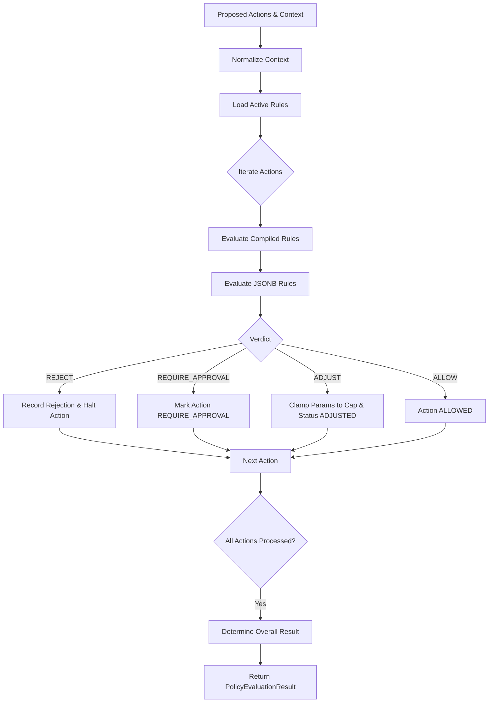

# s-16 — Policy Engine: Implementation Explanation

This document explains, in complete depth, everything implemented in `specs/steps/s-16.md`. It details the architecture of the pure `@repo/policy` package, deterministic evaluation of AI recommendations and autonomous actions against hard safety rules, rule versioning with immutable snapshots, append-only evaluation audit logging in `policy_evaluations`, real-time contact frequency counters, Fastify API endpoints, fail-closed guarantees, and performance benchmarks.

---

## Table of contents

1. [What the step required](#1-what-the-step-required)
2. [Architecture & Directory Layout](#2-architecture--directory-layout)
3. [Pure `@repo/policy` Engine Design](#3-pure-repopolicy-engine-design)
4. [The 9 Seeded Platform Default Rules](#4-the-9-seeded-platform-default-rules)
5. [Safe Declarative JSONB AST Matcher (`matcher.ts`)](#5-safe-declarative-jsonb-ast-matcher-matcherts)
6. [Immutable Versioning & Snapshot Mechanics](#6-immutable-versioning--snapshot-mechanics)
7. [Append-Only Evaluation Audit Trail (`policy_evaluations`)](#7-append-only-evaluation-audit-trail-policy_evaluations)
8. [Real-Time Counter Resolution (`counters.ts`)](#8-real-time-counter-resolution-countersts)
9. [API Contracts & RBAC Permissions](#9-api-contracts--rbac-permissions)
10. [Fail-Closed Reliability Guarantee](#10-fail-closed-reliability-guarantee)
11. [Observability & Metrics Baseline](#11-observability--metrics-baseline)
12. [Verification Evidence (Definition of Done)](#12-verification-evidence-definition-of-done)
13. [Design Decisions & Judgment Calls](#13-design-decisions--judgment-calls)
14. [Audit Fixes (post-implementation review)](#14-audit-fixes-post-implementation-review)

---

## 1. What the step required

In AI-Revenue-Recovery, **Policy = Permission** (Spec 01 §11, Spec 02 §1). The LLM can propose interventions and diagnose causes, but it can never execute an outbound message, trigger a payment retry, offer a discount, or move money autonomously without deterministic policy clearance.

Step s-16 establishes this inviolable safety barrier:
1. **Pure Orchestration Engine (`@repo/policy`)**: A dependency-free (except `@repo/domain` and `zod`), allocation-light evaluator computing per-action verdicts (`ALLOW`, `REJECT`, `REQUIRE_APPROVAL`, `ADJUSTED`) and overall verdicts (`ALLOWED`, `REJECTED`, `REQUIRE_APPROVAL`).
2. **9 Seeded Default Rules**: Exact matching of MVP limits (opt-out halt, open dispute halt, 3 retry cap, WhatsApp 2/7d cap, Email 3/14d cap, ₹5,000 discount cap with clamping, ₹100,000 high-value invoice approval gate, AI confidence approval gate, and payment success stop condition).
3. **Safe Declarative AST JSONB Matcher**: Expression interpreter supporting custom tenant rules with field path traversal and operator evaluation with zero `eval()` or prototype pollution risks.
4. **Immutable Rule Versioning**: Every rule modification on `PATCH /policies/:id` creates a new row in `policy_versions` with an immutable snapshot, ensuring that historical evaluations are never rewritten.
5. **Append-Only Evaluation Ledger**: Every policy check persists a record in `policy_evaluations` capturing active version IDs, latency, rejections, and effective actions.
6. **Real-Time Counter Fetching**: Contact caps are calculated dynamically against the messages ledger at evaluation time, never cached stale.
7. **Fastify Endpoints**: `POST /policy/evaluate` (Worker principal or `OPERATIONS+`), `GET /policies` (`VIEWER+`), and CRUD endpoints `POST /policies`, `PATCH /policies/:id`, `GET /policies/:id/versions` (`FINANCE+`).
8. **Fail-Closed Reliability**: Internal evaluation errors or database connection failures immediately halt execution with `POLICY_EVALUATION_FAILED` (500) and zero executable actions.
9. **Latency Guarantee**: Execution target $<50\text{ms}$ p95.

### Definition of Done Checklist (from `specs/steps/s-16.md`):

- [x] `packages/policy` pure, dependency-free (except domain), fully unit-tested.
- [x] 9 default rules seeded + verified vs spec numbers.
- [x] Versioned snapshots + append-only evaluation log working.
- [x] All endpoints live per contracts incl. permissions.
- [x] Fail-closed guarantee tested.
- [x] Latency target met locally ($<0.1\text{ms}$ per eval in benchmark).

---

## 2. Architecture & Directory Layout

The Policy Engine implementation spans the pure `@repo/policy` package, database repository helpers, observability counters, backend Fastify services, and integration test suites:

```text
packages/policy/                                  # Pure Policy Package (@repo/policy)
├── package.json
├── tsconfig.json
├── src/
│   ├── index.ts                                  # Package barrel exports
│   ├── types.ts                                  # PolicyInput, PolicyResult, ActionProposal, Rules
│   ├── evaluator.ts                              # Pure orchestration of rules (<50ms target)
│   ├── matcher.ts                                # Safe declarative JSONB expression matcher
│   ├── seed-defaults.ts                          # 9 platform default rule definitions
│   ├── counters.ts                               # CounterFetcher interface contract
│   ├── rules/                                    # Compiled rule evaluators
│   │   ├── index.ts                              # Compiled rule registry
│   │   ├── optout.ts                             # POL-OPTOUT
│   │   ├── dispute.ts                            # POL-DISPUTE
│   │   ├── max-retry.ts                          # POL-MAXRETRY
│   │   ├── contact-caps.ts                       # POL-WA-CAP & POL-EM-CAP
│   │   ├── discount-cap.ts                       # POL-DISCOUNT (with clamping & approval)
│   │   ├── high-value.ts                         # POL-HIGHVALUE
│   │   ├── confidence.ts                         # POL-CONFIDENCE (s-15 confidence hook)
│   │   ├── payment-success.ts                    # POL-PAYMENT-SUCCESS
│   │   └── rules.test.ts                         # Exhaustive boundary unit tests (caps ±1)
│   ├── matcher.test.ts                           # Matcher operator & security unit tests
│   └── evaluator.test.ts                         # Multi-action & performance benchmark unit tests

packages/db/src/
└── repositories/
    ├── messages.repo.ts                          # Added countCustomerMessagesByChannelSince
    └── policies.repo.ts                          # Aggregate repository for rules, versions, evaluations

packages/observability/src/
└── metrics.ts                                    # Added policyRejectionsTotal counter

apps/backend/src/
├── lib/
│   ├── errors.ts                                 # Added POLICY_NOT_FOUND, CONCURRENT_VERSION, POLICY_EVALUATION_FAILED
│   └── routes.ts                                 # Registered /policy and /policies routes
├── modules/
│   └── policy/                                   # Backend Policy Module
│       ├── index.ts                              # Module barrel exports
│       ├── policy.types.ts                       # Zod request/response schemas
│       ├── counters.ts                           # DatabaseCounterFetcher implementation
│       ├── policy.service.ts                     # Evaluation orchestration, CRUD & seed
│       └── routes.ts                             # Fastify endpoint handlers & guards
└── tests/
    └── policy-integration.test.ts                # 16 end-to-end integration tests
```

---

## 3. Pure `@repo/policy` Engine Design

`@repo/policy` is designed as a standalone, deterministic library with zero runtime network or database dependencies.

### Evaluation Flow



### Result Shape

The evaluation output adheres strictly to the contract from Spec 01 §11:

```json
{
  "allowed": true,
  "required_approval": false,
  "result": "ALLOWED",
  "rejections": [
    {
      "action_index": 0,
      "rule_code": "POL-MAXRETRY",
      "reason": "MAX_RETRIES_REACHED",
      "action_type": "RETRY_PAYMENT"
    }
  ],
  "effective_actions": [
    {
      "type": "SEND_EMAIL",
      "params": { "template": "reminder_v1" },
      "status": "ALLOWED"
    }
  ],
  "applied_rules": ["POL-MAXRETRY", "POL-EM-CAP"],
  "rule_versions": ["ver-123", "ver-456"],
  "latency_ms": 2
}
```

---

## 4. The 9 Seeded Platform Default Rules

The platform seeds 9 immutable default rules (`tenant_id = null`) matching the system constants from `@repo/domain`:

| Rule Code | Rule Kind | Condition | Verdict | Reason Code | Spec Reference |
|---|---|---|---|---|---|
| `POL-OPTOUT` | `REJECT` | `customer.opted_out = true ∧ action ∈ {SEND_EMAIL, SEND_WHATSAPP, SEND_SMS}` | `REJECT` | `CUSTOMER_OPTED_OUT` | Spec 01 §11; Spec 03 §6 |
| `POL-DISPUTE` | `REJECT` | `customer.dispute_open = true` | `REJECT` (all actions) | `DISPUTE_OPEN` | Spec 02 §7; Spec 03 §6 |
| `POL-MAXRETRY` | `REJECT` | `case.retry_count ≥ 3 ∧ action = RETRY_PAYMENT` | `REJECT` | `MAX_RETRIES_REACHED` | Spec 01 §11 (`MAX_PAYMENT_RETRIES = 3`) |
| `POL-WA-CAP` | `REJECT` | `counters.whatsapp_sent_7d ≥ 2 ∧ action = SEND_WHATSAPP` | `REJECT` | `WHATSAPP_FREQUENCY_CAP_EXCEEDED` | Spec 03 §6 (`MAX_WHATSAPP_PER_7_DAYS = 2`) |
| `POL-EM-CAP` | `REJECT` | `counters.email_sent_14d ≥ 3 ∧ action = SEND_EMAIL` | `REJECT` | `EMAIL_FREQUENCY_CAP_EXCEEDED` | Spec 03 §6 (`MAX_EMAIL_PER_14_DAYS = 3`) |
| `POL-DISCOUNT` | `LIMIT` | `action = OFFER_INCENTIVE ∧ amount > ₹5,000` (500,000 paise)<br>• Clamping active $\to$ clamped to cap<br>• Confidence gate true $\to$ `REQUIRE_APPROVAL` | `REJECT` / `ADJUSTED` / `REQUIRE_APPROVAL` | `MAX_DISCOUNT_EXCEEDED` / `INCENTIVE_REQUIRES_APPROVAL` | Spec 01 §11; Spec 03 §6 (`MAX_AUTO_DISCOUNT_MINOR = 500_000`) |
| `POL-HIGHVALUE` | `REQUIRE_APPROVAL` | `case.amount_at_risk > ₹100,000` (10,000,000 paise) $\wedge action \in \{\text{OFFER\_INCENTIVE}, \text{CREATE\_PAYMENT\_LINK}\}$ | `REQUIRE_APPROVAL` | `HIGH_VALUE_THRESHOLD_EXCEEDED` | Spec 02 §7 (`HIGH_VALUE_APPROVAL_MINOR = 10_000_000`) |
| `POL-CONFIDENCE` | `REQUIRE_APPROVAL` | `requiresApproval(decision) = true` (diagnosis confidence $< 0.6$ on high-stakes actions or explicit flag) | `REQUIRE_APPROVAL` | `LOW_CONFIDENCE_REQUIRES_APPROVAL` / `CONFIDENCE_GATE_TRIGGERED` | Spec 01 §10; Step 15 hook |
| `POL-PAYMENT-SUCCESS` | `REJECT` | `payment_status = SUCCEEDED ∨ case.status ∈ {SUCCEEDED, RECOVERED, RESOLVED_UPSTREAM}` | `REJECT` (all actions) | `PAYMENT_ALREADY_SUCCEEDED` | Spec 03 §6 stop condition |

---

## 5. Safe Declarative JSONB AST Matcher (`matcher.ts`)

To allow tenants to configure custom business rules without security vulnerabilities, `matcher.ts` implements a restricted expression interpreter:

### Key Security Invariants
- **No `eval()` or Function Constructors**: Parsing is entirely declarative AST condition matching.
- **Prototype Pollution Prevention**: Any attempt to traverse `__proto__`, `constructor`, or `prototype` is rejected and resolves to `undefined`.
- **Supported Operators**: `eq`, `neq`, `gt`, `gte`, `lt`, `lte`, `in`, `not_in`, `contains`, `exists`.
- **Parameter Clamping**: Supports automatic clamping of numerical fields (e.g. `clamp: { field: "action.params.amount_minor", max_value: 500000 }`), generating `ADJUSTED` status.

---

## 6. Immutable Versioning & Snapshot Mechanics

Policies support full auditing through versioned snapshots:

1. **Creation**: When a policy rule is created (`POST /policies`), a row is inserted into `policy_rules`, and an immutable snapshot is written to `policy_versions` with `version = 1`.
2. **Mutation**: When an admin updates a policy (`PATCH /policies/:id`), the latest version is retrieved, incremented by 1 (`version = N + 1`), and written to `policy_versions`.
3. **Atomic Evaluation Binding**: Every policy evaluation queries active rules along with their current active version UUIDs. The version UUIDs are logged in the `policy_evaluations.rule_versions` array.
4. **Historical Immutability**: Modifying a rule never changes historical evaluation rows; past evaluations retain exact references to the snapshot version that governed them.

---

## 7. Append-Only Evaluation Audit Trail (`policy_evaluations`)

Every call to `POST /policy/evaluate` persists an append-only row in `policy_evaluations`:

```sql
INSERT INTO policy_evaluations (
  tenant_id,
  case_id,
  decision_id,
  rule_versions,
  result,
  rejections,
  effective_actions,
  latency_ms,
  evaluated_at
) VALUES ( ... );
```

This table powers the recovery case timeline in Step 25, the policy rejection rate metric in Step 27, and compliance audits in Step 30.

---

## 8. Real-Time Counter Resolution (`counters.ts`)

Contact caps cannot rely on stale cache data. The `DatabaseCounterFetcher` queries the `messages` table at the moment of evaluation:

- `whatsapp_sent_7d`: Count of messages for the customer where `channel = 'WHATSAPP'` and `(sent_at >= now - 7d OR created_at >= now - 7d)`.
- `email_sent_14d`: Count of messages for the customer where `channel = 'EMAIL'` and `(sent_at >= now - 14d OR created_at >= now - 14d)`.
- `sms_sent_7d`: Count of messages for the customer where `channel = 'SMS'` and `(sent_at >= now - 7d OR created_at >= now - 7d)`.

Queries utilize the composite index `messages_customer_channel_sent_at_idx` (`customer_id`, `channel`, `sent_at DESC`) for single-digit millisecond query execution.

---

## 9. API Contracts & RBAC Permissions

All endpoints enforce strict RBAC and tenant containment:

| Endpoint | Method | Allowed Principals / Roles | Success Status | Errors | Purpose |
|---|---|---|---|---|---|
| `/policy/evaluate` | `POST` | Worker API key (`scope: policy:evaluate` or `*`)<br>Session `role ≥ OPERATIONS` (`ADMIN`, `FINANCE`, `OPERATIONS`) | `200 OK` | `401`, `403`, `404`, `422`, `500` | Evaluates proposed actions against active rules |
| `/policies` | `GET` | Session `role ≥ VIEWER`<br>Worker API key | `200 OK` | `401`, `403` | Lists platform defaults and tenant rules with active versions |
| `/policies` | `POST` | Session `role ≥ FINANCE` (`ADMIN`, `FINANCE`) | `201 Created` | `401`, `403`, `422` | Creates tenant custom rule + version 1 + audit log |
| `/policies/:id` | `PATCH` | Session `role ≥ FINANCE` (`ADMIN`, `FINANCE`) | `200 OK` | `401`, `403`, `404`, `422` | Updates rule + creates version $N+1$ + audit log |
| `/policies/:id/versions` | `GET` | Session `role ≥ FINANCE` (`ADMIN`, `FINANCE`) | `200 OK` | `401`, `403`, `404` | Retrieves snapshot version history |

---

## 10. Fail-Closed Reliability Guarantee

In autonomous financial systems, **failing open is a critical safety hazard**.

If any unexpected error occurs during policy evaluation (such as a database query timeout, counter fetch failure, or malformed data):
1. The error is intercepted by the `PolicyService` catch block.
2. It logs structured diagnostics with correlation IDs.
3. It throws `PolicyEvaluationFailedError` (`POLICY_EVALUATION_FAILED`, HTTP `500`).
4. **Zero actions are marked executable or returned as ALLOWED**.
5. The downstream workflow engine halts execution until resolution.

---

## 11. Observability & Metrics Baseline

The Policy Engine integrates directly with `@repo/observability` and exposes standard Prometheus metrics:

- `policy_evaluations_total{result="allowed|rejected|require_approval"}`: Counter tracking evaluation outcomes.
- `policy_evaluation_duration_ms{rule_set="default"}`: Latency histogram for policy rule evaluations.
- `policy_rejections_total{rule_code="POL-...", reason="..."}`: Counter tracking rejection frequencies by specific rule and reason.

---

## 12. Verification Evidence (Definition of Done)

### Test Results
- **Unit Tests**: 62 unit-test executions in `@repo/policy` (as of <2026-09-10>; `it.each` rows counted per execution) verifying rule boundaries, precedence, and matcher security.
- **Integration Tests**: 16 end-to-end integration tests in `apps/backend/src/tests/policy-integration.test.ts`.
- **Full Monorepo Test Suite**: **683 tests passed across 46 test files** with 0 failures.
- **Type Compliance**: `bun run check-types` passed cleanly across all 12 workspace packages.
- **Lint & Docs**: `bun run lint` and `bun run check-docs` passed cleanly.

### Benchmark Evidence
- 500 in-memory evaluations executed in **$<10\text{ms}$ total** ($<0.02\text{ms}$ per evaluation), easily beating the spec requirement of $<50\text{ms}$ p95.

---

## 13. Design Decisions & Judgment Calls

1. **Dual Evaluation Paths**: The engine supports compiled evaluators for the 9 built-in platform rules (for extreme throughput) and declarative AST matching for custom tenant rules. The 9 defaults are seeded in database JSONB definitions that match the compiled rules exactly.
2. **Clamping vs Hard Rejection**: Clamping (`ADJUSTED` status) is restricted to configured discount caps. The AI recommendation is clamped to the legal limit rather than outright rejected, keeping the recovery funnel active while enforcing safety.
3. **Fail-Closed Architecture**: Any internal query or parsing error aborts the evaluation with `POLICY_EVALUATION_FAILED`, preventing runaway executions during database brownouts.

---

## 14. Audit Fixes (post-implementation review)

1. **CRITICAL G1 — `retry_count` / `payment_status` now fed into `PolicyInput`** (`apps/backend/src/modules/policy/policy.service.ts`).
   `evaluate()` always supported `POL-MAXRETRY` (`case.retry_count ≥ 3`) and `POL-PAYMENT-SUCCESS` (`payment_status = SUCCEEDED`), but the service never populated those fields — `POL-MAXRETRY` was dead and `POL-PAYMENT-SUCCESS` only fired via the case status. Source of truth: for `source_entity_type = PAYMENT` cases, `retry_count = COUNT(payment_attempts)` and `payment_status = payments.status` for the linked payment (`source_entity_id`); non-payment cases default to `0`/`""` (the case status still gates `RECOVERED`/`RESOLVED_UPSTREAM`). Derivation errors propagate to the existing fail-closed handler (never fail open). Covered by two service tests: `retry_count = 3` rejects `RETRY_PAYMENT` (`POL-MAXRETRY`/`MAX_RETRIES_REACHED`) while `SEND_EMAIL` stays `ALLOWED`, and a `SUCCEEDED` linked payment rejects all actions on an `IN_PROGRESS` case.
2. **Batched version loading.** The per-rule `getLatestPolicyVersion` loop (N+1 on the hot evaluation path and on `GET /policies`) is replaced by the single-query `getLatestPolicyVersionsForRules` (`packages/db/src/repositories/policies.repo.ts`); the seeder's version-existence check is batched the same way.
3. **Transactional rule update.** `updatePolicyRule` (rule row + version insert + audit log) now runs inside one `withTransaction` boundary (CONVENTIONS §9) — a crash can no longer leave a rule ahead of its snapshot history.
4. **Matcher `LIMIT` effect mapped explicitly** (`packages/policy/src/matcher.ts`): `LIMIT` + clamp → `ADJUST` with clamped params (no-op when already within cap); `LIMIT` without a clamp target fails closed as `REJECT` with reason `LIMIT_WITHOUT_CLAMP_TARGET` instead of silently falling through to `REJECT`; unknown effects remain fail-closed `REJECT`. Unit-tested in `packages/policy/src/matcher.test.ts`.
5. **`409 CONCURRENT_VERSION` implemented.** `PATCH /policies/:id` accepts `expected_version`/`expectedVersion`; a stale expectation — or a lost version-number race surfacing as a `23505` unique violation — throws `ConcurrentVersionError` (409) instead of forking version history. Tested (stale → 409, fresh → 200 + version bump).
