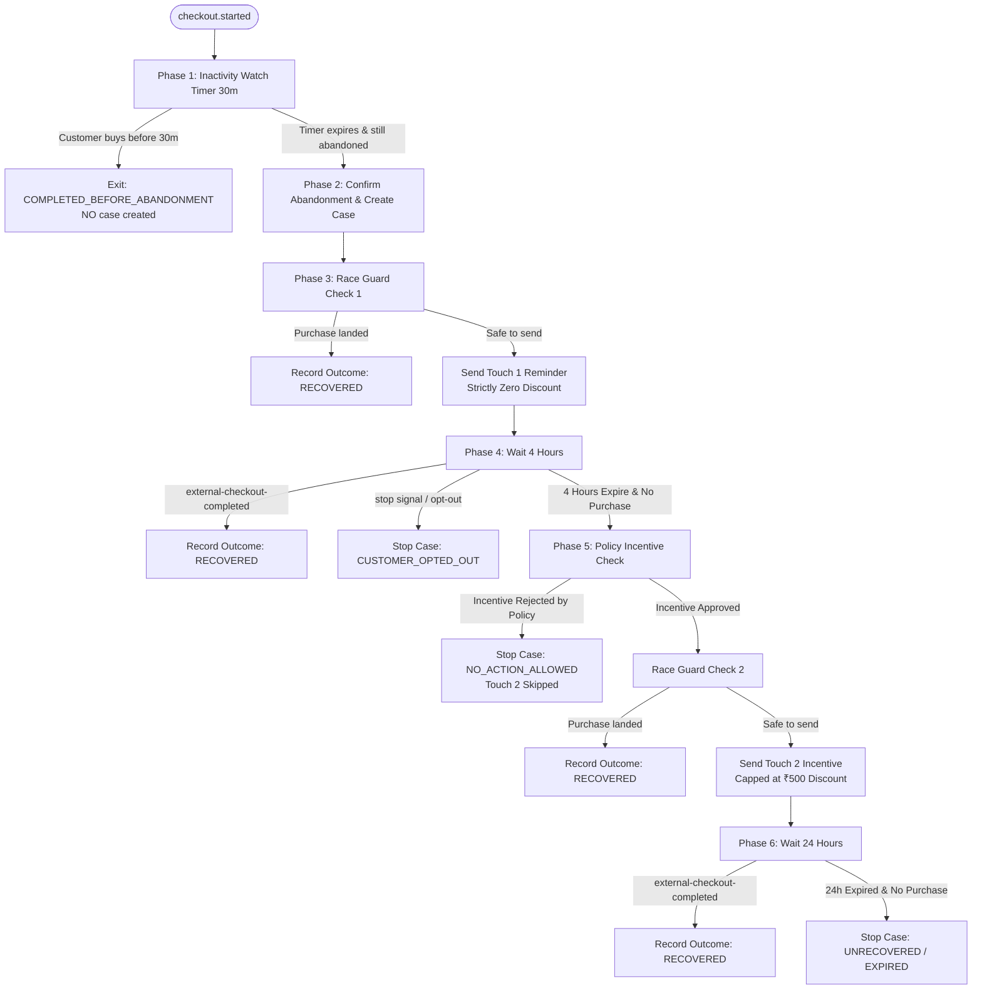

# s-23 — Workflow B: Checkout Abandonment: Implementation Explanation

This document provides a comprehensive technical explanation of the architecture, data structures, workflow lifecycle, race condition defenses, signaling bridges, activities, and verification test matrix implemented for **Step 23 (Workflow B: Checkout Abandonment)** per `specs/steps/s-23.md`.

---

## Table of contents

1. [Overview & Scope](#1-overview--scope)
2. [Workflow Lifecycle & Phase Progression](#2-workflow-lifecycle--phase-progression)
3. [Watch Phase & Deferred Case Creation](#3-watch-phase--deferred-case-creation)
4. [First-Touch Zero-Discount Invariant](#4-first-touch-zero-discount-invariant)
5. [Pre-Dispatch Race Guards & Anti-Spam Defenses](#5-pre-dispatch-race-guards--anti-spam-defenses)
6. [Worker Activities Implementation](#6-worker-activities-implementation)
7. [Event-Reactive Signal Bridge](#7-event-reactive-signal-bridge)
8. [Backend Ingestion & Watch Initiation](#8-backend-ingestion--watch-initiation)
9. [Comprehensive 8-Scenario Acceptance Matrix](#9-comprehensive-8-scenario-acceptance-matrix)
10. [Verification Evidence & Definition of Done](#10-verification-evidence--definition-of-done)

---

## 1. Overview & Scope

Workflow B coordinates the automated recovery of abandoned carts and checkouts (`RiskType: 'CHECKOUT_ABANDONMENT'`). In contrast to failed recurring payments (which trigger immediate case recovery), checkout abandonment features:

1. **Lightweight Inactivity Watch Phase**: On `checkout.started`, the workflow enters an inactivity timer (default 30 minutes). If the customer finishes their purchase before timeout, the workflow terminates silently without ever creating a recovery case in PostgreSQL.
2. **Confirmed Abandonment Qualification**: When the inactivity watch timer expires, the checkout status is verified from the database. If still abandoned, the workflow qualifies the case, calculates deterministic risk scores, builds customer context, invokes AI decisioning, and evaluates policy constraints.
3. **Touch 1 Reminder Invariant**: The initial outbound touch (WhatsApp or Email) provides a friendly cart reminder and recovery link with **strictly zero discount** (Spec 03 Scenario B invariant).
4. **4-Hour Decision Window**: After Touch 1 dispatch, the case enters `WAITING` status for 4 hours, monitoring for customer purchase completion or opt-out signals.
5. **Touch 2 Policy-Gated Incentive**: If the customer has not completed their order and policy approved an incentive (capped at ₹500 / 50,000 paise per `POL-DISCOUNT`), Touch 2 offers the coupon incentive. If the policy rejected the incentive (e.g. cart value or discount exceeds limits), Touch 2 is skipped and the case closes gracefully with `STOPPED (NO_ACTION_ALLOWED)`.
6. **Pre-Dispatch Completion Race Guard**: Prior to sending either outbound touch (reminder or incentive), an atomic transactional check (`completeRaceGuard`) verifies that no purchase event or concurrent payment completed. If completed, message transmission is aborted instantly and the workflow terminates as `RECOVERED`.

---

## 2. Workflow Lifecycle & Phase Progression

The workflow logic is implemented deterministically in `services/worker/src/workflows/checkout-abandonment.ts`:



---

## 3. Watch Phase & Deferred Case Creation

### Single Source of Truth via `checkouts` Ledger
Rather than introducing a dedicated table for watch records, watch state is recorded on the `checkouts` entity itself using `status = 'STARTED'` and append-only `checkout_events` with type `WATCH_STARTED` and payload `{ abandonment_workflow_started: true }`.

### `findWatchable` Repository Method
In `packages/db/src/repositories/checkouts.repo.ts`:
- Checks if `checkout.status === 'COMPLETED'` or `checkout.completedAt !== null`.
- Scans `checkout_events` for existing `WATCH_STARTED` records.
- Guarantees idempotent watch initiation and deduplicates concurrent or repeat `checkout.started` events.

---

## 4. First-Touch Zero-Discount Invariant

Per Spec 03 Scenario B:
- Customers often abandon carts temporarily (distraction, device switching). Offering immediate discounts erodes merchant margin and trains customers to abandon carts intentionally.
- **Touch 1** sends only a reminder:
  - Template: `checkout_abandonment_reminder`
  - Variables: `customer_name`, `cart_value`, `currency`, `checkout_url`.
  - Discount: strictly zero.
- **Touch 2** sends an incentive only after the 4-hour window expires without a purchase, and only if approved by policy (`POL-DISCOUNT` cap ₹500).

---

## 5. Pre-Dispatch Race Guards & Anti-Spam Defenses

To prevent sending recovery reminders to customers who already purchased:

### Database Race Guard (`completeRaceGuard`)
In `packages/db/src/repositories/checkouts.repo.ts`:
```ts
export async function completeRaceGuard(
  ctx: ContextWithDb,
  input: { tenantId: string; checkoutId: string; step: "REMINDER" | "INCENTIVE" },
): Promise<{ safeToSend: boolean; status: string; completedAt: Date | null }>
```
- Performs a fresh read of the checkout row.
- If `status === 'COMPLETED'` or `completedAt !== null`, returns `safeToSend: false`.
- If safe to send, records a `TOUCH_CONTACTED` event (`step: "REMINDER"` or `step: "INCENTIVE"`) inside the transaction.

### Worker Activity (`checkoutRaceGuard`)
In `services/worker/src/activities/checkout-race-guard.ts`:
- Called immediately before calling `sendTemplateMessage`.
- If `safeToSend === false`, the workflow skips message transmission and transitions the case directly to `RECOVERED`.

---

## 6. Worker Activities Implementation

Three dedicated activities were introduced in `services/worker/src/activities/`:

1. **`checkCheckoutStatus`** (`check-checkout-status.ts`):
   - Reads the latest checkout state from PostgreSQL.
   - Computes elapsed inactivity duration.
   - Returns `{ exists, status, isCompleted, isAbandoned, cartValue, currency, customerId, ... }`.

2. **`confirmAbandonmentAndCreateCase`** (`confirm-abandonment-and-create-case.ts`):
   - Transitions checkout status from `STARTED` to `ABANDONED` if not already abandoned.
   - Runs deterministic risk scoring (`scoreCheckout`) evaluating cart value, abandonment latency, and historical checkout completions.
   - Idempotently creates the `recovery_cases` row (or loads existing live case for this checkout obligation).
   - Builds customer context, invokes AI decisioning, and evaluates policy rules (`POL-OPTOUT`, `POL-DISCOUNT`, `POL-WA-CAP`, `POL-EM-CAP`).
   - Returns prepared templates, channels, and policy approval state for Touch 1 and Touch 2.

3. **`checkoutRaceGuard`** (`checkout-race-guard.ts`):
   - Invokes `completeRaceGuard` to atomically verify safety before dispatching messages.

---

## 7. Event-Reactive Signal Bridge

The `CheckoutCompletedSignalBridge` (`services/worker/src/signaling/checkout-completed.bridge.ts`) listens on the `revenue-events.v1` bus:

- Subscribes to `checkout.completed` and `payment.succeeded` events.
- Resolves `checkoutId` and looks up active recovery cases by obligation `sourceEntityType: 'CHECKOUT', sourceEntityId: checkoutId`.
- Dispatches the Temporal signal `external-checkout-completed` with payment details, payload amount, and timestamp.
- Allows running workflows (in either watch phase or 4h/24h wait states) to awaken instantly without waiting for timer expiration.

---

## 8. Backend Ingestion & Watch Initiation

In `apps/backend/src/modules/cases/consumer.ts`:
- `CaseConsumerHandler.handleDomainEvent` handles `checkout.started`.
- Checks `findWatchable` to ensure the checkout is valid and not already watched.
- Records `WATCH_STARTED` event to `checkout_events`.
- Starts the `CheckoutAbandonmentWorkflow` with `{ tenantId, caseId: checkoutId, checkoutId, workflowType: "CheckoutAbandonmentWorkflow" }`.

---

## 9. Comprehensive 8-Scenario Acceptance Matrix

The matrix test suite (`services/worker/src/workflows/checkout-abandonment.test.ts`) tests all 8 required scenarios using `@temporalio/testing` time-skipping:

| Scenario | Behavior Tested | Outcome Verified |
|---|---|---|
| **1. Completes before timer** | Customer purchases during 30m watch window | Workflow exits silently with `COMPLETED_BEFORE_ABANDONMENT`; zero cases created; zero messages sent. |
| **2. Completes after reminder** | Reminder sent -> customer buys during 4h wait | Workflow transitions to `RECOVERED`; exactly 1 reminder sent; outcome recorded in ledger. |
| **3. Full path with incentive** | Abandoned -> reminder -> 4h wait -> incentive (policy approved) -> purchase | Workflow transitions to `RECOVERED`; exactly 2 messages sent (Touch 1 reminder + Touch 2 coupon). |
| **4. Policy rejects incentive** | Cart value/discount exceeds policy cap | Touch 2 skipped; workflow transitions to `STOPPED (NO_ACTION_ALLOWED)`; exactly 1 reminder sent. |
| **5. Completion race condition** | Purchase completes between DB check and message send | `checkoutRaceGuard` detects completion; send aborted (verified by activity spy); workflow closes `RECOVERED`. |
| **6. Duplicate started events** | Repeat `checkout.started` events arrive | `findWatchable` returns `watchable: false`; second workflow start rejected idempotently. |
| **7. Customer opt-out** | Customer sends STOP signal after reminder | Workflow immediately stops with `CUSTOMER_OPTED_OUT`; Touch 2 incentive is never sent. |
| **8. High-intent scoring parity** | Cart ₹7,999 fixture (Spec 03 Scenario B) | `high_checkout_intent` rule triggers (+15); score maps to `HIGH` band (60-84). |

---

## 10. Verification Evidence & Definition of Done

### Verification Commands Executed
- `bun run check-types`: **12/12 packages passed** (0 errors)
- `bun run lint`: **14/14 packages passed** (0 errors, 0 warnings)
- `bunx vitest run services/worker/src/workflows/checkout-abandonment.test.ts`: **8/8 tests passed**
- `bun run test`: **56 test files passed, 815 tests passed** (0 regressions across full workspace)
- `bun run check-docs`: **19 doc links OK**

### Definition of Done Satisfied
- [x] Inactivity watch timer (30m) implemented; exits silently with NO case created if purchased early.
- [x] First-touch reminder enforces strict zero-discount invariant.
- [x] Pre-dispatch race guard (`completeRaceGuard` & `checkoutRaceGuard`) checks and flags checkout before every touch.
- [x] Touch 2 policy-gated incentive offer (<= ₹500 cap) skipped if policy rejects.
- [x] Signal bridge `CheckoutCompletedSignalBridge` handles `checkout.completed` and `payment.succeeded`.
- [x] All 8 acceptance matrix test scenarios pass under time-skipping Temporal environment.
- [x] Traceability and progress tracking documents updated.
