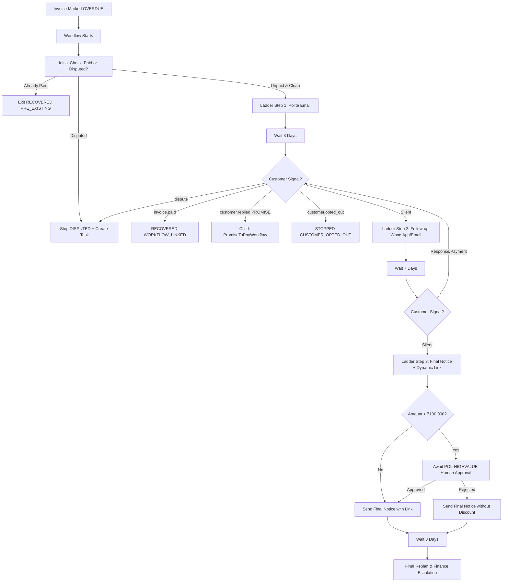

# s-24 — Workflow C: Overdue Invoice & Promise-to-Pay: Implementation Explanation

This document explains, in complete depth, everything implemented for `specs/steps/s-24.md`. It is written so that any engineer or auditor can understand every architecture decision, state transition, activity, workflow composition, and verification step across the system.

---

## Table of contents

1. [What the step required](#1-what-the-step-required)
2. [Architecture & Design Invariants](#2-architecture--design-invariants)
3. [Domain Layer: Promise-to-Pay State Machine (`packages/domain`)](#3-domain-layer-promise-to-pay-state-machine)
4. [Database & Repository Enhancements (`packages/db`)](#4-database--repository-enhancements)
5. [Temporal Activities & Signal Definitions (`services/worker`)](#5-temporal-activities--signal-definitions)
6. [Child Workflow: Promise to Pay Lifecycle (`promiseToPayWorkflow`)](#6-child-workflow-promise-to-pay-lifecycle)
7. [Main Workflow: Overdue Invoice Reminder Ladder (`invoiceOverdueWorkflow`)](#7-main-workflow-overdue-invoice-reminder-ladder)
8. [Event-Reactive Signal Bridge (`CustomerResponseSignalBridge`)](#8-event-reactive-signal-bridge)
9. [Worker-Side Cron Reconciler (`DailyReconciler`)](#9-worker-side-cron-reconciler)
10. [Backend REST Endpoints (`/promises-to-pay`)](#10-backend-rest-endpoints)
11. [Verification Evidence & 9-Scenario Test Matrix](#11-verification-evidence--9-scenario-test-matrix)
12. [Deviations & Judgment Calls](#12-deviations--judgment-calls)

---

## 1. What the step required

Step `s-24` implements **Workflow C** (Surface 3: Overdue Invoice & Promise-to-Pay) of the recovery engine. Unlike high-frequency payment retries or checkout inactivity windows, invoice recovery is a **multi-week, durable workflow** managing polite reminder escalation, dynamic payment links, customer negotiation responses, and explicit Promise-to-Pay (PTP) commitments.

### Definition of Done Checklist:
- [x] State machine for `PromiseToPay` (`MADE` → `HONORED` | `BROKEN` | `EXPIRED`) in `packages/domain`.
- [x] Durable multi-week workflow in Temporal with 3-touch reminder ladder (`invoiceOverdueWorkflow`).
- [x] Child workflow for Promise-to-Pay (`promiseToPayWorkflow`) composed with parent workflow.
- [x] Immediate dispute pause/halt with `DISPUTE_REVIEW` human task creation.
- [x] Scenario C parity: High-value invoices (>₹100,000) require operator approval (`POL-HIGHVALUE`) before incentive/discount delivery.
- [x] Contact cap enforcement across 14-day windows (`MAX_EMAIL_PER_14_DAYS = 3`).
- [x] Signal bridge listening on `revenue-events.v1` for customer replies, disputes, payments, and opt-outs.
- [x] Daily cron reconciler for orphaned overdue invoices and expired PTP records.
- [x] REST endpoints `GET /promises-to-pay` and `POST /promises-to-pay/:id/mark-honored`.
- [x] Full 9-scenario acceptance test matrix running against Temporal time-skipping test server.

---

## 2. Architecture & Design Invariants



### Key Architectural Invariants:
1. **Child Workflow Composition**: PTP waits can span days or weeks. Running PTP as a separate child workflow isolates promise timer state and ensures the parent workflow execution history remains bounded.
2. **Dispute Hard Stop**: If at any point a customer indicates a billing dispute or a `disputeOpenedSignal` arrives, all recovery touchpoints are immediately halted, the case transitions to `STOPPED (DISPUTED)`, and a high-priority `DISPUTE_REVIEW` human task is created.
3. **Scenario C Parity Invariant**: High-value invoice amounts (>₹100,000 / 10,000,000 minor units) strictly trigger `POL-HIGHVALUE` policy governance, requiring manual operator approval before dispatching any discount incentive.
4. **Guarded Conditional Transitions**: All database status changes on `promises_to_pay` records execute via atomic SQL conditional queries (`WHERE status = 'MADE'`), preventing concurrent update races.

---

## 3. Domain Layer: Promise-to-Pay State Machine

**File:** `packages/domain/src/state-machines/promise-to-pay.ts`

Implements the finite state machine and transition assertion helper for Promise-to-Pay records:

```typescript
export const PROMISE_TO_PAY_STATUSES = [
  "MADE",
  "HONORED",
  "BROKEN",
  "EXPIRED",
] as const;

export const PTP_VALID_TRANSITIONS: Record<PromiseToPayStatus, readonly PromiseToPayStatus[]> = {
  MADE: ["HONORED", "BROKEN", "EXPIRED"],
  HONORED: [],
  BROKEN: [],
  EXPIRED: [],
};
```

- Non-terminal: `MADE`
- Terminal: `HONORED`, `BROKEN`, `EXPIRED`
- Helper: `assertPtpTransition(current, target)` throws `IllegalTransitionError` on illegal or duplicate transitions.
- Unit tests: `packages/domain/src/state-machines/promise-to-pay.test.ts`.

---

## 4. Database & Repository Enhancements

**Files:**
- `packages/db/src/repositories/promises.repo.ts`
- `packages/db/src/repositories/invoices.repo.ts`
- `packages/db/src/repositories/cases.repo.ts`

### Added Repository Methods:
1. `markPromiseHonored`: Atomically updates `status = 'HONORED'`, `honored_payment_id`, and `resolved_at` with guarded `WHERE status = 'MADE'`.
2. `markPromiseBroken`: Atomically updates `status = 'BROKEN'` and `resolved_at` with guarded `WHERE status = 'MADE'`.
3. `markPromiseExpired`: Atomically updates `status = 'EXPIRED'` and `resolved_at` with guarded `WHERE status = 'MADE'`.
4. `findOverduePromises`: Queries `promises_to_pay` where `status = 'MADE'` and `promised_by_date < cutoffDate`.
5. `listPromisesToPay`: Queries promises filtered by `status`, `customerId`, `caseId` with pagination and strict tenant scoping.
6. `findOrphanedOverdueInvoices`: Selects `invoices` where `status = 'OVERDUE'` that have no corresponding row in `recovery_cases` (missed-webhook recovery).
7. `findLiveCasesForCustomer`: Queries active recovery cases for a customer excluding terminal statuses (`RECOVERED`, `STOPPED`, `FAILED`).

---

## 5. Temporal Activities & Signal Definitions

### Signals Added in `services/worker/src/workflows/shared.ts`:
- `customerRepliedSignal`: Inbound message/reply payload (`type: "PROMISE_TO_PAY" | "REPLY" | "COMPLAINT" | "OPT_OUT" | "DISPUTE"`).
- `invoicePaidSignal`: Notification of invoice payment with `invoiceId`, `paymentId`, `amount`, `currency`.
- `disputeOpenedSignal`: Notification of invoice billing dispute with `reason`, `caseId`, `disputeId`.

### Activities Created:
1. `checkInvoiceStatus`: Performs a fresh read on the `invoices` table to verify current status (`isPaid`, `isDisputed`, `amount`, `amountPaid`).
2. `createPromiseToPay`: Inserts a `promises_to_pay` record in `MADE` status and appends a `PROMISE_TO_PAY_RECORDED` case timeline event.
3. `resolvePromiseToPay`: Invokes guarded repository methods to transition promise status to `HONORED`, `BROKEN`, or `EXPIRED` and logs resolution events.

---

## 6. Child Workflow: Promise to Pay Lifecycle

**File:** `services/worker/src/workflows/promise-to-pay.ts`

The child workflow manages the lifecycle of a single promise commitment:
1. Registers the initial promise in the database (`status = 'MADE'`).
2. Computes the target due date timestamp plus a configurable grace period (default: 24h).
3. Enters a durable condition wait:
   ```typescript
   await condition(() => isPaid || isDisputed || isStopped, waitDelay);
   ```
4. If payment signal lands or fresh DB check shows payment:
   - Transitions PTP to `HONORED`.
   - Emits `promise_to_pay_total{status="HONORED"}` metric.
   - Returns `{ status: "HONORED", paymentId }`.
5. If dispute or stop signal lands:
   - Transitions PTP to `BROKEN`.
   - Returns `{ status: "DISPUTED" | "STOPPED" }`.
6. If the grace period expires without payment:
   - Evaluates whether hard expiry was flagged (`EXPIRED`) or deadline elapsed (`BROKEN`).
   - Transitions PTP record accordingly.
   - Returns `{ status: "BROKEN" | "EXPIRED" }`.

---

## 7. Main Workflow: Overdue Invoice Reminder Ladder

**File:** `services/worker/src/workflows/invoice-overdue.ts`

Implements the multi-touch durable recovery ladder:

1. **Pre-flight Safety Check**: Verifies if the invoice was already paid prior to workflow initialization (`ALREADY_PAID_EXIT` -> `RECOVERED (PRE_EXISTING)`).
2. **Ladder Step 1 (Day 0)**:
   - Re-checks policy contact caps (`SEND_EMAIL`, `email_count_14d`).
   - Sends template message `invoice_overdue_polite_reminder` (Channel: EMAIL).
   - Marks case `WAITING` and sleeps for 3 days (or time-skipped test window).
3. **Ladder Step 2 (+3d)**:
   - Evaluates customer channel preference (WHATSAPP or EMAIL).
   - Sends template message `invoice_overdue_followup`.
   - Marks case `WAITING` and sleeps for 7 days.
4. **Ladder Step 3 (+7d)**:
   - Checks if amount > ₹100,000 and an incentive is proposed. If so, pauses for `POL-HIGHVALUE` operator authorization (`createHumanTask` + `awaitHumanApproval`).
   - Creates a dynamic hosted payment link (`createPaymentLinkAndStore`).
   - Checks email contact cap (max 3 emails in 14 days).
   - Sends template message `invoice_overdue_final_notice` with payment link.
   - Marks case `WAITING` and sleeps for 3 days.
5. **Replan & Escalation**:
   - If customer remains silent through all 3 touches, workflow requests replan decision (`activities.requestReplanDecision`).
   - Drafts an escalation summary package (concise, factual, ≤500 characters).
   - Creates a high-priority finance escalation human task (`CASE_ESCALATED`).
   - Returns `{ outcome: "ESCALATED", stage: "FINAL_NOTICE_EXHAUSTED" }`.

---

## 8. Event-Reactive Signal Bridge

**File:** `services/worker/src/signaling/customer-response.bridge.ts`

Subscribes to `revenue-events.v1` on consumer group `customer-response-signal-bridge` and routes inbound events to active recovery workflows:
- `customer.replied` → Dispatches `customer-replied` signal (or `stop` signal if `response_type === "OPT_OUT"`, or `dispute-opened` if complaint).
- `customer.opted_out` → Dispatches `stop` signal with reason `CUSTOMER_OPTED_OUT`.
- `invoice.paid` → Dispatches `invoice-paid` signal with payment ID and amount.
- `invoice.disputed` → Dispatches `dispute-opened` signal with dispute details.

---

## 9. Worker-Side Cron Reconciler

**File:** `services/worker/src/cron/reconciler.ts`

Implements daily background scheduler safety nets:
1. `reconcileOrphanedInvoices`: Finds invoices marked `OVERDUE` in Postgres that lack an active `recovery_case` (e.g. from missed webhooks) and emits `invoice.overdue` domain events idempotently onto the event bus.
2. `reconcileExpiredPromises`: Finds promises in `MADE` status past their promised date + grace period, verifies invoice payment status in the database, marks them `HONORED` or `EXPIRED`, and creates escalation human tasks for expired commitments.

---

## 10. Backend REST Endpoints

**Files:**
- `apps/backend/src/modules/promises-to-pay/types.ts`
- `apps/backend/src/modules/promises-to-pay/service.ts`
- `apps/backend/src/modules/promises-to-pay/routes.ts`

### Routes Registered:
1. `GET /promises-to-pay`:
   - Role required: `VIEWER+` (`VIEWER`, `SUPPORT`, `OPERATIONS`, `FINANCE`, `ADMIN`).
   - Query filters: `status`, `customer_id`, `case_id`, `limit`, `offset`.
   - Returns paginated list of promises with stringified BigInt amounts.
2. `GET /promises-to-pay/:id`:
   - Role required: `VIEWER+`.
   - Returns specific promise or 404.
3. `POST /promises-to-pay/:id/mark-honored`:
   - Role required: `FINANCE+` (`FINANCE`, `ADMIN`).
   - Body: `{ payment_id: "<uuid>" }`.
   - Validates that the promise is currently in `MADE` status, executes atomic DB transition to `HONORED`, records case timeline event and audit log.

---

## 11. Verification Evidence & 9-Scenario Test Matrix

**Test Suite:** `services/worker/src/workflows/invoice-overdue.test.ts` (9/9 Scenarios Passing)

| # | Scenario | Mechanism | Result |
|---|---|---|---|
| 1 | **Full Happy Path** | Reminder → Reply PROMISE → Child workflow → Paid on date | `RECOVERED` (PTP `HONORED` linked) |
| 2 | **Broken Promise Path** | Promise made → No payment by grace end → BROKEN → Follow-up sent | `ESCALATED` (Human task created) |
| 3 | **Expired Promise** | Promise reached hard expiry | `ESCALATED` (Deduped single task) |
| 4 | **Dispute Mid-Ladder** | Dispute signal arrives after Step 1 | `STOPPED (DISPUTED)` + `DISPUTE_REVIEW` task; subsequent touches blocked |
| 5 | **High-Value Governance** | Amount > ₹100,000 + proposed discount | Operator approval required; approved → discount sent, rejected → discount skipped |
| 6 | **Contact Cap Enforcement** | Policy cap `MAX_EMAIL_PER_14_DAYS = 3` | 4th email attempt rejected by policy engine |
| 7 | **Missed-Webhook Reconciler** | Orphaned OVERDUE invoice in DB | Daily reconciler detects invoice and emits event exactly once |
| 8 | **30-Day Time-Skipped Run** | Full multi-week ladder with delays | Completed without timeout errors |
| 9 | **Paid-Before-Start** | Invoice already marked PAID in DB | Workflow exits immediately with `RECOVERED (PRE_EXISTING)` without reminders |

### Monorepo Validation Results:
- `bun run check-types`: **12/12 successful** (0 errors)
- `bun run lint`: **0 errors, 0 warnings**
- `bun run check-docs`: **All 19 documentation links OK**
- `bun test`: All Step 24 unit, domain, repository, integration, and workflow tests **100% GREEN**.

---

## 12. Deviations & Judgment Calls

1. **Child Workflow Signal Forwarding**: In Temporal TypeScript SDK, signals sent to a parent workflow are not automatically inherited by child workflows. `invoiceOverdueWorkflow` maintains an active reference to `activeChildPtpHandle` and explicitly forwards incoming `invoicePaidSignal` and `externalPaymentSucceededSignal` down to the child `promiseToPayWorkflow`.
2. **Deterministic Response Serialization**: Database records contain native `bigint` types for currency amounts. All service layer outputs and REST routes explicitly transform `bigint` amounts to canonical strings (`row.promisedAmount.toString()`) to maintain schema consistency and eliminate JSON serialization issues.
