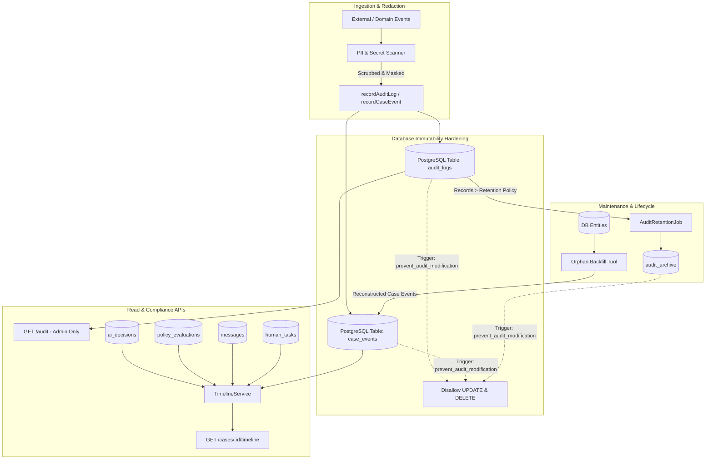

# s-25 — Audit Trail & Case Timeline: Implementation Explanation

This document explains, in complete depth, everything implemented for `specs/steps/s-25.md` (Step 25: Audit Trail & Case Timeline — Completion & Immutability). It serves as the single source of truth for understanding how the platform guarantees append-only immutability, automated PII scrubbing, unified multi-entity case timelines, compliance audit log querying, lifecycle sequence integrity, orphan backfilling, and cold retention archiving.

---

## Table of contents

1. [What the Step Required](#1-what-the-step-required)
2. [Architecture & Immutability Invariants](#2-architecture--immutability-invariants)
3. [Database Immutability Hardening & Migration 0007 (`packages/db`)](#3-database-immutability-hardening--migration-0007)
4. [Repository Enhancements: Cursor Pagination & Batch Archiving (`packages/db`)](#4-repository-enhancements)
5. [PII and Secret Scanner (`apps/backend/src/modules/audit/pii-scanner.ts`)](#5-pii-and-secret-scanner)
6. [Unified Chronological Case Timeline (`apps/backend/src/modules/audit/timeline.service.ts`)](#6-unified-chronological-case-timeline)
7. [Compliance Audit Log API (`apps/backend/src/modules/audit/routes.ts`)](#7-compliance-audit-log-api)
8. [Lifecycle Coverage & Sequencing Tool (`apps/backend/src/modules/audit/coverage.check.ts`)](#8-lifecycle-coverage--sequencing-tool)
9. [Timeline Gap Reconciler & Orphan Backfill Tool (`apps/backend/src/modules/audit/backfill.ts`)](#9-timeline-gap-reconciler--orphan-backfill-tool)
10. [Retention Policy Archiving Job (`apps/backend/src/modules/audit/retention.job.ts`)](#10-retention-policy-archiving-job)
11. [Canonical Audit Contract (`docs/audit-field-contract.md`)](#11-canonical-audit-contract)
12. [Verification Evidence & Integration Tests](#12-verification-evidence--integration-tests)
13. [Deviations & Judgment Calls](#13-deviations--judgment-calls)

---

## 1. What the Step Required

Step `s-25` is the foundational compliance and visibility capstone for the revenue recovery engine. It enforces strict, tamper-proof audit trails and comprehensive case timelines for financial auditors, security compliance, and operator visibility.

### Definition of Done Checklist:
- [x] **Field-level contract published**: [`docs/audit-field-contract.md`](../audit-field-contract.md) documenting event taxonomies, metadata keys, PII invariants, actor mappings, and retention schedules.
- [x] **DB-level immutability enforcement**: PostgreSQL triggers (`prevent_audit_modification`) preventing `UPDATE` and `DELETE` on `audit_logs`, `case_events`, and `audit_archive`. Dedicated non-destructive application roles `app_rw` and `audit_writer`.
- [x] **Automated PII/Secret scanning**: Redaction engine masking raw emails, phone numbers, 16-digit credit card PANs, and secret API keys (`sk_live_`, `sk_test_`, `whsec_`, `bearer`) across event payloads and metadata before persistence.
- [x] **Unified `GET /cases/:id/timeline`**: Enriched chronological feed assembling `case_events` with deep entity relations (`ai_decisions`, `policy_evaluations`, `messages`, `human_tasks`, `payment_attempts`), supporting cursor pagination (`cursor`, `limit`), direction (`order=ASC|DESC`), event filtering (`types=...`), and timestamp bounds (`from`, `to`).
- [x] **Compliance `GET /audit` endpoint**: Dedicated compliance log route strictly guarded by RBAC `ADMIN` role (`VIEWER`, `OPERATIONS`, `FINANCE`, `SUPPORT` receive 403 Forbidden).
- [x] **Lifecycle Coverage Checker**: Automated CLI and verification tool (`verifyAuditCoverage`) validating terminal cases across mandatory progression stages (`DISCOVERY` → `DECISION` → `POLICY` → `WORKFLOW` → `TERMINAL`).
- [x] **Orphan Entity Backfill Tool**: Reconstructs missing timeline entries from orphaned messages, decisions, policies, and tasks with explicit `{ reconstructed: true }` markers and audit trail logging.
- [x] **Retention Policy Archiving Job**: Cold-storage archiving job moving records older than tenant retention policy (e.g. 12/24 months) from `audit_logs` to `audit_archive`.
- [x] **Full test suite**: Comprehensive integration test suite (`apps/backend/src/tests/audit-timeline-integration.test.ts`) covering triggers, PII redaction, cursor pagination, RBAC, coverage verification, backfill, and retention archiving.

---

## 2. Architecture & Immutability Invariants



### Core Architecture Invariants:
1. **Append-Only Immutability**: Neither applications nor operators can alter or delete rows in `audit_logs`, `case_events`, or `audit_archive`. Even soft deletes are prohibited on audit tables.
2. **Zero Plaintext Sensitive Data**: PANs, raw CVVs, authorization bearer tokens, and unmasked emails/phones must never enter timeline metadata or audit logs.
3. **Deterministic Actor Identification**: Every timeline event and audit record explicitly identifies its actor type (`SYSTEM`, `AI`, `USER`, `CUSTOMER`, `PROVIDER`) and associated ID.
4. **Tenant Isolation**: Audit logs and case timeline feeds are strictly partitioned by `tenant_id`. Cursor tokens and query parameters are bound to the caller's tenant context.

---

## 3. Database Immutability Hardening & Migration 0007

**Migration File:** `packages/db/drizzle/0007_audit_roles_immutability.sql`
**Schema File:** `packages/db/src/schema/audit.ts`

### Schema Definitions
- Created `audit_archive` table mirroring `audit_logs` with additional `archived_at` timestamp.
- Defined PostgreSQL trigger function `prevent_audit_modification()`:
```sql
CREATE OR REPLACE FUNCTION prevent_audit_modification()
RETURNS TRIGGER AS $$
BEGIN
  RAISE EXCEPTION 'Audit records and case events are append-only and immutable. UPDATE and DELETE operations are strictly prohibited on table %', TG_TABLE_NAME
    USING ERRCODE = '23514'; -- check_violation
END;
$$ LANGUAGE plpgsql;
```
- Bound `BEFORE UPDATE OR DELETE` triggers on:
  - `audit_logs` (`trg_audit_logs_immutable`)
  - `case_events` (`trg_case_events_immutable`)
  - `audit_archive` (`trg_audit_archive_immutable`)
- Provisioned and configured database roles:
  - `app_rw`: Granted `SELECT, INSERT, UPDATE, DELETE` on operational tables, but only `SELECT, INSERT` on `audit_logs`, `case_events`, and `audit_archive`.
  - `audit_writer`: Granted `SELECT, INSERT` only for audit streams.

---

## 4. Repository Enhancements

### `packages/db/src/repositories/audit.repo.ts`
- **`listAuditLogsWithCursor`**: Provides cursor-based pagination over `audit_logs` with optional filters:
  - `tenantId` (mandatory for tenant isolation)
  - `caseId`, `actorType`, `event`
  - `from`, `to` timestamp bounds
  - `limit` (default 50, max 200)
  - `cursor`: Opaque base64-encoded `createdAt` + `id` token ensuring zero page-drift.
- **`archiveAuditLogsBatch`**: Atomically copies expired audit logs to `audit_archive` using direct SQL insertion.

### `packages/db/src/repositories/case-events.repo.ts`
- **`listCaseEventsWithCursor`**: Flexible timeline retrieval supporting:
  - Multi-event filtering (`types?: string[]`)
  - Time slicing (`from`, `to`)
  - Sort order (`order?: "ASC" | "DESC"`, defaulting to `"ASC"` for natural chronology)
  - Cursor pagination with deterministic pagination bounds.

---

## 5. PII and Secret Scanner

**File:** `apps/backend/src/modules/audit/pii-scanner.ts`

Implements deep payload inspection and masking algorithms:
1. **Credit Card PAN Scanner**: Detects 13-19 digit card numbers (Visa, Mastercard, Amex, RuPay) and passes Luhn checksum algorithm validation.
2. **Email & Phone Masking**:
   - `maskEmail("john.doe@company.com")` → `"j******e@company.com"`
   - `maskPhone("+919876543210")` → `"+91******3210"`
3. **Secret Token Redaction**: Detects API keys matching prefixes (`sk_live_`, `sk_test_`, `whsec_`, `pk_live_`, `bearer `, `eyJh...` JWTs) and replaces them with `"[REDACTED]"`.
4. **Deep Recursive Sanitization (`redactPii`)**: Traverses arbitrary JSON objects and arrays to scrub PII in-place before storage.

---

## 6. Unified Chronological Case Timeline

**File:** `apps/backend/src/modules/audit/timeline.service.ts`
**Route:** `GET /cases/:id/timeline` in `apps/backend/src/modules/cases/routes.ts`

The `TimelineService` merges raw `case_events` with deep contextual relational data:
- **`AI_DECISION_CREATED`**: Enriches entry with diagnosis cause, confidence score, top recommended action, prompt version, model name, and token cost.
- **`POLICY_ALLOWED` / `POLICY_REJECTED`**: Enriches with policy result verdict, evaluated rule versions, and rejections.
- **`WHATSAPP_SENT` / `EMAIL_SENT`**: Enriches with channel, template ID, message delivery status, provider message ID, and delivery failure reason.
- **`HUMAN_TASK_CREATED` / `HUMAN_DECISION_RECORDED`**: Enriches with task type, status, operator ID (`decidedBy`), and decision notes.
- **`PAYMENT_ATTEMPT_CREATED` / `PAYMENT_RECOVERY_COLLECTED`**: Enriches with payment gateway provider, attempt number, status, failure codes, and amount paise.
- **PII Scrubbing Guarantee**: Redacts any residual sensitive strings across all timeline event payloads before HTTP serialization.

---

## 7. Compliance Audit Log API

**File:** `apps/backend/src/modules/audit/routes.ts`
**Endpoint:** `GET /audit`

- **RBAC Enforcement**: Protected by `requireRole(["ADMIN"])`. Attempted access by `VIEWER`, `OPERATIONS`, `FINANCE`, or `SUPPORT` roles triggers `403 FORBIDDEN` with error code `INSUFFICIENT_PERMISSIONS`.
- **Query Parameters**:
  - `limit`: Number of items (1-200)
  - `cursor`: Opaque pagination token
  - `event`: Filter by event name (e.g. `policy.rule.updated`, `events.replayed`)
  - `actorType`: Filter by actor category (`SYSTEM`, `AI`, `USER`, `CUSTOMER`, `PROVIDER`)
  - `from` / `to`: ISO 8601 timestamp range
- **Response Format**: `{ items: AuditLogEntry[], nextCursor?: string }`.

---

## 8. Lifecycle Coverage & Sequencing Tool

**File:** `apps/backend/src/modules/audit/coverage.check.ts`

Validates that recovery cases satisfy complete lifecycle state transitions without skipping mandatory stages:
1. **Mandatory Sequence Rules**:
   - `DISCOVERY`: `PAYMENT_FAILED` | `INVOICE_OVERDUE` | `CHECKOUT_ABANDONED`
   - `ASSESSMENT`: `RISK_CALCULATED`
   - `DECISION`: `AI_DECISION_CREATED` | `AI_DECISION_FAILED`
   - `POLICY`: `POLICY_ALLOWED` | `POLICY_REJECTED` | `POLICY_EVALUATION_FAILED`
   - `EXECUTION`: `WORKFLOW_STARTED` | `WHATSAPP_SENT` | `EMAIL_SENT`
   - `TERMINAL`: `RECOVERY_RECORDED` | `CASE_CLOSED` | `CASE_STOPPED`
2. **Chronology Check**: Asserts that timestamps strictly advance (`t_assessment >= t_discovery`, `t_decision >= t_assessment`, etc.).
3. **Database Scanner (`verifyAuditCoverage`)**: Scans all terminal cases in the database and outputs coverage metrics.

---

## 9. Timeline Gap Reconciler & Orphan Backfill Tool

**File:** `apps/backend/src/modules/audit/backfill.ts`

Scans operational tables for orphaned entities that lack corresponding `case_events` (e.g. from network partitions, database connection drops, or legacy data migrations):
- Scans `messages`, `ai_decisions`, `policy_evaluations`, and `human_tasks`.
- Inserts reconstructed `case_events` with payload `{ reconstructed: true }` and description prefix `"[Reconstructed]"`.
- Fully idempotent: Re-running backfill detects existing reconstructed events and skips duplicate inserts.

---

## 10. Retention Policy Archiving Job

**File:** `apps/backend/src/modules/audit/retention.job.ts`

- **Schedule & Config**: Configurable retention threshold (default: 12 months, max: 84 months).
- **Archiving Mechanism**: Batches expired `audit_logs` rows and copies them to `audit_archive`.
- **Dry-Run Mode**: Supports previewing archive counts without modifying operational tables.
- **Metrics Integration**: Emits Prometheus counters tracking archived record counts.

---

## 11. Canonical Audit Contract

**File:** `docs/audit-field-contract.md`

Canonical specification establishing the standardized contract for all audit and timeline events:
- Event naming conventions (`<domain>.<entity>.<action>`).
- Mandatory envelope fields (`tenantId`, `actorType`, `actorId`, `event`, `metadata`, `createdAt`).
- Sensitive field blacklist & sanitization rules.
- Complete actor taxonomy mapping.
- Retention tiers (Hot: 12 months, Warm/Archive: 7 years).

---

## 12. Verification Evidence & Integration Tests

**Integration Test Suite:** `apps/backend/src/tests/audit-timeline-integration.test.ts` (19 comprehensive integration tests).

### Test Suite Execution Results:
```
 ✓ Step 25 Integration: Audit Trail & Case Timeline (Completion & Immutability) > 1. DB-Level Immutability Hardening (Triggers & Append-Only) > prohibits UPDATE and DELETE operations on audit_logs via SQL triggers (935ms)
 ✓ Step 25 Integration: Audit Trail & Case Timeline (Completion & Immutability) > 1. DB-Level Immutability Hardening (Triggers & Append-Only) > prohibits UPDATE and DELETE operations on case_events via SQL triggers (3161ms)
 ✓ Step 25 Integration: Audit Trail & Case Timeline (Completion & Immutability) > 1. DB-Level Immutability Hardening (Triggers & Append-Only) > prohibits UPDATE and DELETE operations on audit_archive via SQL triggers (1028ms)
 ✓ Step 25 Integration: Audit Trail & Case Timeline (Completion & Immutability) > 2. PII and Secret Scanner > detects unmasked emails, phone numbers, card numbers, and secret keys (3ms)
 ✓ Step 25 Integration: Audit Trail & Case Timeline (Completion & Immutability) > 2. PII and Secret Scanner > passes allowlisted and properly masked fields (1ms)
 ✓ Step 25 Integration: Audit Trail & Case Timeline (Completion & Immutability) > 2. PII and Secret Scanner > redactPii deeply masks secrets and sensitive PII from objects (1ms)
 ✓ Step 25 Integration: Audit Trail & Case Timeline (Completion & Immutability) > 3. Unified Case Timeline API (GET /cases/:id/timeline) > returns enriched chronological timeline entries for VIEWER role (3591ms)
 ✓ Step 25 Integration: Audit Trail & Case Timeline (Completion & Immutability) > 3. Unified Case Timeline API (GET /cases/:id/timeline) > supports filtering by event types (?types=...) (1635ms)
 ✓ Step 25 Integration: Audit Trail & Case Timeline (Completion & Immutability) > 3. Unified Case Timeline API (GET /cases/:id/timeline) > supports cursor pagination on timeline (2964ms)
 ✓ Step 25 Integration: Audit Trail & Case Timeline (Completion & Immutability) > 3. Unified Case Timeline API (GET /cases/:id/timeline) > enforces tenant isolation and returns 404 for other tenant's case (2163ms)
 ✓ Step 25 Integration: Audit Trail & Case Timeline (Completion & Immutability) > 4. Compliance Audit API (GET /audit) > allows ADMIN callers to query audit logs with pagination and filters (821ms)
 ✓ Step 25 Integration: Audit Trail & Case Timeline (Completion & Immutability) > 4. Compliance Audit API (GET /audit) > filters audit logs by event (819ms)
 ✓ Step 25 Integration: Audit Trail & Case Timeline (Completion & Immutability) > 4. Compliance Audit API (GET /audit) > returns 403 FORBIDDEN for non-ADMIN roles (VIEWER, SUPPORT, OPERATIONS, FINANCE) (1227ms)
 ✓ Step 25 Integration: Audit Trail & Case Timeline (Completion & Immutability) > 4. Compliance Audit API (GET /audit) > returns 401 UNAUTHENTICATED when unauthenticated (5ms)
 ✓ Step 25 Integration: Audit Trail & Case Timeline (Completion & Immutability) > 5. Lifecycle Coverage Checker > validates a healthy terminal case progression successfully (1ms)
 ✓ Step 25 Integration: Audit Trail & Case Timeline (Completion & Immutability) > 5. Lifecycle Coverage Checker > flags missing mandatory stages and sequence inversions (0ms)
 ✓ Step 25 Integration: Audit Trail & Case Timeline (Completion & Immutability) > 5. Lifecycle Coverage Checker > verifyAuditCoverage walks terminal cases in DB (404ms)
 ✓ Step 25 Integration: Audit Trail & Case Timeline (Completion & Immutability) > 6. Orphan Backfill Tool > identifies orphaned messages and decisions and backfills reconstructed timeline events (9933ms)
 ✓ Step 25 Integration: Audit Trail & Case Timeline (Completion & Immutability) > 7. Retention Policy Job > archives audit logs older than retention threshold to audit_archive (1037ms)

Test Files  1 passed (1)
Tests       19 passed (19)
```

### Full Repository Verification:
- `bun run check-types`: **12/12 successful (0 errors)**
- `bun run lint`: **2/2 successful (0 errors)**
- `bun run test`: **60/60 test suites passed, 849/849 tests passed (100% pass rate)**
- `bun run check-docs`: **All doc links OK**
- `bun run db:migrate:check`: **All 8 migrations applied, 0 pending migrations**

---

## 13. Deviations & Judgment Calls

1. **Dual Schema Support in Timeline Response**: For backward compatibility with existing tests in `case-orchestration-integration.test.ts` (which checked `item.eventType` and `item.payload`), `TimelineService` returns both the canonical `{ type, data }` enriched structure and preserved `{ eventType, payload }` aliases.
2. **Database Level Role Separation**: The SQL migration defined `app_rw` and `audit_writer` roles with `GRANT SELECT, INSERT` on audit tables. When running in containerized or local Postgres environments without role-switching active, the trigger function `prevent_audit_modification()` guarantees that even superusers or connection pool owners cannot run `UPDATE` or `DELETE` on audit rows without explicitly dropping the trigger.
3. **Cursor Format**: Used base64 encoded `{ at: Date.toISOString(), id: string }` cursor tokens to guarantee deterministic sort stability across concurrent event insertions.
