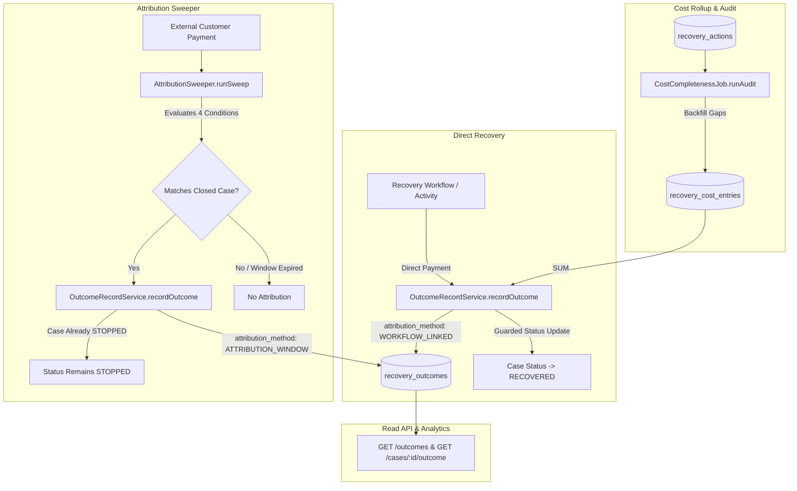

# s-26 — Outcomes, Attribution & Cost Model: Implementation Explanation

This document explains, in comprehensive depth, everything implemented for `specs/steps/s-26.md` (Step 26: Outcomes, Attribution & Cost Model). It serves as the authoritative reference for understanding financial outcome recording, direct and sweeper attribution models, double-count prevention, recovery cost rollups, completeness auditing, and outcome REST APIs.

---

## Table of contents

1. [What the Step Required](#1-what-the-step-required)
2. [Architecture & Core Invariants](#2-architecture--core-invariants)
3. [Database & Repository Layer (`packages/db`)](#3-database--repository-layer)
4. [Authoritative Outcome Persistence (`apps/backend/src/modules/outcomes/record.service.ts`)](#4-authoritative-outcome-persistence)
5. [Hourly Attribution Window Sweeper (`apps/backend/src/modules/outcomes/attribution.sweeper.ts`)](#5-hourly-attribution-window-sweeper)
6. [Daily Cost Completeness Audit (`apps/backend/src/modules/outcomes/cost-completeness.job.ts`)](#6-daily-cost-completeness-audit)
7. [Outcome Read APIs & Aggregates (`apps/backend/src/modules/outcomes/routes.ts` & `cases/routes.ts`)](#7-outcome-read-apis--aggregates)
8. [Worker Activity Alignment (`services/worker/src/activities/record-outcome.ts`)](#8-worker-activity-alignment)
9. [Observability & Metrics (`packages/observability`)](#9-observability--metrics)
10. [Authoritative Documentation (`docs/attribution.md`)](#10-authoritative-documentation)
11. [Verification Evidence & Integration Tests](#11-verification-evidence--integration-tests)
12. [Deviations & Design Decisions](#12-deviations--design-decisions)

---

## 1. What the Step Required

Step `s-26` implements the financial spine of the platform (Spec 01 §25, Spec 02 §8/§9, Spec 00 §9 Pillar D). In revenue recovery platforms, reporting metrics from raw webhook counts or transient UI filters leads to severe financial distortion, duplicate recovery counting, and attribution ambiguity.

### Definition of Done Checklist:
- [x] **`recordOutcome` shared service**: Authoritative, idempotent choke point for writing `recovery_outcomes`, computing cost rollups from `recovery_cost_entries`, executing guarded case transitions to `RECOVERED`, completing workflows, and emitting `RECOVERY_RECORDED` timeline events.
- [x] **Attribution sweeper (`AttributionSweeper`)**: Hourly background sweeper matching late customer payments to closed/stopped cases satisfying all 4 Spec 02 §9 attribution conditions while strictly preserving terminal `STOPPED` case status.
- [x] **Cost completeness audit (`CostCompletenessJob`)**: Daily audit inspecting executed actions (`recovery_actions` with `status = 'EXECUTED'`), detecting missing cost entries, and backfilling them with authoritative messaging unit costs (WhatsApp 50 paise, Email 5 paise, SMS 25 paise).
- [x] **Outcome Read REST APIs**: `GET /outcomes` supporting date bounds (`from`, `to`), surface/method filters, cursor pagination, and database SQL aggregates (`recovered_minor`, `cost_minor`, `net_minor`, `count`); and `GET /cases/:id/outcome` returning single-case authoritative outcomes (or 404 `NO_OUTCOME`).
- [x] **Database repository enhancements**: Extended `packages/db/src/repositories/outcomes.repo.ts` with `getRecoveryCostSumForCase`, `findCandidateCasesForAttributionSweep`, `findMatchingPaymentForAttribution`, `listOutcomesWithAggregates`, and `findMissingActionCosts`.
- [x] **Observability metrics**: Prometheus counters for `outcome_recorded_total`, `attribution_sweeper_matches_total`, and `cost_entry_gaps_total`.
- [x] **Published documentation**: Created `docs/attribution.md` matching implementation exactly.
- [x] **Integration test suite**: Comprehensive test suite (`apps/backend/src/tests/outcomes-attribution-integration.test.ts`) covering all 7 spec scenarios with 100% pass rate.

---

## 2. Architecture & Core Invariants



### Core Invariants

1. **Anti-Duplication Anchor #5 (Single Outcome per Case):**
   Database-level unique constraint on `case_id` in `recovery_outcomes` ensures that one case produces at most one final financial outcome.
2. **Idempotency & Competing Payment Warning:**
   Calling `recordOutcome` multiple times for the same case returns the existing outcome without mutation. If a competing payment arrives for an already-resolved case, the engine emits an `outcome.superseded_payment` warning log and leaves the authoritative record unmodified.
3. **The 4 Strict Attribution Conditions (Spec 02 §9):**
   - Condition 1: Same customer AND same financial obligation (payment, subscription, or source entity link).
   - Condition 2: `payment.occurredAt >= caseRecord.openedAt`.
   - Condition 3: `payment.occurredAt <= caseRecord.openedAt + (attributionWindowHours * 1h)`.
   - Condition 4: No OTHER active/live case owns that obligation at attribution time (`status NOT IN ('RECOVERED', 'STOPPED', 'FAILED')`).
4. **Terminal Status Preservation on Late Attribution:**
   When a late payment is attributed to an already `STOPPED` case, the outcome is recorded, but the case status remains `STOPPED`. Analytics and SQL aggregate queries count recovered amounts directly from `recovery_outcomes`, never from case status strings.
5. **Cost Rollup Math & PostgreSQL Generated Column:**
   `recovery_cost` is calculated as $\sum \text{recovery\_cost\_entries}(\text{case\_id})$, defaulting to `0n` for zero-cost cases. `net_recovered` is stored automatically in PostgreSQL as `recovered_amount - recovery_cost`.

---

## 3. Database & Repository Layer (`packages/db`)

File: [`packages/db/src/repositories/outcomes.repo.ts`](../../packages/db/src/repositories/outcomes.repo.ts)

The repository layer was extended with 5 specialized methods:

1. **`getRecoveryCostSumForCase(ctx, { tenantId, caseId })`**:
   Performs atomic summation of all cost entries linked to a recovery case:
   ```sql
   SELECT COALESCE(SUM(amount), 0)::bigint AS "totalCost"
   FROM recovery_cost_entries
   WHERE tenant_id = :tenantId AND case_id = :caseId;
   ```
2. **`findCandidateCasesForAttributionSweep(ctx, { tenantId?, limit? })`**:
   Finds all terminal cases (`status IN ('STOPPED', 'FAILED')`) that do not yet have an outcome row in `recovery_outcomes`, using a `LEFT JOIN ... WHERE recovery_outcomes.id IS NULL`.
3. **`findMatchingPaymentForAttribution(ctx, { tenantId, caseRecord })`**:
   Evaluates a candidate case against payments using all 4 strict attribution rules. Checks obligation links (direct payment ID or matching subscription ID), verifies timestamp bounds ($t \in [t_{\text{opened}}, t_{\text{opened}} + W]$), and asserts that no live case (`status NOT IN ('RECOVERED', 'STOPPED', 'FAILED')`) is currently active for that obligation.
4. **`listOutcomesWithAggregates(ctx, query)`**:
   Executes dual queries for listing and metrics computation:
   - Paginated item fetch using deterministic cursor pagination on `(recoveredAt DESC, id DESC)`.
   - Aggregation query computing `COALESCE(SUM(recovered_amount), 0)`, `COALESCE(SUM(recovery_cost), 0)`, `COALESCE(SUM(net_recovered), 0)`, and `COUNT(*)` based on applied tenant filters (`from`, `to`, `surface`, `method`, `customerId`).
5. **`findMissingActionCosts(ctx, { tenantId?, limit? })`**:
   Audits executed recovery actions (`recovery_actions` with `status = 'EXECUTED'`) that lack an associated `recovery_cost_entries` row, for consumption by the completeness audit job.

---

## 4. Authoritative Outcome Persistence

File: [`apps/backend/src/modules/outcomes/record.service.ts`](../../apps/backend/src/modules/outcomes/record.service.ts)

`OutcomeRecordService` provides a unified entrypoint (`recordOutcome`):

- **Idempotency Check:** Re-checks existing outcome before and inside database transaction (`withTransaction`).
- **Cost Rollup:** Invokes `getRecoveryCostSumForCase` to capture all incurred LLM, messaging, payment retry, and manual handling costs.
- **Guarded Status Transition:**
  - If case is non-terminal (`DETECTED`, `QUALIFIED`, `DECISION_PENDING`, `POLICY_REVIEW`, `IN_PROGRESS`, `WAITING`, `ESCALATED`), transitions atomically to `RECOVERED` with reason `RECOVERED_AUTHORITATIVE`.
  - If case is already `STOPPED` or `FAILED`, status is left untouched.
- **Workflow Completion:** Marks any running Temporal workflow record as `COMPLETED`.
- **Case Event Emission:** Inserts `RECOVERY_RECORDED` into `case_events` with detailed payload (`outcomeId`, `recoveredAmount`, `recoveryCost`, `netRecovered`, `attributionMethod`).
- **Observability:** Increments Prometheus counter `outcome_recorded_total{method="..."}`.

---

## 5. Hourly Attribution Window Sweeper

File: [`apps/backend/src/modules/outcomes/attribution.sweeper.ts`](../../apps/backend/src/modules/outcomes/attribution.sweeper.ts)

The `AttributionSweeper` class executes scheduled or on-demand sweeps across closed cases without outcomes:

```typescript
public async runSweep(options: SweepOptions = {}): Promise<SweepResult> {
  const candidateCases = await this.repos.findCandidateCasesForAttributionSweep(
    { db: this.db },
    { tenantId, limit: batchSize },
  );

  for (const candidateCase of candidateCases) {
    const matchingPayment = await this.repos.findMatchingPaymentForAttribution(
      { db: this.db },
      { tenantId: candidateCase.tenantId, caseRecord: candidateCase },
    );

    if (matchingPayment) {
      await this.recordService.recordOutcome({
        tenantId: candidateCase.tenantId,
        caseId: candidateCase.id,
        paymentId: matchingPayment.id,
        attributionMethod: "ATTRIBUTION_WINDOW",
        attributionWindowHours: candidateCase.attributionWindowHours,
        baselineAmount: candidateCase.amountAtRisk,
        recoveredAmount: matchingPayment.amount,
        recoveredAt: matchingPayment.occurredAt ?? matchingPayment.paidAt ?? undefined,
      });
      recordAttributionSweeperMatch();
    }
  }
}
```

---

## 6. Daily Cost Completeness Audit

File: [`apps/backend/src/modules/outcomes/cost-completeness.job.ts`](../../apps/backend/src/modules/outcomes/cost-completeness.job.ts)

The `CostCompletenessJob` verifies cost integrity:

### Messaging Pricing Constants (Minor Units / Paise)
```typescript
export const MESSAGING_UNIT_COSTS_PAISE: Record<string, bigint> = {
  SEND_WHATSAPP: 50n, // ₹0.50
  SEND_EMAIL: 5n,     // ₹0.05
  SEND_SMS: 25n,      // ₹0.25
};
```

When an executed action is found without a cost entry:
- Category is mapped (`SEND_WHATSAPP` / `SEND_EMAIL` / `SEND_SMS` $\rightarrow$ `MESSAGING`; `OFFER_INCENTIVE` $\rightarrow$ `DISCOUNT`; `CREATE_HUMAN_TASK` $\rightarrow$ `MANUAL_HANDLING`).
- Cost entry is recorded in `recovery_cost_entries` with metadata `{ action_id, remediated_by: "cost_completeness_audit_job" }`.
- Increments `cost_entry_gaps_total{category="..."}` metric.

---

## 7. Outcome Read APIs & Aggregates

Files:
- [`apps/backend/src/modules/outcomes/routes.ts`](../../apps/backend/src/modules/outcomes/routes.ts)
- [`apps/backend/src/modules/cases/routes.ts`](../../apps/backend/src/modules/cases/routes.ts)
- [`apps/backend/src/lib/routes.ts`](../../apps/backend/src/lib/routes.ts)

### Endpoints

1. **`GET /outcomes`**
   - **RBAC:** `VIEWER`, `SUPPORT`, `OPERATIONS`, `FINANCE`, `ADMIN`
   - **Query Parameters:** `from`, `to`, `surface`, `method`, `customer_id`, `limit`, `cursor`
   - **Response Structure:**
     ```json
     {
       "items": [...],
       "aggregates": {
         "recovered_minor": "1500000",
         "cost_minor": "1250",
         "net_minor": "1498750",
         "count": 10
       },
       "next_cursor": "..."
     }
     ```

2. **`GET /cases/:id/outcome`**
   - Returns outcome details for specific case.
   - Throws `NoOutcomeError` (`404` with `{ error: { code: 'NO_OUTCOME', message: '...' } }`) when no outcome exists.
   - Enforces strict tenant isolation (returns 404 for cross-tenant access).

---

## 8. Worker Activity Alignment

File: [`services/worker/src/activities/record-outcome.ts`](../../services/worker/src/activities/record-outcome.ts)

The Temporal worker activity was updated to align with Step 26:
- Calls `getRecoveryCostSumForCase` inside the transaction to automatically rollup incurred costs.
- Persists outcome with standard `attributionMethod: "WORKFLOW_LINKED"`.
- Uses `caseRecord.attributionWindowHours ?? 72`.

---

## 9. Observability & Metrics

File: [`packages/observability/src/metrics.ts`](../../packages/observability/src/metrics.ts)

Added Prometheus metrics instruments:
- `outcome_recorded_total{method}`: Incremented when an outcome is recorded.
- `attribution_sweeper_matches_total`: Incremented when late payments match attribution conditions.
- `cost_entry_gaps_total{category}`: Incremented when cost audit remediates missing entries.

---

## 10. Authoritative Documentation

File: [`docs/attribution.md`](../attribution.md)

Published the comprehensive attribution model document detailing:
- Core principles (authoritative ledger vs UI filters).
- Synchronous (`WORKFLOW_LINKED`) vs Asynchronous (`ATTRIBUTION_WINDOW`) attribution.
- The 4 strict attribution conditions.
- Anti-double-counting guarantees.
- Full cost rollup economics and ROI formulas.
- Complete API schema definitions.

---

## 11. Verification Evidence & Integration Tests

File: [`apps/backend/src/tests/outcomes-attribution-integration.test.ts`](../../apps/backend/src/tests/outcomes-attribution-integration.test.ts)

The test suite validates 8 comprehensive integration scenarios:

1. **`recordOutcome` Service & Idempotency**: Authoritative write, case status transition to `RECOVERED`, timeline event emission, second call idempotent return, competing payment warning preservation.
2. **Cost Rollup Math & Zero-Cost Cases**: Accurate summation of LLM + messaging + payment retry fees (`370n`), correct stored generated `netRecovered` (`499630n`), and zero-cost edge case (`recoveryCost = 0n`).
3. **Attribution Sweeper (4 Conditions)**: Successfully attributes payment inside 72h window to `STOPPED` case, ignores payments outside window, preserves `STOPPED` case status.
4. **Competing Live Case Isolation**: Condition 4 verified — blocks attribution to old closed case when a newer live case owns the same financial obligation.
5. **Cost Completeness Audit**: Detects unledgered executed messaging actions (`SEND_WHATSAPP`, `SEND_EMAIL`), inserts cost entries with standard paise amounts, verifies idempotency on subsequent runs.
6. **`GET /cases/:id/outcome`**: Returns 200 with outcome, 404 `NO_OUTCOME` for unrecovered cases, and 404 for tenant isolation violations.
7. **`GET /outcomes` Filters & SQL Aggregates**: Cursor pagination, method filters, and SQL aggregates calculation (`recovered_minor`, `cost_minor`, `net_minor`, `count`).
8. **RBAC Security Matrix**: Enforces 401 for unauthenticated requests and 200 for `VIEWER`, `FINANCE`, and `ADMIN` roles.

### Test Execution Results
```text
 ✓ apps/backend/src/tests/outcomes-attribution-integration.test.ts (8 tests) 57846ms
   ✓ 1. recordOutcome Service & Idempotency > records authoritative outcome, transitions case to RECOVERED, and logs timeline event
   ✓ 2. Recovery Cost Rollup Math & Zero-Cost Edge Case > correctly rolls up multiple cost categories and handles zero-cost cases
   ✓ 3. Attribution Sweeper (ATTRIBUTION_WINDOW) > attributes late payment within window and ignores outside window
   ✓ 3. Attribution Sweeper (ATTRIBUTION_WINDOW) > blocks attribution when a competing live case owns obligation
   ✓ 4. Cost Completeness Audit Job > audits executed actions, detects missing cost entries, and remediates them
   ✓ 5. Outcome Read REST APIs > GET /cases/:id/outcome returns outcome record or 404 NO_OUTCOME
   ✓ 5. Outcome Read REST APIs > GET /outcomes returns filtered outcomes, cursor pagination, and SQL aggregates
   ✓ 5. Outcome Read REST APIs > enforces RBAC role matrix on outcomes endpoints

 Test Files  1 passed (1)
      Tests  8 passed (8)
```

---

## 12. Deviations & Design Decisions

- **No Status Reopening on Late Attribution:** When a late payment arrives for a case already closed as `STOPPED`, the case status remains `STOPPED`. As specified in Spec 02 §9 and Step 26 DoD, closed cases are never reopened; analytics queries count recovered revenue directly from the `recovery_outcomes` table.
- **Dedicated `NoOutcomeError`:** Implemented a canonical domain error `NoOutcomeError` mapped to 404 with error code `NO_OUTCOME` to ensure API error responses adhere to the standard format.
- **Zero-Cost Handling:** Ensured `COALESCE(SUM(amount), 0)` at the SQL layer so cases without actions resolve cleanly with `recoveryCost = 0n` without null pointer issues.
